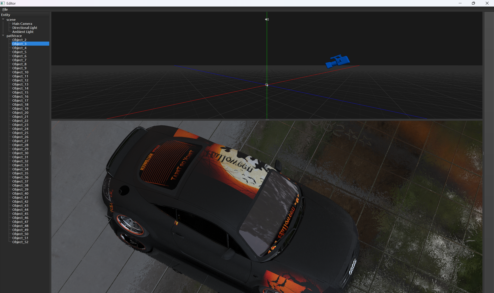
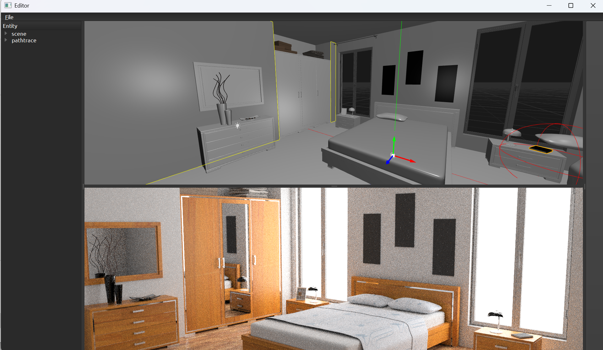
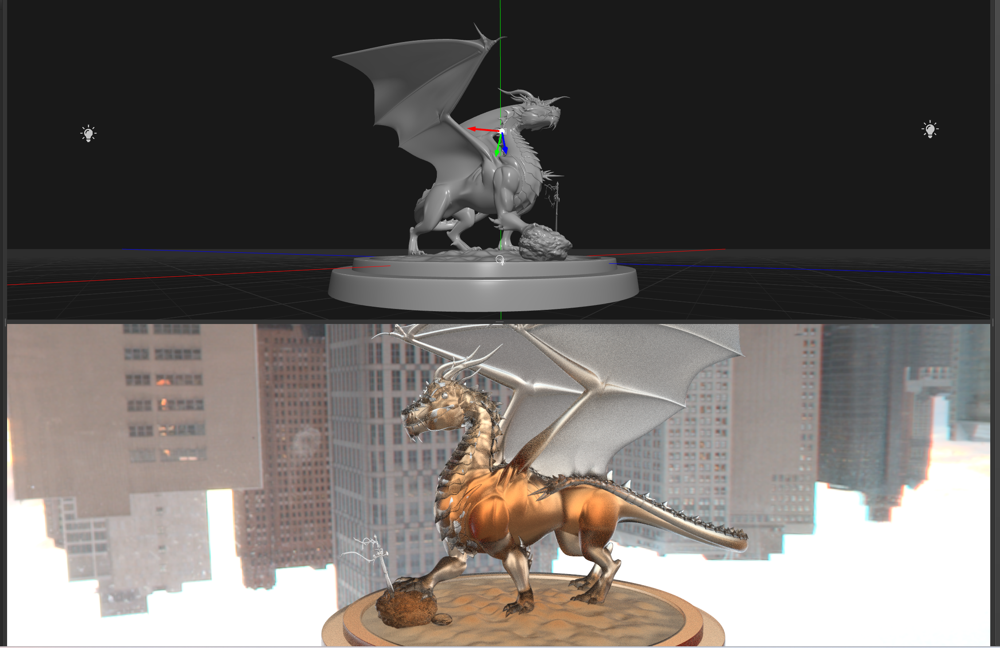
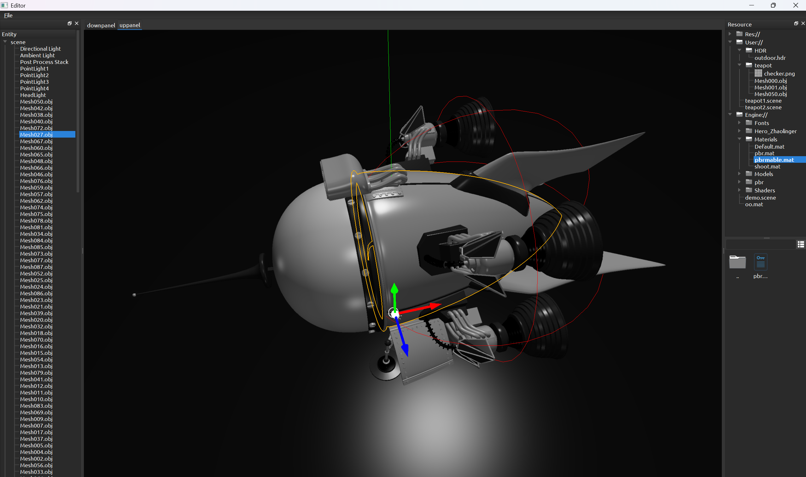
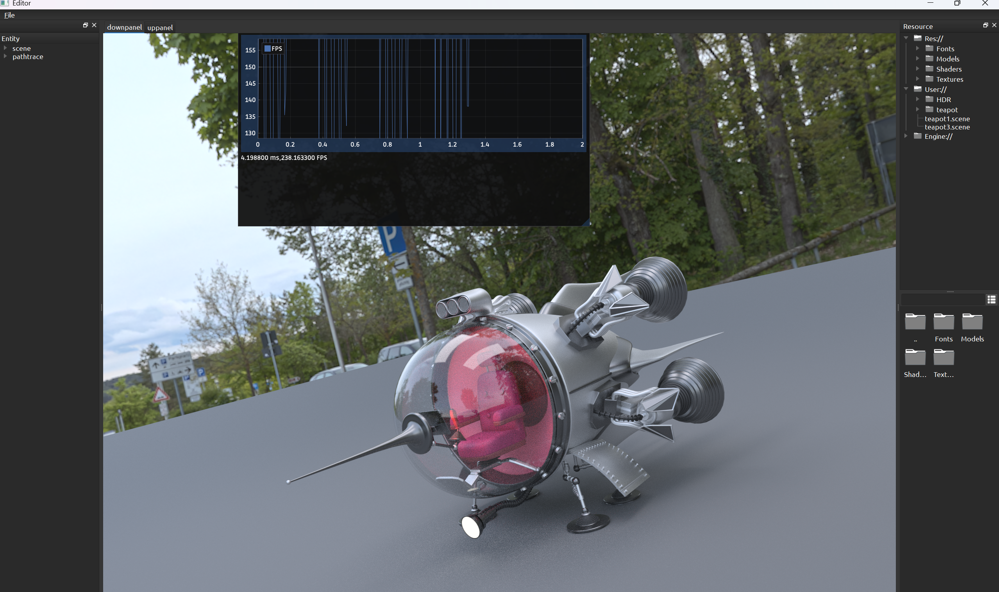
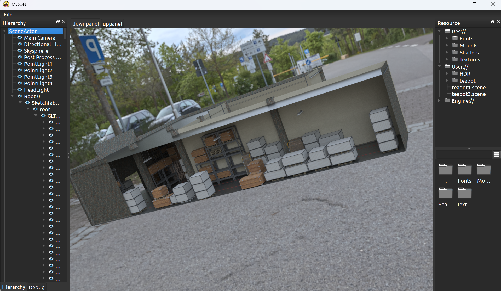

# Moon Render Toy

This is a renderer written based on Qt+Opengl

## PathTrace

## To Do

### PathTrace

Here are a lot of things to do:

- [ ] Added animation effects to camera perspective adjustment
- [ ] Render options panel
- [ ] Materials panel
- [ ] Visibility Control and Selection Interactions

