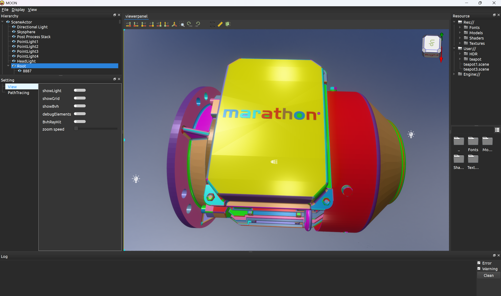
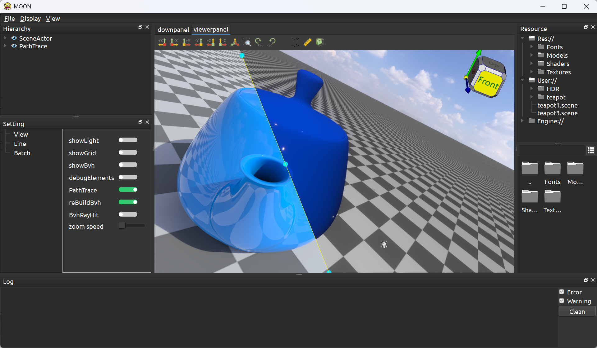
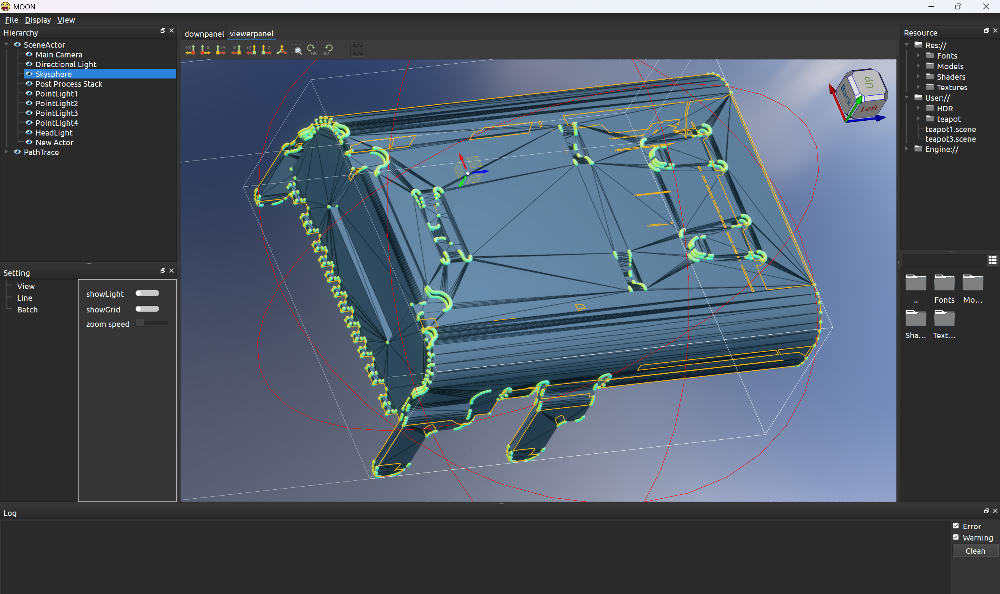
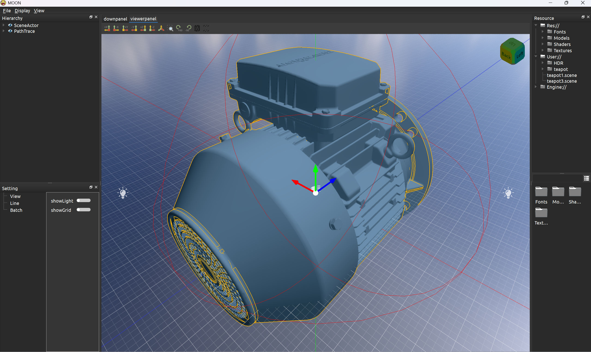

# Moon Render Toy

This is a renderer written based on Qt+Opengl

## Viewer

## PathTrace

## To Do

### PathTrace

Here are a lot of things to do:

- [x] Added animation effects to camera perspective adjustment
- [ ] Render options panel
- [ ] Materials panel
- [x] Visibility Control and Selection Interactions

