# Moon Render

基于 Qt + OpenGL 的 CAD 建模与渲染学习项目，核心是「草图建模 → 特征建模 → PBR/PathTrace 渲染」这条主线。
几何内核使用 OpenCascade（OCC），UI 基于 Qt Widgets，3D 预览与交互基于自研的交互 Widget 体系（Im3D 立即模式渲染）。

---

## 功能清单

### 几何建模（OCC）

- [x] 草图绘制（2D）：点 / 直线 / 多段线 / 圆 / 圆弧 / 椭圆 / 正多边形 / 腰形槽 / 圆弧槽 / 样条 / 矩形 / 旋转 / 对称 / 裁剪 / 圆角 / 偏移
- [x] 草图吸附、构造方式切换（M 键）、连续绘制模式
- [x] 特征建模（3D）：Pad（拉伸）/ Pocket（切除）/ Revolve / Groove / Thickness（抽壳）/ Fillet（圆角）/ Chamfer（倒角）
- [x] 特征预览：参数变化实时重建差异几何（半透明品红预览）
- [x] STEP / OBJ / GLTF 等模型导入

### 渲染

- [x] PBR + IBL（天空盒 / 辐照度 / 预过滤环境贴图）
- [x] PathTrace（GPU fragment）
- [ ] PathTrace（CPU / CUDA）
- [x] SSAO（深度感知，可开关）
- [x] 透明渲染（depth peel 深度剥离）
- [x] 阴影（反射平面）
- [x] 后处理：Bloom / FXAA / Tonemap / Auto Exposure
- [ ] LOD / 网格简化等性能优化

### 交互与选择

- [x] 交互 Widget：viewcube、剖切平面（ClipPlane）、平移/旋转手柄（AxisTranslationWidget 等）
- [x] 点选 / 框选 / 悬停高亮
- [x] 相机：环绕 / 平移 / 缩放 / 视角切换动画

### 编辑器 UI

- [x] 属性面板（Inviwo 风格折叠组、拖动数字控件）
- [x] 设置面板（折叠组分层：材质 / 调试 / 渲染 Pass）
- [x] 日志面板（Level / Time / Message 三栏，按级别过滤与着色）
- [x] 层级树（无线条、统一箭头）
- [x] 自定义 Dock 标题栏

---

## 架构文档

| 文档 | 内容 |
| --- | --- |
| [docs/InteractiveWidget.md](docs/InteractiveWidget.md) | 交互 Widget 体系：事件层 / 绘制层 / 拾取 / 状态机（ClipPlane 为例） |
| [docs/SketchModelingWidget.md](docs/SketchModelingWidget.md) | 草图建模 Handler 深入解析：事件 → 交互 → 曲线 → 预览 → 提交 |
| [docs/SketchModelingWidgetArchitecture.md](docs/SketchModelingWidgetArchitecture.md) | 草图建模架构总览（分层与依赖、设计模式） |
| [docs/SketchWidgets/README.md](docs/SketchWidgets/README.md) | 各草图工具专项文档（Point/Line/LineSet/Circle/Ellipse/Polygon/Slot/ArcSlot/BSpline/Rectangle/Fillet/Symmetry/Rotate/Offset/Trimming） |
| [docs/FeatureModeling.md](docs/FeatureModeling.md) | Feature 参数化建模：预览逻辑 / 建模 / 任务 UI / 属性系统 |
| [docs/SectionRendering.md](docs/SectionRendering.md) | 剖切截面渲染（模板 / 奇偶裁剪） |
| [docs/ImguiArchitecture.md](docs/ImguiArchitecture.md) | ImGui 集成架构 |
| [docs/API.md](docs/API.md) | API 索引 |

---

## 构建说明

### 依赖

| 依赖 | 版本 | 说明 |
| --- | --- | --- |
| Visual Studio | 2022（MSVC v143） | 编译器 |
| CMake | ≥ 3.12（建议 3.28） | 构建系统 |
| Qt | 5.15.2 `msvc2019_64` | Qt Widgets / Gui / OpenGL / Svg |
| OpenCASCADE | 7.9.3（x64，含 3rd-party DLL） | 几何内核 |
| Eigen / Boost | 3.4.0 / 项目自带 | `Extern/` 下 |
| spdlog / assimp / tinygltf 等 | 由 `Extern/` 子目录自动构建 | 无需手动安装 |

### 配置与编译

```bat
:: 1. 配置（OpenCASCADE_DIR 指向含 env.bat 的目录）
cmake -S . -B Build -DOpenCASCADE_DIR=D:/path/to/opencascade-7.9.3

:: 2. 构建（目标 Moon；Release）
cmake --build Build --target Moon --config Release -- /m /nologo

:: 3. 运行
Build\bin\Release\Moon.exe
```

> 提示：
> - 首次构建会自动编译 `Extern/` 下的 spdlog / assimp / tinygltf 等第三方库，耗时较长；
> - 运行时若提示缺少 OCC 或 3rd-party DLL，把 OpenCASCADE 的 bin 目录加入 `PATH`；
> - 编译前请关闭正在运行的 Moon.exe，否则链接会因文件占用失败。

---

## 截图

### OCC 几何建模

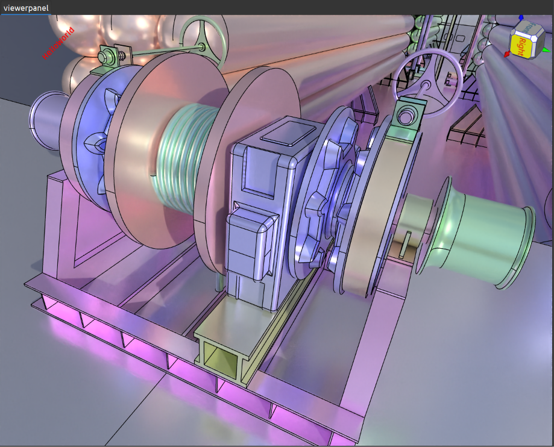

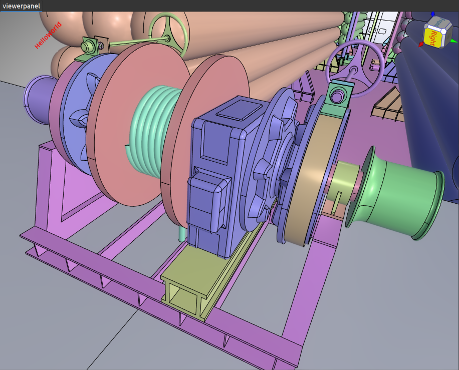

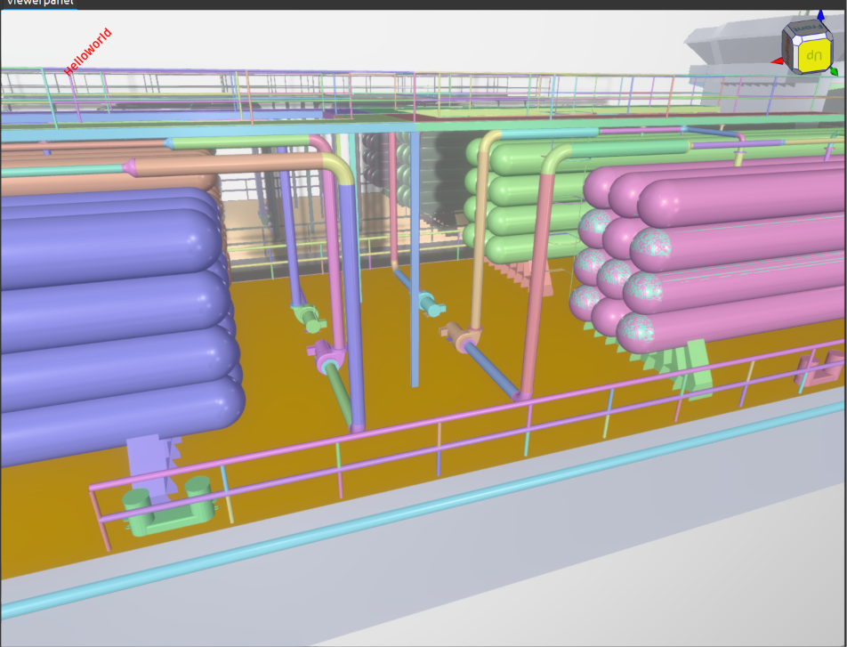

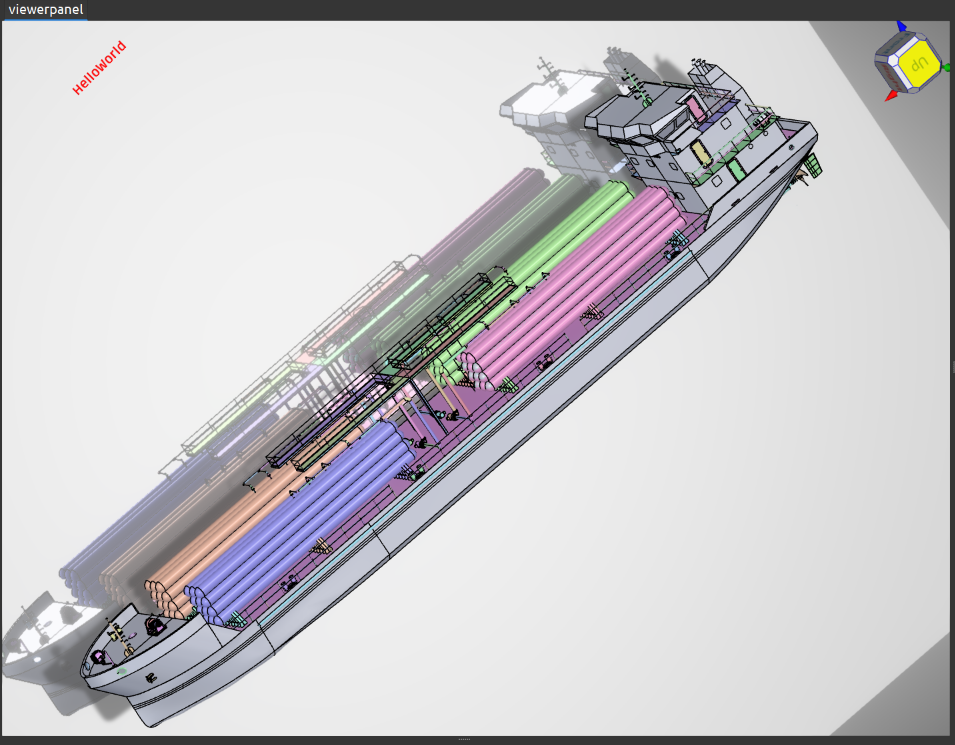

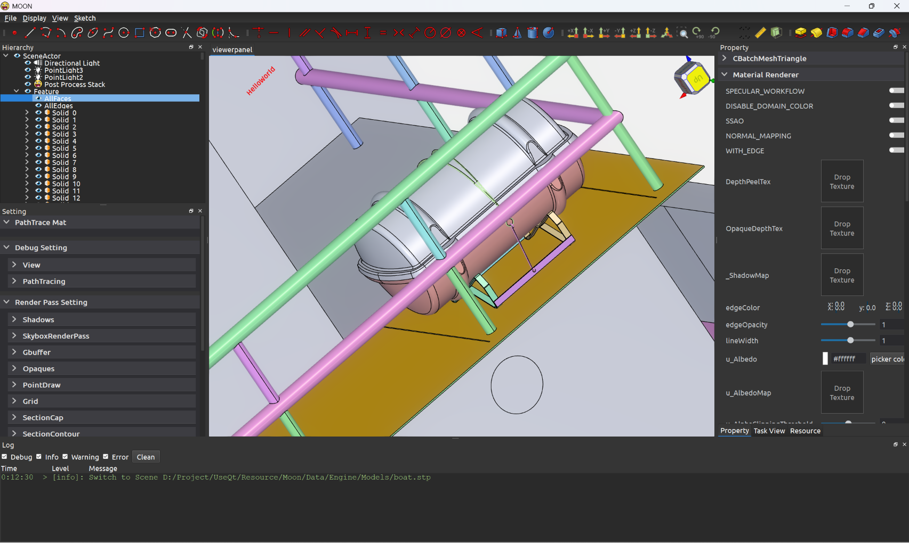

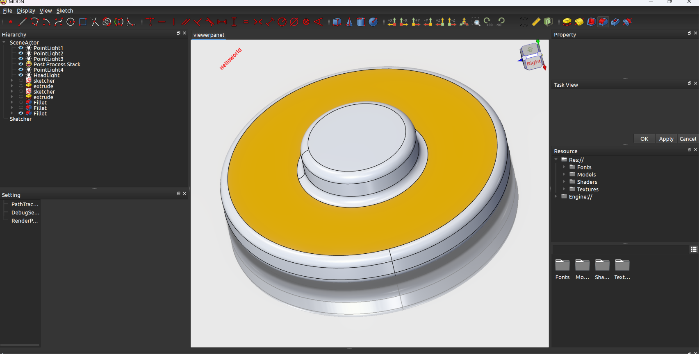
*草图绘制与 3D 特征建模效果*

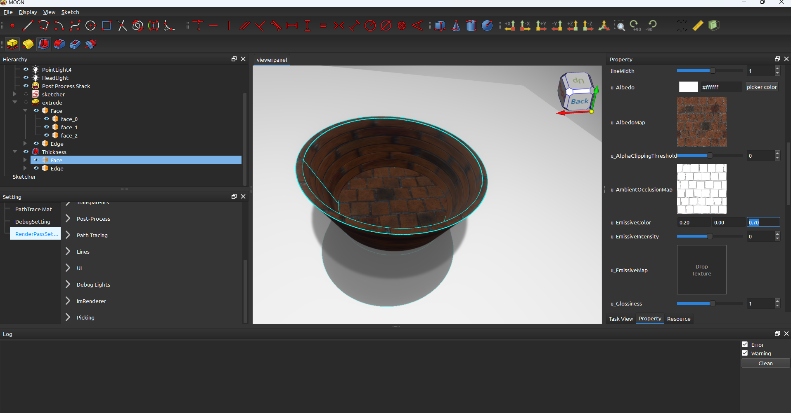
*特征建模：基于草图生成实体*

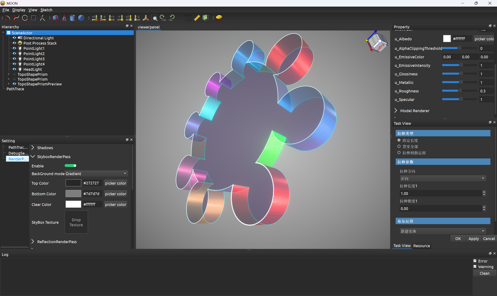
*特征建模结果*

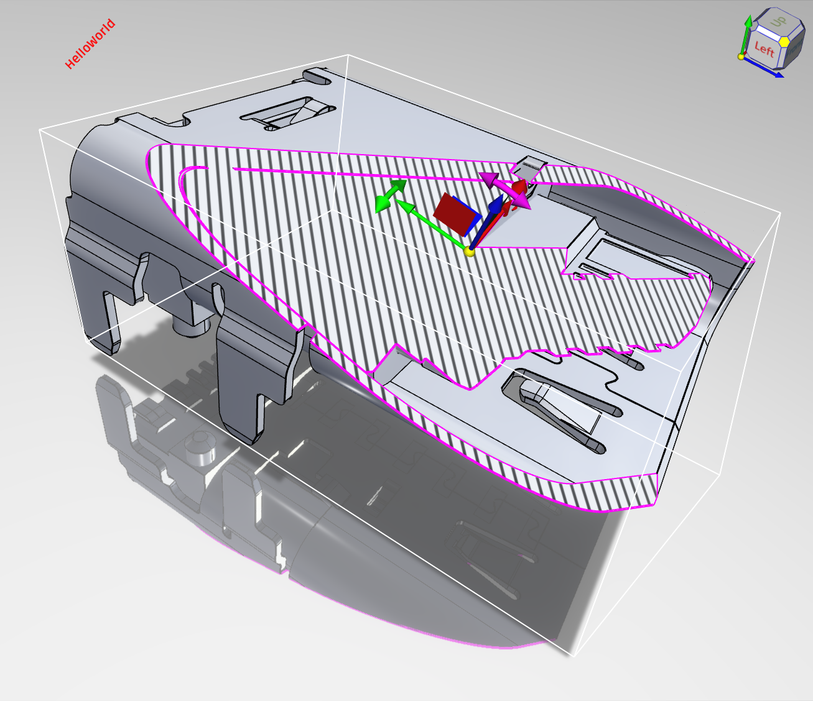
*草图约束 / 几何编辑*

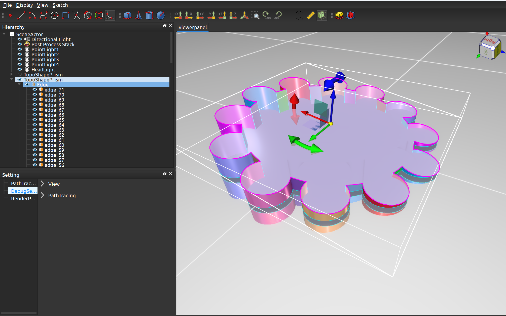
*实体模型*

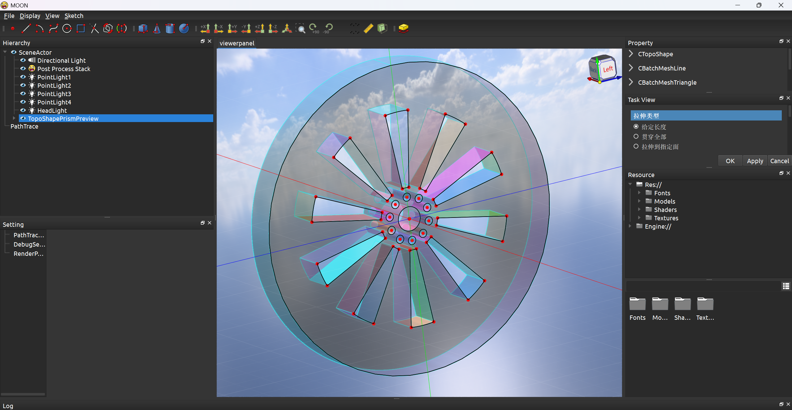
*实体模型*

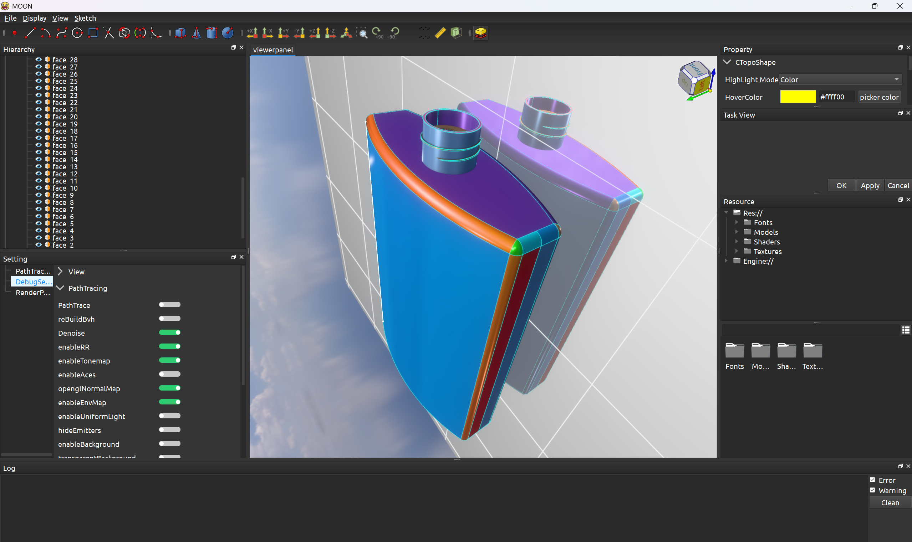
*实体模型*

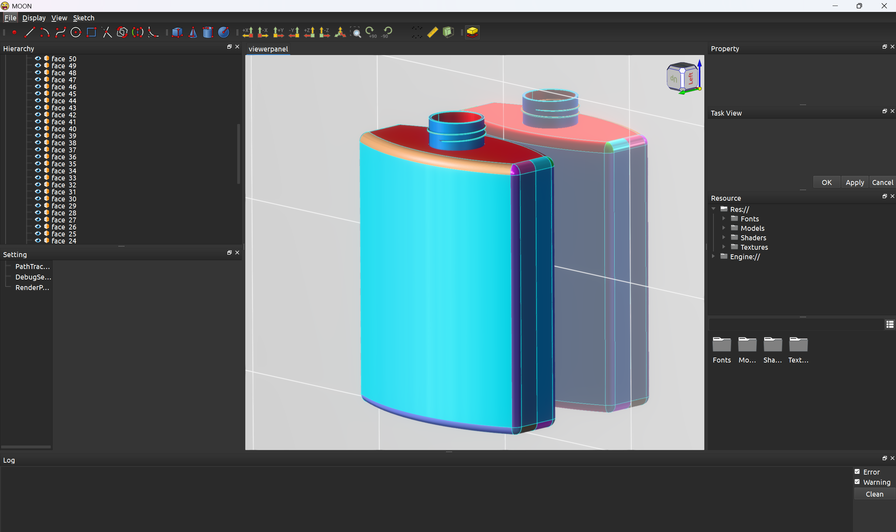
*实体模型*

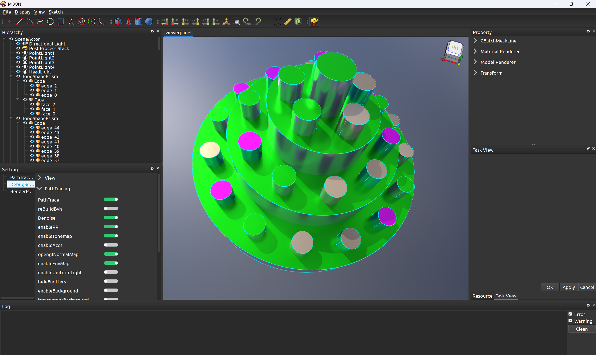
*实体模型*

### PBR 与 PathTrace


*PBR 材质与光照*


*PBR 材质与光照*


*PBR 材质与光照*


*GPU fragment 路径追踪*

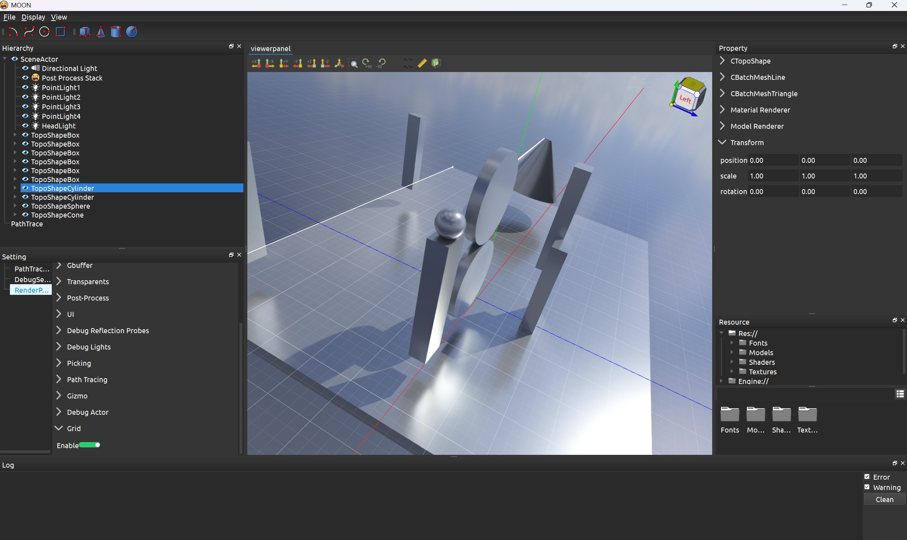
*渲染效果*


*渲染效果*


*渲染效果*


*渲染效果*


*渲染效果*

### SSAO

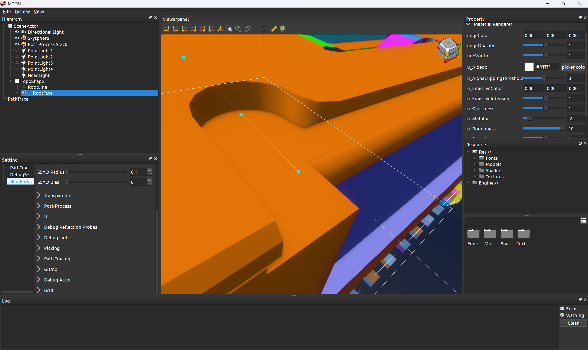
*屏幕空间环境光遮蔽*

### 透明（depth peel）


*深度剥离透明*

### 剖切（clip）


*剖切平面交互*


*剖切截面*

### 选择与高亮


*拾取与高亮*


*拾取与高亮*

### 交互 Widget 架构

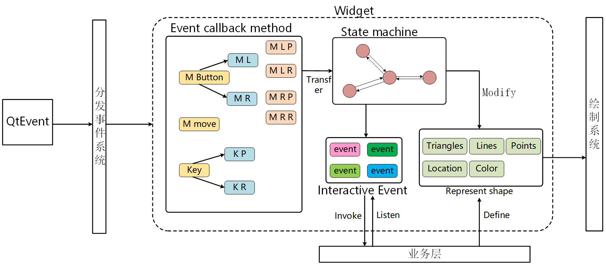
*交互 Widget 体系架构*
