# Moon Render

This is a renderer written based on Qt+Opengl

## Viewer

### pbr and pathtrace

------

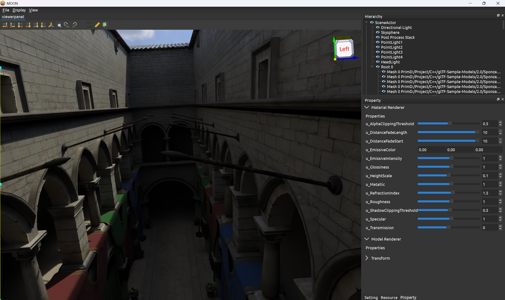

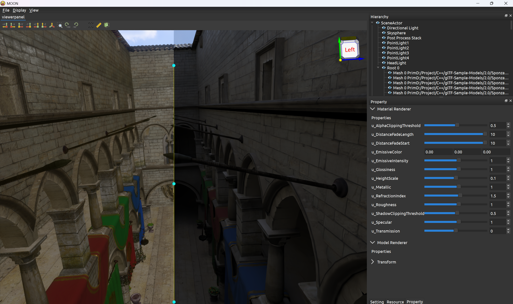

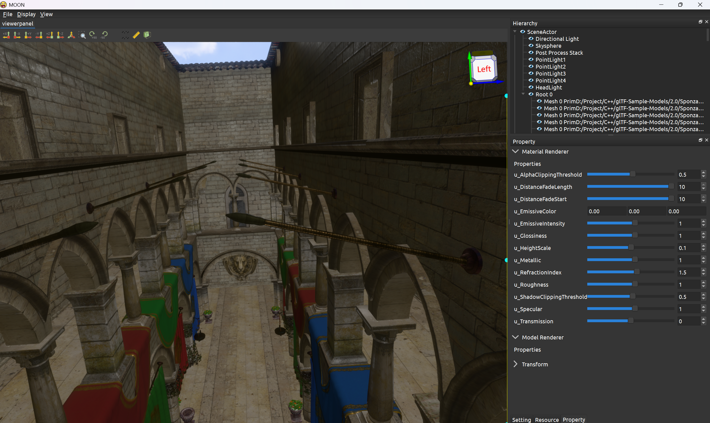

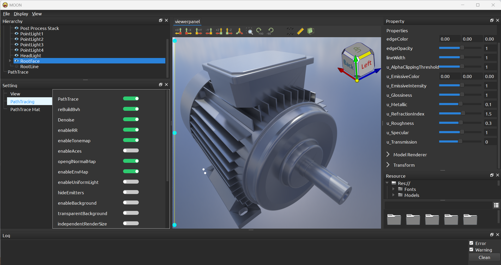

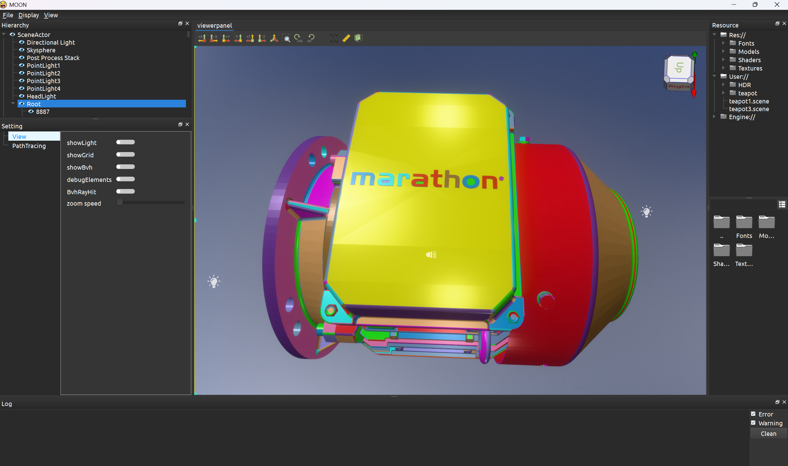

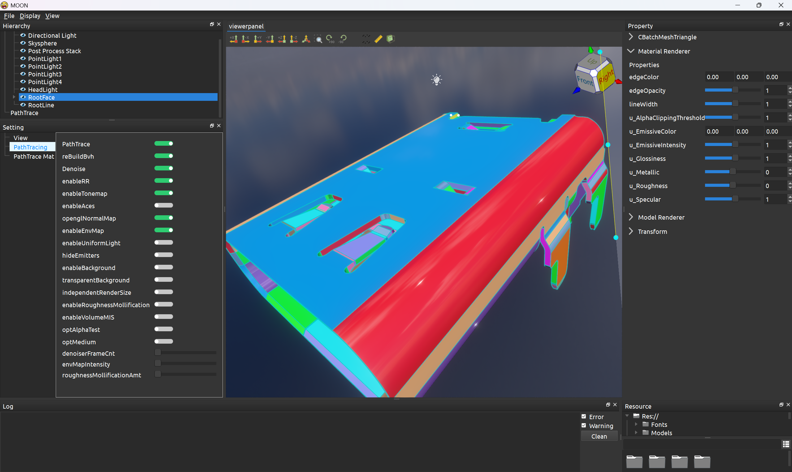

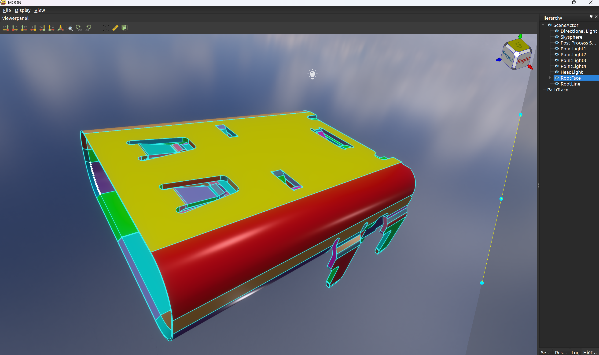

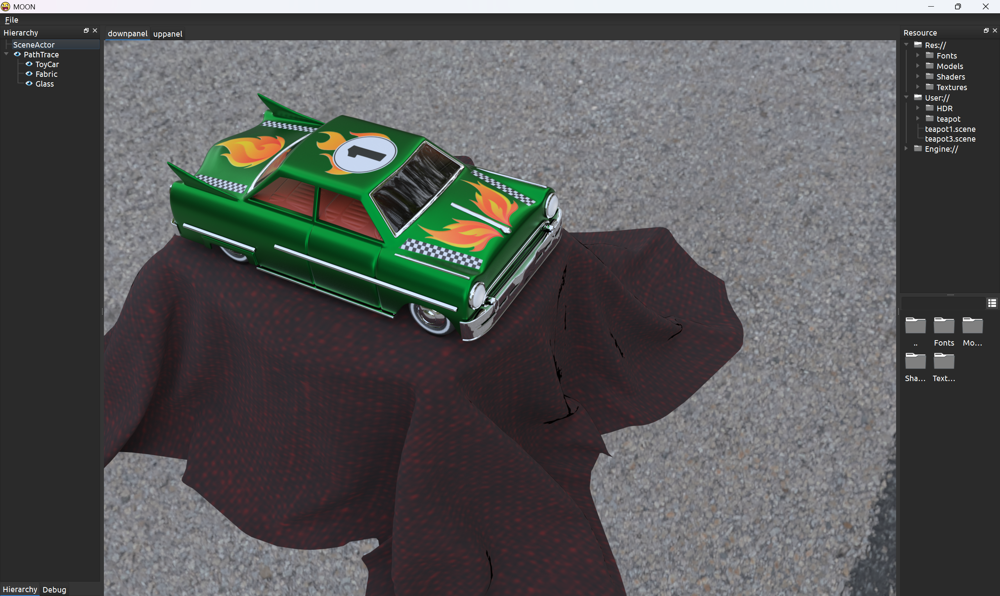

### transparent

------

depth peel

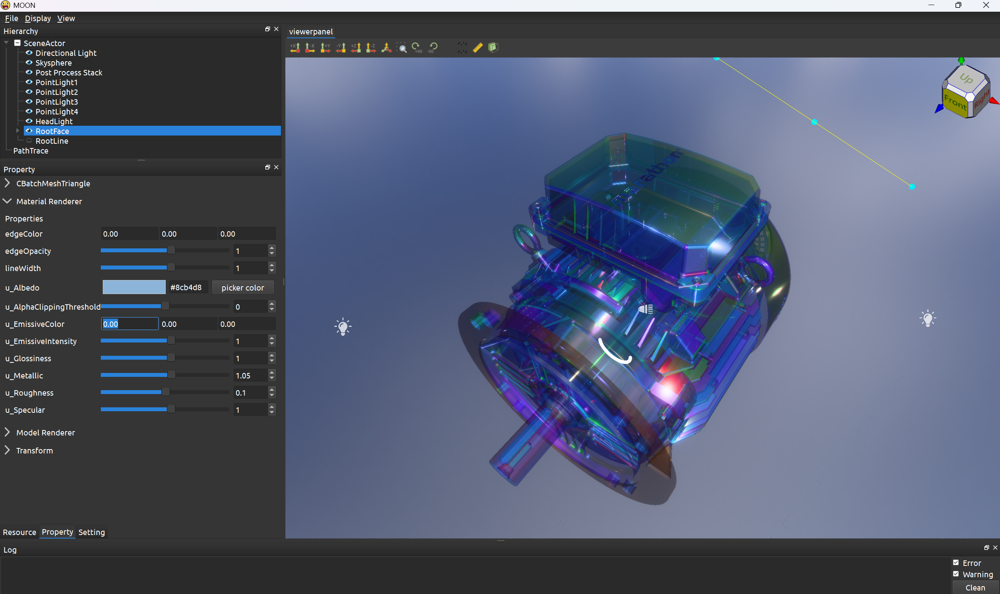

### clip

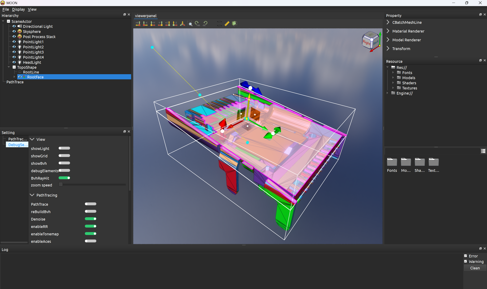

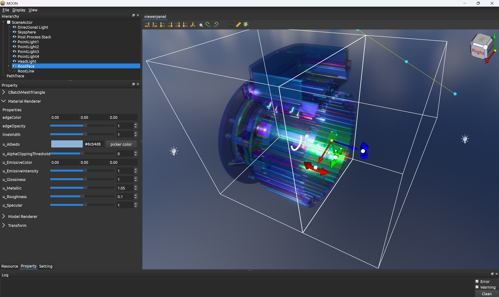

### select and highlight

------

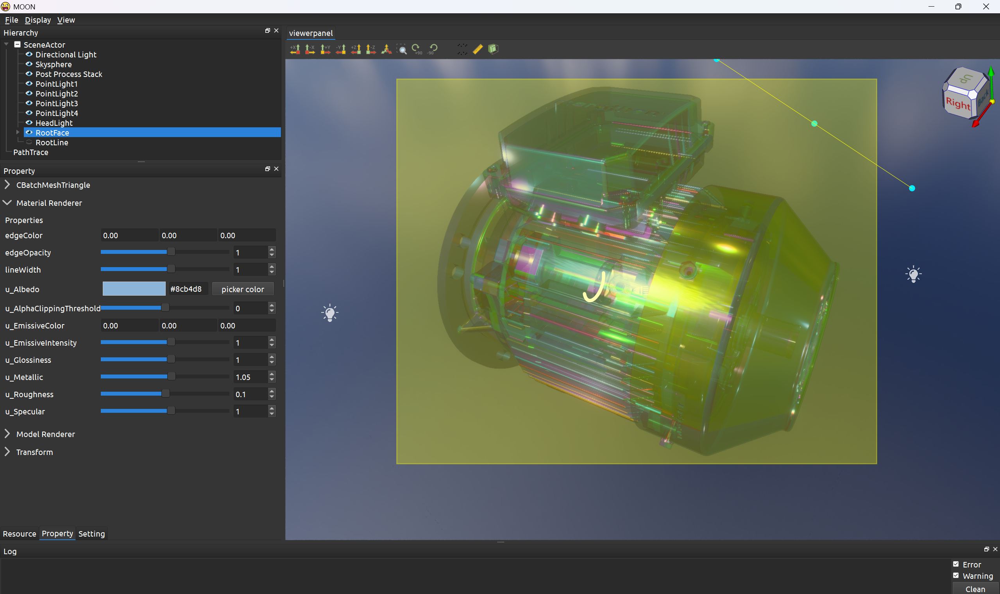

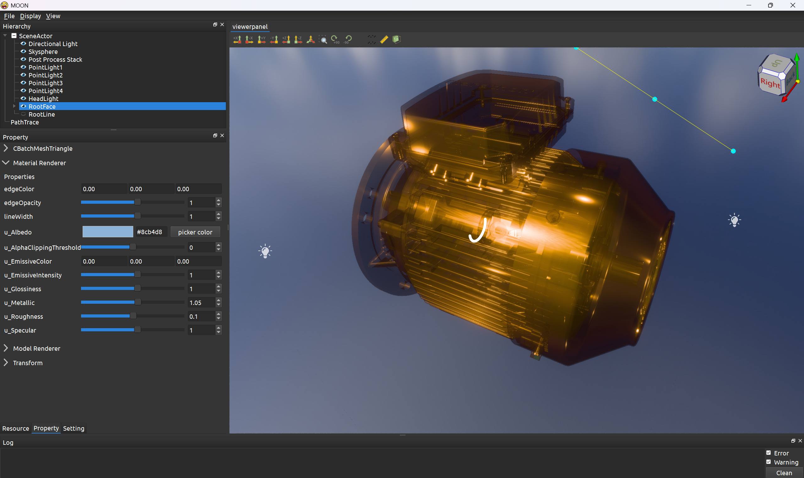

## Features

- [x] animation effects to camera perspective adjustment

- [x] pathtracing and PBR

- [x] Render options panel

- [x] Materials panel

- [x] Visibility Control and Selection Interactions

- [x] postprocess effects

- [ ] and plans to do

  89
  
  
