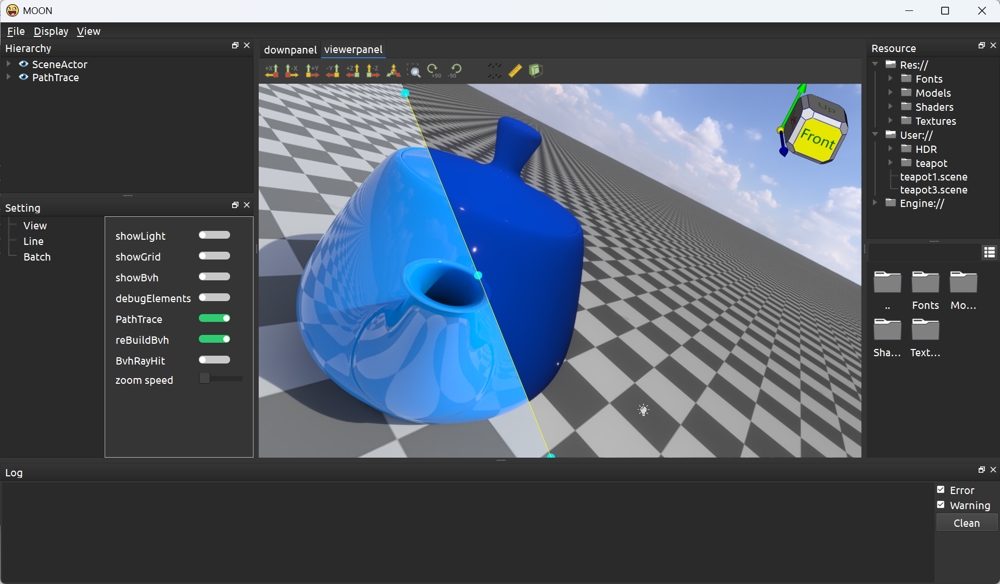
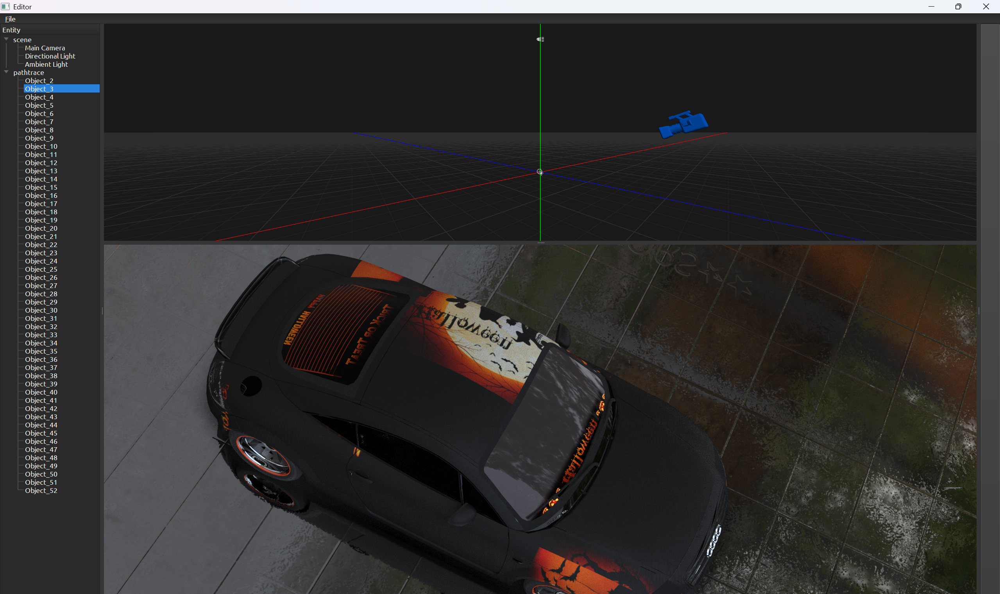
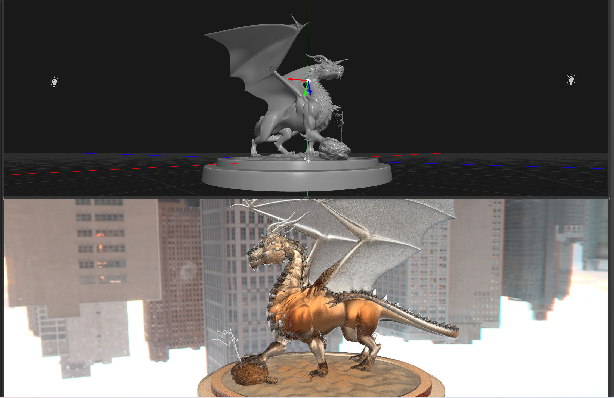
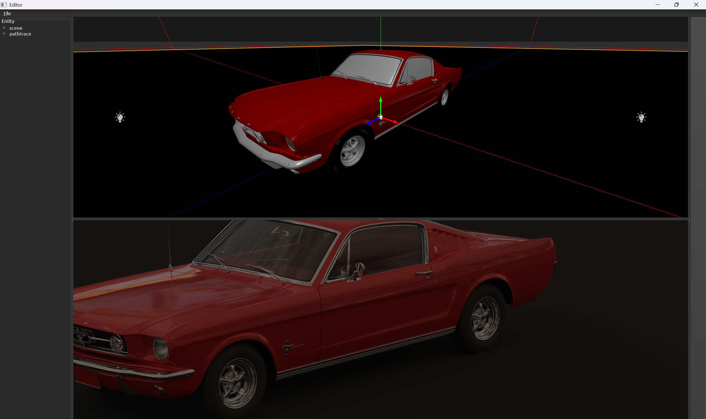
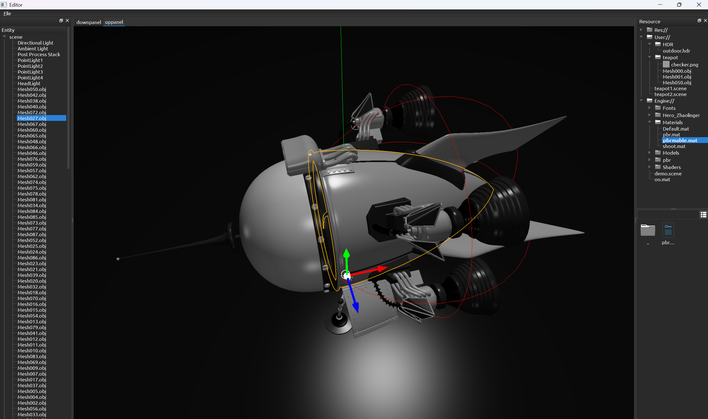
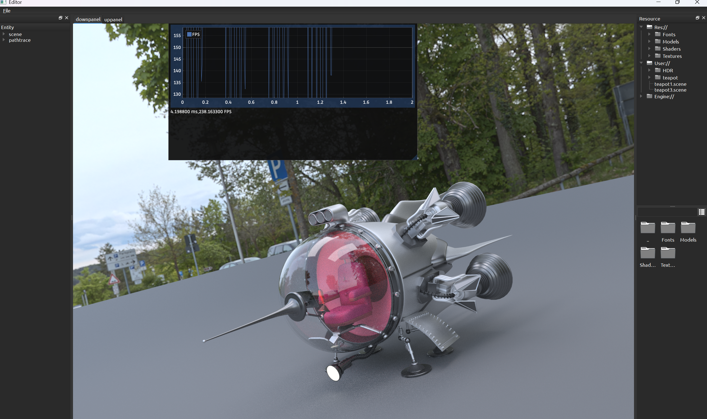

# Moon Render

This is a renderer written based on Qt+Opengl

## Viewer

## 

## Features

- [x] animation effects to camera perspective adjustment

- [x] pathtracing and PBR

- [x] Render options panel

- [x] Materials panel

- [x] Visibility Control and Selection Interactions

- [x] postprocess effects

- [ ] and plans to do

  

