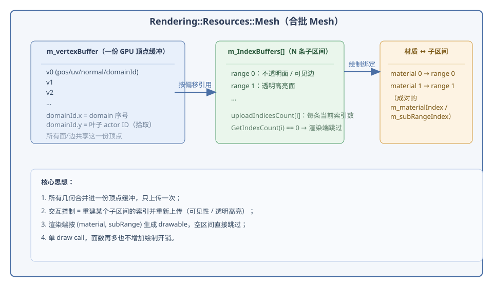
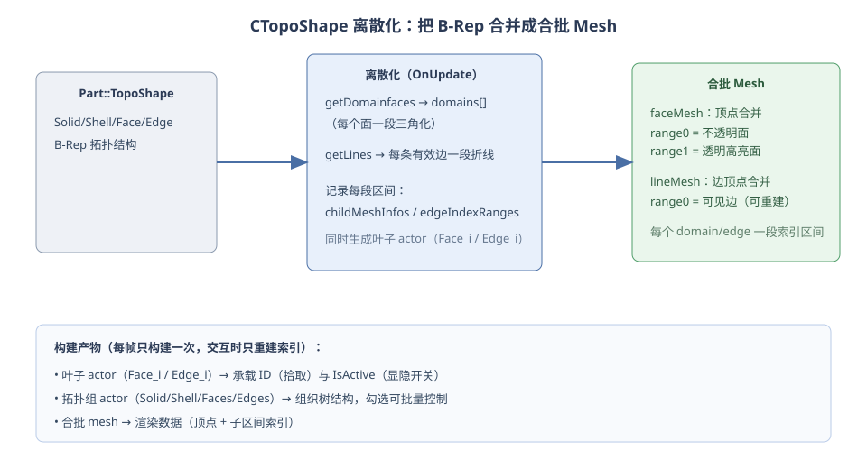
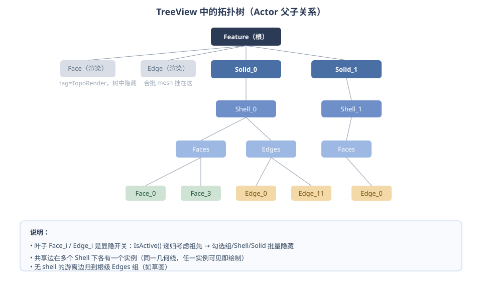
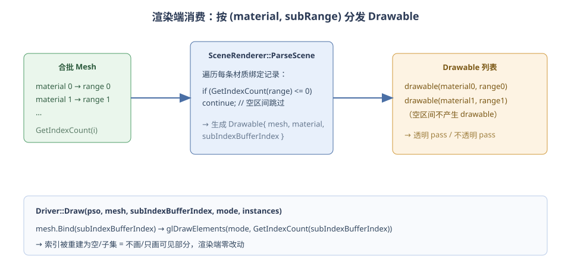
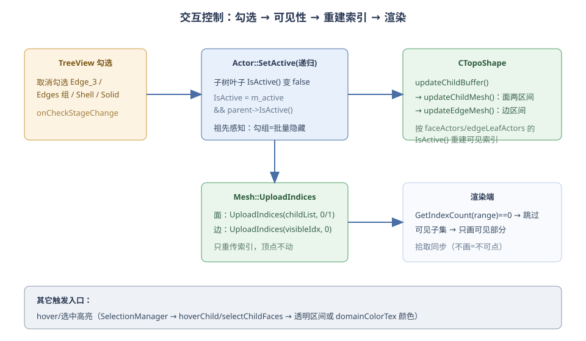

# 合批 Mesh 与拓扑交互控制

> 本文讲解渲染侧的**合批 Mesh** 设计，以及 `CTopoShape` 组件如何基于它实现
> **显隐 / 透明高亮 / 拾取 / 拓扑树**等交互控制。
>
> 涉及源码：
> - `MoonRender/include/Rendering/Resources/Mesh.h`、`MoonRender/src/Rendering/Resources/Mesh.cpp`（合批容器）
> - `Moon/core/component/CTopoShape.h/.cpp`（离散化 + 控制）
> - `Moon/core/component/TopoShapeActor.h/.cpp`（TopoActor 骨架、渲染锚点、材质）
> - `MoonRender/src/Core/Rendering/SceneRenderer.cpp`（渲染消费）
> - `Moon/editor/UI/TreeViewPanel/EntityTreeModel.cpp`、`treeViewpanel.cpp`（勾选入口）
> - `Moon/core/SelectionManager.cpp`（hover/选中）
> - `Moon/renderer/PickingRenderPass.cpp`、`Resource/Moon/Data/Engine/Shaders/GeomertySurfacePick.ovfx`（拾取）

---

## 1. 设计动机与总览

CAD 模型的 B-Rep 形状离散化后可能包含成百上千个面与边。如果每个面/边各建一个
mesh 各自绘制，draw call 会随几何数量线性增长，交互（显隐、高亮）还要逐 mesh 开关，
代价高且状态容易错位。

本设计选择**合批**：

- **一份顶点缓冲**装下所有面/边的顶点（顶点带 `domainId`，用于域颜色与拾取）；
- **多条索引子区间**把几何按用途切分（不透明面 / 透明高亮面 / 边）；
- **材质 ↔ 子区间绑定表**决定“哪个材质槽画哪一段”；
- **交互控制 = 重建某个子区间的索引并重新上传**——不拆网格、不新增 draw call。

这样显隐、透明高亮、拾取都收敛到“改索引”一个动作上，渲染端只按索引数量剔除空区间。



---

## 2. Mesh 内部结构

### 2.1 数据成员

`Rendering::Resources::Mesh` 的核心字段：

```cpp
HAL::VertexBuffer m_vertexBuffer;                       // 一份 GPU 顶点缓冲（全部几何）
std::vector<std::unique_ptr<HAL::IndexBuffer>> m_IndexBuffers; // N 条索引子区间
std::vector<uint32_t> uploadIndicesCount;               // 每条子区间当前索引数
std::vector<uint32_t> m_materialIndex;                  // 材质绑定表：材质槽
std::vector<uint32_t> m_subRangeIndex;                  // 材质绑定表：对应子区间
std::vector<Geometry::VertexBVH> m_vertices;            // CPU 侧顶点（拾取/高亮取点）
std::vector<uint32_t> m_indices;                        // CPU 侧完整索引（hover 取段）
```

### 2.2 子区间与材质绑定

```cpp
void Mesh::AddMaterial(int materialIndex, int subRangeIndex)
{
    m_materialIndex.push_back(materialIndex);   // 第 i 条：材质槽
    m_subRangeIndex.push_back(subRangeIndex);   // 第 i 条：画哪个子区间
}
```

一个 mesh 可以有多条 `(material, subRange)` 记录。例如 TopoActor 的 faceMesh：

```cpp
// CTopoShape.cpp（face 部分）
faceMesh = new Mesh(faceVertices, indices, 0, TRIANGLES); // 构造时自动 AddMaterial(0, 0)
faceMesh->AddSubRangeBuffer();                             // 加第二个索引子区间
faceMesh->AddMaterial(1, 1);                               // 材质槽 1 → 子区间 1
```

- 子区间 0 = 不透明面（`faceMat`，材质槽 0）
- 子区间 1 = 透明高亮面（`faceTransparentMat`，材质槽 1）

### 2.3 索引上传（交互的“落点”）

```cpp
// 按 (offset, count) 列表上传 —— 面 mesh 用
void Mesh::UploadIndices(const std::vector<std::pair<int,int>>& childList, int index);
// 按完整索引向量上传 —— 线 mesh 用
void Mesh::UploadIndices(const std::vector<uint32_t>& p_indices, int index);
```

上传后 `uploadIndicesCount[index]` 更新。**顶点缓冲从不重传**，变化的只有“这一段画哪些索引”。

---

## 3. 合批构建：CTopoShape 离散化

`CTopoShape::OnUpdate` 在形状更新时把 B-Rep 合并成合批 mesh，同时生成控制用的
叶子 actor 与拓扑组 actor。



### 3.1 面 mesh

1. `getDomainfaces()` 对每个面做三角化，得到 `domains[]`（每面一段顶点/三角）；
2. 把所有面合并进一份 `faceVertices`，逐面记录区间 `childMeshInfos`；
3. 每个有三角化的面生成一个叶子 actor `Face_<i>`（ID 写入顶点 `domainId.y`）；
4. 建 `faceMesh`（两个子区间），并把 `domainColorTex` 挂在 `faceMat` 上。

### 3.2 线 mesh

1. 对每条有效边提取折线（`getPolygon3D` 或面三角化上的 pcurve）；
2. 合并进 `linePoints`，记录每条边的顶点区间与索引区间；
3. 每条有效边生成叶子 actor `Edge_<i>`（可能按所属 shell 有多个实例）；
4. 建 `lineMesh`（单子区间），记录 `edgeIndexRanges` 供后续重建可见索引。

### 3.3 拓扑组 actor

`rebuildTopologyTree()` 按 OCCT 拓扑（`MapShapesAndAncestors`）建：

```
Solid_k → Shell_k → Faces / Edges → Face_i / Edge_i
```

叶子 actor 承载两件事：**ID（拾取）** 与 **IsActive（显隐开关）**。



---

## 4. 渲染端消费

`SceneRenderer::ParseScene` 对每个 mesh 的材质绑定表逐条生成 drawable，
**空子区间直接跳过**：

```cpp
for (int i = 0; i < meshMatIndex.size(); i++) {
    auto& materialIndex = meshMatIndex[i];
    int bufferIndex = meshRangeBufferIndex[i];
    if (mesh->GetIndexCount(bufferIndex) <= 0) {
        continue;                       // 索引被重建为空 → 不产生 drawable
    }
    ...
    result.drawables.push_back(drawable{ mesh, material, bufferIndex, ... });
}
```

绘制时 `Driver::Draw` 绑定对应子区间的 vertex array，按上传的索引数量绘制：

```cpp
p_mesh.Bind(index);                                    // 顶点缓冲 + 该子区间索引缓冲
m_gfxBackend->DrawElements(p_primitiveMode, p_mesh.GetIndexCount(index));
```

因此**“隐藏”对渲染端是透明的**：索引区间为空就不画，拾取自然也不可点。



---

## 5. 交互控制

### 5.1 可见性（显隐）

`Actor::IsActive()` 是祖先感知的：

```cpp
bool Actor::IsActive() const {
    return m_active && (m_parent ? m_parent->IsActive() : true);
}
```

所以**取消勾选一个祖先节点（Edges 组 / Shell / Solid），整棵子树的叶子都变 inactive**。

勾选入口在 `EntityTreeModel::onCheckStageChange`：

```cpp
actor->SetActive(checked);          // SetActive 递归同步子树
// 向上找到 CTopoShape 属主
for (cur = actor; cur; cur = cur->HasParent() ? cur->GetParent() : nullptr) {
    if (cur->HasComponent("CTopoShape")) {
        cur->GetComponent<CTopoShape>()->updateChildBuffer();
        break;
    }
}
```

`updateChildBuffer()` 置标记，`OnUpdate` 末尾执行：

- **面**：`updateChildMesh()` 按 `faceActors[i]->IsActive()` 重建两个子区间的索引
  （不透明区间 / 透明高亮区间）；
- **边**：`updateEdgeMesh()` 按每条边叶子 actor 的可见性重建可见索引并上传到子区间 0。

```cpp
void CTopoShape::updateEdgeMesh()
{
    ...
    for (size_t i = 0; i < edgeCount; ++i) {
        bool visible = false;
        for (auto* actor : mInternal->edgeLeafActors[i])
            if (actor->IsActive()) { visible = true; break; }
        if (!visible) continue;
        // 把该边区间索引追加进 visibleIndices
    }
    mInternal->lineMesh->UploadIndices(visibleIndices, 0);
}
```



### 5.2 透明高亮

`setChildsMeshTransParent(childs)` 把指定面从“不透明子区间”挪到“透明子区间”，
材质槽 1 的 `faceTransparentMat`（`u_Albedo.a = 0.5`）经过深度剥离透明 pass 渲染。

```cpp
// CTopoShape.cpp
void CTopoShape::setChildsMeshTransParent(const std::vector<int>& childs, bool updateBuffer)
{
    ...
    mInternal->curTransparentChildMeshIndex = listTransparentIndex;
    mInternal->curOpaqueChildMeshIndex = listOpaqueIndex;
}
```

`SelectionManager` 的 hover/选中会把拾取到的叶子 actor 解析成 domain 索引，
调用 `hoverChild / selectChildFaces / hoverChildLine / selectChildLines`：

- 颜色模式：改 `domainColorTex`（按 domain 取色的纹理缓冲），不动索引；
- 透明模式：把候选面挪进透明子区间。

### 5.3 拾取

顶点 `domainId.y` 存叶子 actor 的 ID；拾取 shader 直接把它编码成像素色：

```glsl
// GeomertySurfacePick.ovfx
int actorId = int(round(VSDomainId.y));
int r = actorId & 0xFF; int g = (actorId >> 8) & 0xFF; int b = (actorId >> 16) & 0xFF;
FRAGMENT_COLOR = vec4(r / 255.0, g / 255.0, b / 255.0, 1.0);
```

`PickingRenderPass::ReadbackPickingResult` 按像素还原 actor ID，`FindActorByID` 得到叶子。
因为**隐藏的几何根本不绘制**，拾取自动跟随可见性，不会出现“看不见却点得到”。

---

## 6. 端到端时序

```
用户取消勾选 Shell_0
  → onCheckStageChange: SetActive(false)（递归子树叶子变 inactive）
  → 向上找到 CTopoShape → updateChildBuffer()
  → OnUpdate 末尾: updateChildMesh()          // 面：重建两区间索引
                   updateEdgeMesh()           // 边：重建可见索引
  → Mesh::UploadIndices(可见子集, range)
  → 下一帧 SceneRenderer::ParseScene: GetIndexCount(range) 变小/为 0
  → 不可见部分不再产生 drawable / 不再绘制 / 不再参与拾取
```

---

## 7. 设计要点、边界与扩展

**要点**

- 几何合并成一份顶点缓冲，交互只改索引 → 单 draw call，状态单一；
- `IsActive()` 祖先感知 → 勾选组/Shell/Solid 天然批量控制；
- 渲染端只认 `GetIndexCount` → 显隐对渲染/拾取透明；
- 面与边共用同一套“合批 + 重建索引”模式，控制逻辑一致。

**边界**

- 共享边（两个 solid 共用同一 `TopoDS_Edge`）在多个 shell 下各有一个叶子实例，
  任一实例可见即绘制——它本质是同一条几何线；
- 隐藏某个 shell 的共享边而另一 shell 仍可见时，该边仍会绘制（符合几何事实）。

**扩展方向**

- 需要多套高亮/选择颜色时，`(material, subRange)` 绑定表已支持更多子区间；
- 若要按边单独着色，可在线 mesh 上引入 `lineColorTex` 之类的纹理缓冲，与
  `domainColorTex` 对 face 的做法一致；
- 若要支持“隐藏边后 hover 高亮同步消失”，可在 `hoverChildLine` 前检查叶子
  `IsActive()`，当前实现保留 CPU 侧完整索引，方便按需过滤。
