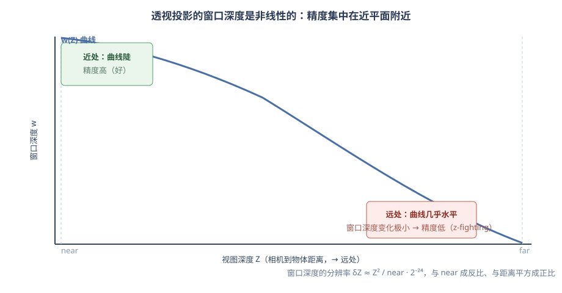
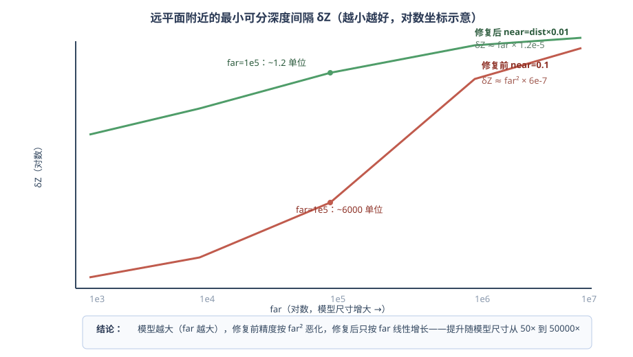
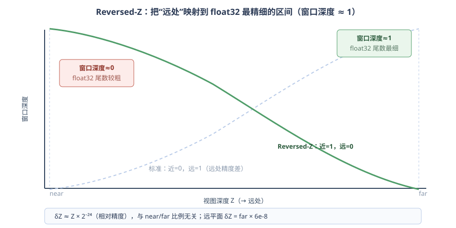

# 大尺寸场景深度精度与线面冲突的解决：动态近远平面 + Reversed-Z

> 透视相机下，模型尺寸很大时，移动相机（旋转/平移）会在模型表面出现
> “破碎”、闪烁、不断变化的小面片——这是**深度精度不足导致的 z-fighting**。
> 同一根因还带来**线面冲突**：共面的边线被面盖住 / 远处线框被精度噪声吞掉。
>
> 本工程**同时采用了两套方案**，互为补充：
> - **方案一：动态近远平面**——把 near/far 比例从 1:10⁶ 收紧到 ~1:200；
> - **方案二：Reversed-Z 深度缓冲**——把 float32 的精度放到远处最需要的地方，
>   精度从“与 near/far 比例强相关”变成“与比例无关”，同时配合 polygon offset
>   方向修正，一并解决线面冲突。
>
> 本文说明根因、两个方案各自的原理与数据，以及组合后的最终状态。
>
> 涉及源码：
> - `Moon/renderer/CameraController.h/.cpp`（`UpdateDepthRange`，方案一）
> - `MoonRender/src/Rendering/HAL/OpenGL/GLBackend.cpp`（深度范围反转，方案二）
> - `MoonRender/src/Rendering/Data/PipelineState.cpp`（默认深度函数 GREATER）
> - `MoonRender/src/Rendering/Context/Driver.cpp`（polygon offset 方向，方案二的连带修复）
> - `MoonRender/src/Core/Rendering/SceneRenderer.cpp`（线/剖切深度函数、剥离层纹理）
> - `Moon/renderer/PickingRenderPass.cpp`、`Moon/Interactive/Im3DRenderer.cpp`（深度函数）
> - `Resource/Moon/Data/Engine/Shaders/Lighting/Shadow.ovfxh`、`GeomertySurface.ovfx`、
>   `SectionFace.ovfx`（深度值解释转换）
> - `MoonRender/src/Rendering/Entities/Camera.cpp`（`ProjectionFitToSphere` 远平面修复）

---

## 1. 现象

透视相机下，把相机放到一个尺寸很大的模型附近（比如 fit 之后），**只要相机一
动**，模型表面就会出现随机变化的“破碎”区域。这不是网格问题，而是远处两个
本应分开的面，在深度缓冲里**分辨不出前后**，每帧交替获胜，表现为闪烁/破碎。

同一根因还伴随**线面冲突**：STEP 模型的边线与所属面共面，远处精度不足时线被面
盖住或闪烁；拾取也会跟着错位（点到面而不是线）。



---

## 2. 根因：为什么大模型会碎

### 2.1 深度缓冲的精度模型

OpenGL 深度缓冲存的是**窗口深度 w ∈ [0,1]**，透视投影下 w 与视图深度 Z
（相机到物体的距离）是**非线性**关系：

```
w(Z) = ½ + (f+n)/(2(f−n)) − fn/((f−n)·Z)
```

对 Z 求导：

```
dw/dZ = fn/((f−n)·Z²) ≈ n/Z²        （当 f >> n）
```

深度缓冲是离散的（float32 有 24 位有效尾数，最小间隔 δw ≈ 2⁻²⁴ ≈ 5.96e-8），
所以某个距离 Z 处**能可靠分辨的最小深度差**为：

```
δZ ≈ δw / (dw/dZ) ≈ Z² / n · 2⁻²⁴
```

两个关键结论：

1. **δZ 与距离的平方成正比**——越远越差；
2. **δZ 与近平面 n 成反比**——near 越小，远处精度越差。

这也解释了为什么**已经是 float32 深度**（本项目主 MSAA framebuffer 用
`DEPTH32F_STENCIL8`）仍然会碎：格式只是增加位宽，非线性的分布没有变，
坏点仍然集中在远处。

### 2.2 修复前本项目的数据

修复前：`near = 0.1`（固定），`far = max(距离 + 半径, 1200)`（fit 大模型时
可能到几十万甚至上百万）。代入公式，**远平面附近的 δZ**：

```
δZ(far) = far² / 0.1 × 5.96e-8 = far² × 5.96e-7
```

| far | 远平面 δZ（最小可分深度差） | 意味着 |
| --- | --- | --- |
| 1,000 | 0.6 单位 | 表面间隔 < 0.6 就开始打架 |
| 10,000 | 60 单位 | 60 单位内的共面/近面全碎 |
| 100,000 | 5,960 单位 | 几乎所有相邻特征都 z-fight |
| 1,000,000 | 596,000 单位 | 完全不可用 |

这就是“模型一大，一动相机就碎”的直接原因。

---

## 3. 方案一：动态近远平面（已采用）

### 3.1 思路

既然 δZ ∝ 1/near，**把 near 从固定 0.1 提升到与相机距离成比例的值**，就能成数量级
地改善远处精度；同时 near 又不能无限大（放大/贴近模型时会裁掉近处几何），所以
**按当前相机到场景的距离动态设置**，远近都能兼顾。

每帧执行（`CameraController::UpdateDepthRange`，在 `HandleInputs` 开头调用）：

```cpp
void ::Editor::Core::CameraController::UpdateDepthRange()
{
    Maths::FVector3 sceneCenter = m_view.GetRoaterCenter();
    float sceneRadius = 0.0f;
    if (auto* bvh = m_view.GetScene()->GetBvh()) {
        const auto& b = bvh->m_bounds;
        sceneCenter = (b.pmin + b.pmax) * 0.5f;
        sceneRadius = Maths::FVector3::Length(b.pmax - b.pmin) * 0.5f;
    }
    const float dist = Maths::FVector3::Length(m_camera.GetPosition() - sceneCenter);
    const float far  = std::max(dist + sceneRadius * 2.0f, 1200.0f);
    const float near = std::max(dist * 0.01f, 0.001f);   // near = 1% 的相机距离
    m_camera.SetNear(near);
    m_camera.SetFar(far);
}
```

`near = dist × 0.01` 的含义：

- 相机在 fit 距离附近时，`dist ≈ far/2`，于是 `near ≈ far × 0.005`，near/far 比例
  从原来的 1:1,000,000 收紧到约 1:200；
- 缩放贴近模型时 `dist` 变小，`near` 同步变小，不会裁掉眼前几何；
- 平移/旋转时每帧重算，始终跟随当前视野。

### 3.2 数据

代入 `n = dist × 0.01 ≈ far × 0.005`：

```
δZ(far) = far² / (far × 0.005) × 5.96e-8 = far × 1.19e-5
```

| far | 修复前 δZ（near=0.1） | 方案一 δZ（near=dist×0.01） | 提升 |
| --- | --- | --- | --- |
| 1,000 | 0.596 单位 | 0.0119 单位 | ≈ 50× |
| 10,000 | 59.6 单位 | 0.119 单位 | ≈ 500× |
| 100,000 | 5,960 单位 | 1.19 单位 | ≈ 5,000× |
| 1,000,000 | 596,000 单位 | 11.9 单位 | ≈ 50,000× |



**边界**：极端超大模型下 δZ 仍随 far 线性增长；且贴到距离 1% 以内时可能裁剪近处
几何。这正是方案二补上的地方。

---

## 4. 方案二：Reversed-Z 深度缓冲（已采用）

### 4.1 原理

float32 的尾数精度不是均匀的：**数值越接近 1，相对间隔越小**（[0.5, 1) 区间 ULP
恒为 2⁻²⁴）。标准深度把远处映射到窗口深度 ≈ 1 附近——但远处恰恰是导数最平的地方，
两者叠加最差。反转之后：

- 近平面 → 窗口深度 1，远平面 → 窗口深度 0（`glDepthRange(1, 0)`）；
- 远处（大 Z）落在 float32 最精细的 [0.5, 1) 区间；
- 深度函数从 `LESS` 改为 `GREATER`，清屏深度从 1 改为 0。



精度变为**相对精度**：

```
δZ ≈ Z × 2⁻²⁴ ≈ Z × 6e-8
```

**与 near/far 比例无关**——即使比例是 1:10⁶，远平面 δZ 也只有 `far × 6e-8`。

### 4.2 为什么其它 pass 不受影响

反转深度范围 + 翻转比较函数（LESS→GREATER）在数学上**正好互相抵消**：对任何固定
几何，`z' = 1 − z` 且比较方向反转，深度测试的通过/失败结果逐帧完全一致。因此
所有“只做深度测试/写入”的 pass（不透明、Gbuffer、拾取、剖切奇偶、天空盒、UI）
不需要任何改动。

只有**读取深度纹理并解释数值**的地方需要显式转换，本项目共两处：

1. **深度剥离 shader**（`GeomertySurface.ovfx` / `SectionFace.ovfx` 的 `Transparents`
   块）：窗口深度反算从 `2r − 1` 改为 `1 − 2r`；
2. **阴影 shader**（`Shadow.ovfxh`）：把片元的光空间 z 也转成反转空间
   `projCoords.z = 1 − z` 后再比较，阴影贴图里存的同样是反转深度。

### 4.3 连带修复：polygon offset 方向

`glPolygonOffset` 是往窗口深度上**加**偏移。反转深度后（远=0、近=1），正偏移会把面
往**近**推，共面线反而被面盖住。因此 `Driver::SetPipelineState` 里的
`PolygonOffset(1, 1)` 改为 `PolygonOffset(-1, -1)`——负偏移才把面往远推，让
后画的线（`GREATER_EQUAL`、不写深度）重新赢回。拾取 fallback 材质共用同一偏移，
边的拾取同步恢复。

### 4.4 数据

| far | 方案二 δZ（reversed-Z） | 相对方案一 |
| --- | --- | --- |
| 1,000 | 6e-5 单位 | ≈ 200× |
| 10,000 | 6e-4 单位 | ≈ 200× |
| 100,000 | 6e-3 单位 | ≈ 200× |
| 1,000,000 | 0.06 单位 | ≈ 200× |

---

## 5. 为什么同时解决线面冲突

线面冲突的本质是**共面的边线与面在深度上竞争**，与“模型破碎”是同一个根因。
两套方案从三个层面把它一并解决：

### 5.1 精度：远处线框不再被吞

线的“被盖住”经常不是面真的在前面，而是**远处深度精度不足**：共面线/面的窗口
深度落在同一个不可分辨的区间里，深度测试随机抖动，线被面吞掉。

```
修复前（far=100,000）：远平面 δZ ≈ 5,960 单位 → 线/面一起落在噪声里
最终（两方案）      ：远平面 δZ ≈ 6e-3 单位 → 共面关系稳定分出前后
```

精度提升 10⁶ 倍后，即使模型很大、相机在远处，**线框也能稳定显示在面上方**。

### 5.2 偏移方向：面确实被“往远推”

线面关系的设计是“**面往远推、线后画胜出**”：

- 面材质开启 `glPolygonOffset`，把面在深度上向后推一点；
- 线后画，`GREATER_EQUAL` + 不写深度，贴着面但不受精度影响。

反转深度后，`glPolygonOffset` 的**符号必须反过来**：反转空间里“远”是窗口深度 0，
正偏移反而把面往近推、让面赢过线。本工程把
`PolygonOffset(1, 1)` 改为 `PolygonOffset(-1, -1)`，**“面后退、线在前”的分离关系
才真正生效**。

### 5.3 拾取同步

拾取 pass 的 face fallback 材质与线共用同一套偏移和深度比较（`GREATER_EQUAL` +
不写深度），所以**画面上线在面上、拾取也点线得线**，不会出现“画面正常、拾取错位”。

### 5.4 残余边界

- 极端掠射角（线几乎平行且紧贴面）下分离余量仍可能不够，可调大
  `Driver::SetPipelineState` 里 `PolygonOffset` 的 factor/units（如 `(-2, -1)`）；
- 线/面共面且两者都极薄（厚度小于一个深度间隔）时，仍受深度分辨率下限约束。

---

## 6. 组合后的最终状态

两套方案**同时启用**，且不冲突：

- Reversed-Z 负责“精度大头”：远平面 δZ ≈ `far × 6e-8`，与 near/far 比例无关；
- 动态近远平面负责“范围卫生”：far 始终贴合场景（避免被设成离谱大数、影响 float
  指数范围），near 随距离缩放（放大不裁切），同时保留 fit 后大模型不被远裁剪切掉
  的修复；
- polygon offset 方向修正保证共面线/面关系在反转深度下依旧正确。

最终精度表（两个方案叠加）：

| far | 修复前 | 最终（两方案） | 总提升 |
| --- | --- | --- | --- |
| 1,000 | 0.596 | ≈ 6e-5 | ≈ 10⁴× |
| 10,000 | 59.6 | ≈ 6e-4 | ≈ 10⁵× |
| 100,000 | 5,960 | ≈ 6e-3 | ≈ 10⁶× |
| 1,000,000 | 596,000 | ≈ 0.06 | ≈ 10⁷× |

---

## 7. 回归清单

Reversed-Z 改的是**全局渲染状态**，合入后应回归：

- 大模型 fit 后旋转/平移，无“破碎”；
- 阴影方向/软阴影正常；
- 透明（深度剥离）前后层正确；
- STEP 线框显示在面上方，凹角/小二面角边线正常；
- 剖切截面、拾取面/边、正交相机、UI/gizmo 正常。

---

## 8. 涉及文件

方案一（动态近远平面）：
- `Moon/renderer/CameraController.h/.cpp`

方案二（Reversed-Z）：
- `MoonRender/src/Rendering/HAL/OpenGL/GLBackend.cpp`（深度范围 + 清屏深度）
- `MoonRender/src/Rendering/Data/PipelineState.cpp`（默认深度函数）
- `MoonRender/src/Core/Rendering/SceneRenderer.cpp`（线/剖切轮廓深度函数、剥离层纹理）
- `Moon/renderer/PickingRenderPass.cpp`、`Moon/Interactive/Im3DRenderer.cpp`
- `Resource/Moon/Data/Engine/Shaders/Lighting/Shadow.ovfxh`
- `Resource/Moon/Data/Engine/Shaders/GeomertySurface.ovfx`、`SectionFace.ovfx`

连带修复：
- `MoonRender/src/Rendering/Context/Driver.cpp`（polygon offset 方向）
- `MoonRender/src/Rendering/Entities/Camera.cpp`（`ProjectionFitToSphere` 远平面）
