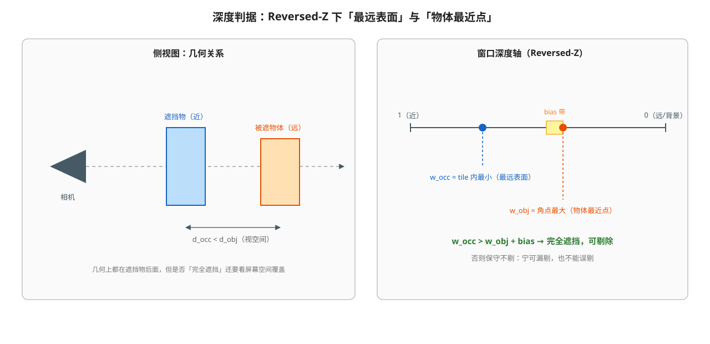
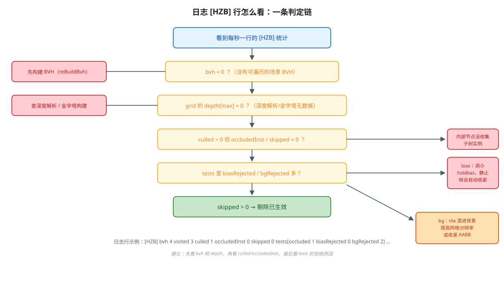

# 开发工作记录

> 本文按 **渲染** / **建模** 两个主题归档开发过程中完成的工作；渲染下分 **渲染效果** 与 **性能优化** 两个模块。
> 每个条目记录「做了什么 / 关键文件 / 结果」，近期重点（HZB 遮挡剔除、ParseScene 解析缓存）在 §1.2 展开。
>
> 相关文档：[HzbOcclusionCulling.md](./HzbOcclusionCulling.md)、[DepthPrecision.md](./DepthPrecision.md)、
> [BatchedMesh.md](./BatchedMesh.md)、[mass-entity-render-perf.md](./mass-entity-render-perf.md)、
> [SectionRendering.md](./SectionRendering.md)、[FeatureModeling.md](./FeatureModeling.md)、
> [SketchConstraints.md](./SketchConstraints.md)、[InteractiveWidget.md](./InteractiveWidget.md)、[todo.md](./todo.md)

---

## 1. 渲染

### 1.1 渲染效果

| 主题 | 完成内容 | 关键文件 |
|---|---|---|
| **IBL / 天空盒** | `SkyboxRenderPass` 完成 HDR 环境图 → CubeMap 转换、irradiance、prefilter、BRDF LUT 的全链路；材质面板 `u_Metallic` / `u_Roughness` 联动 | `renderer/SkyboxRenderPass.*`、`SkyboxConvert/Irradiance/Prefilter.ovfx`、`Lighting/IBL.ovfxh` |
| IBL 反射方向修复 | 之前金属度=1、粗糙度≈0 时，移动相机模型表面的天空反射不变化。定位为反射向量在 view space 与 world space 之间混用，修正后反射随相机正确变化（顺带确认：平面反射的射线方向与平面平移无关） | 同上 + `skybox/Material` 属性传递 |
| **透明与深度剥离** | 深度剥离实现透明排序（`mBlendFbo` + `mLayerFbo[]` 逐层 peel）；修复正交相机下的条纹；打通「材质面板改 `u_Albedo` 透明度 → 透明队列分发 → Transparent pass」链路 | `SceneRenderer.cpp`（TransparentRenderPass）、`PropertyWidget.cpp` |
| **剖切与截面** | `ClipPlane` 交互 widget 实时剖切；截面渲染从 CPU 交线三角化改为 GPU 逐像素奇偶（模板 `INVERT`）；修复截面光照（法线取剖切平面法线）、背面穿透、以及远景随相机变化的条纹 | `Interactive/Widgets/ClipPlane.*`、`SceneRenderer`（SectionCap/SectionContour）、`Section*.ovfx`、[SectionRendering.md](./SectionRendering.md) |
| **线面深度冲突** | `res` 模型中线与面共面时被面遮挡：采用 reverse-Z + 深度比较策略（线用 `GREATER_EQUAL`）+ 多边形偏移；`PickingRenderPass` 的 id 绘制同步同一深度策略 | `LineRenderPass`、`PickingRenderPass`、[DepthPrecision.md](./DepthPrecision.md) |
| **SSAO** | `GbufferPass` 的 SSAO 变体与材质面板开关；改为深度感知采样、7×7 模糊；缓解边缘变钝；当前 SSAO / Reflect feature 暂时整体禁用（commit `2cb9fc7c`） | `GbufferPass.*`、`ssao.ovfx`、`ssaoblur.ovfx` |
| **路径追踪** | 场景 mesh → 顶点/索引 TBO + BVH TBO，`PathTraceRenderPass` 做光追；新增低分辨率变体 `PathTraceLowRes.ovfx`；正交/透视切换时重建累积与变体；每个 solid 一种配色（修正 domainId → solidId 的映射） | `renderer/PathTraceRenderPass.*`、`PathTrace/*.ovfx` |
| **拓扑与网格可视化** | `TopoShape` 离散化时按拓扑结构建 Actor（Solid/Shell/Face/Edge），并加 `AllFaces` / `AllEdges` 锚点；支持从祖先节点整体显隐、边隐藏、相机 fit 与拾取 | `core/component/CTopoShape.*`、`TopoShapeActor.*`、`TreeViewPanel` |
| **反射平面 / 其它** | `GridRenderPass` 固定尺寸反射平面；编辑器叠加层（FPS、帧吞吐、Gbuffer 调试视图） | `renderer/GridRenderPass.*`、`viewerwidget.cpp` |

---

### 1.2 性能优化

#### 1.2.1 合批渲染与可见性索引（BatchedMesh）

- 把同一模型离散化后的面/线合并成合批 mesh，减少 draw call；
- 用「重建可见索引」的方式支持对合并 mesh 做按拓扑节点的显隐与拾取，使合批与拓扑交互不冲突。
- 详见 [BatchedMesh.md](./BatchedMesh.md)。

#### 1.2.2 HZB 遮挡剔除（本阶段重点）

**目标场景**：CAD 装配，2 万+ mesh 实例全部落在视锥内、彼此遮挡明显，视锥剔除基本无效。

**原理**（详见 [HzbOcclusionCulling.md](./HzbOcclusionCulling.md)）：

```text
帧 N   ：不透明绘制 → 深度 → 2×2 逐级取「最远表面」（Reversed-Z 下取 min）→ 网格（≤64×64）
帧 N+1 ：BVH 节点 AABB → 屏幕矩形 → 查网格最远深度 → tileMin > 最近点 + bias → 整棵子树剔除
```



**初版实现**（commit `00f30449`）

| 模块 | 内容 |
|---|---|
| `HzbBuildPass` | 解析 MSAA 深度 → R32F 金字塔逐级 reduce → 回读最小一级 → 交给 culler；pass order `35000` |
| `HzbCuller` | CPU 侧 BVH 分层遍历、节点 AABB → 屏幕矩形 → tile 深度测试、统计输出 |
| `SceneRenderer` | pass 注册、`FilterDrawables` 中按遮挡结果跳过 drawable |
| `HzbReduce.ovfx` | 2×2 取最远表面（本项目 Reversed-Z 下为 min）的降采样 shader |

**本阶段发现并修复的问题**

| 问题 | 现象 | 修复 |
|---|---|---|
| 内部节点剪枝不记录实例 | `culled nodes > 0` 但 `occludedInst / skipped = 0`，省了遍历却没省 draw call | 节点判定遮挡后收集**整棵子树**的叶子实例再剪枝 |
| 遮挡结果按 `Mesh*` 记录 | CAD 里同一标准件复用同一 `Mesh*`，一个实例被挡会把所有共用该 mesh 的 drawable 一起剔掉（遮挡物自身也消失） | 改为按 `(Mesh*, actorID)` 的 `InstanceKey` 记录，`IsOccluded(mesh, actorID)` 匹配 drawable |
| 固定窗口深度偏置过大 | 零件贴合时深度差极小，偏置把几乎所有候选都拒掉（`biasRejected` 高） | 改为**相对偏置** `bias = max(effectiveBias × closestDepth, 1e-9)`（`Δw/w ≈ Δd/d`，与距离无关）；并比较前后帧 view-projection 矩阵，**相机静止时自动降到 1e-6 量级** |
| tile 扫描整片矩形 | 大节点的覆盖矩形被完整扫描，成本高 | 发现任一 tile 不满足遮挡条件即**提前退出** |
| 每帧/每节点堆分配 | 遍历栈、子树的 vector 每帧、每节点新建 | 遍历栈 / 子树栈改为成员复用；遮挡集合 `reserve(instanceCount)` |
| BVH 未构建时静默失效 | 不点 `reBuildBvh` 时 `bvh 0 / visited 0`，观感像"剔除没生效" | 统计里区分并给出明确提示；文档说明 BVH 必须手动构建 |
| 剔除与 pass 开关不联动 | 关掉 HZB pass 后上一帧结果仍在生效 | `FilterDrawables` 检查 HZB pass 是否启用，未启用时 `ClearGrid()` 当帧完全不剔 |

**参数与开关**

- 偏置参数放在 **HZB pass** 上：`Depth Bias` / `Static Bias`，通过 `HzbPassComponent` 暴露到 **Settings → Passes → HZB**（连同 `Enable` 开关）；
- 之前放在 View 设置里的 `hzbBias` 节点与 viewerwidget 的同步代码已移除。

**异步回读（commit `0b1c1742`）**

- 回读从同步 `glReadPixels` 改为 **3 槽 PBO 环形缓冲 + fence**：每帧投递一次回读，读取两帧前那个已 fence 通过的槽；未 signaling 就跳过本帧更新并复用旧网格，不阻塞 CPU；
- 暴露 `readback slots / pending / skipped frames / latency frames` 统计；
- 文档同步修正了"回读延迟"的描述（commit `fb2d523a`）。

**调试统计**

打开 `Display → Show FPS`（`showFPS` 节点）后，视口叠加层输出：

```text
FPS / Frame ms
帧吞吐：顶点数、三角形/线条 batch 与 instance 数
[HZB] grid WxH depth[min max mean]
[HZB] bvh instances | visited | culled nodes | occluded meshes
[HZB] tests: occluded | bias rejected | bg rejected | best margin | bias
[HZB] skipped drawables | cull X ms
[HZB] readback slots (pending) | skipped frames | latency frames
```

判读流程：



| 统计 | 含义 |
|---|---|
| `bvh / visited` | BVH 实例数与本帧遍历节点数（`0` 说明 BVH 未构建） |
| `grid depth[max]` | 网格深度范围（`0` 说明深度解析/金字塔无数据） |
| `culled / occluded / skipped` | 被剪节点数 / 被判遮挡的实例数 / 真正跳过的 drawable 数 |
| `tests[bias rejected]` | 只差偏置没敢剔的节点数（偏置调优依据） |
| `tests[bg rejected]` | 覆盖区域混进背景（tile 太粗）的节点数 |
| `readback skipped / latency` | PBO 环形里错过 fence 的帧数与当前网格延迟 |

**实测数据**

| 指标 | 数值 |
|---|---|
| 场景 | CAD 装配，2 万+ mesh 实例 |
| HZB 剔除实例 | 1 万+ |
| CPU 侧剔除耗时（优化前） | ~4 ms |
| 剔除误剔 | 修正实例粒度后不再出现"遮挡物一起消失" |

**已知限制与后续**（见 §1.2.5 与 [HzbOcclusionCulling.md](./HzbOcclusionCulling.md) §9）

- 网格上限 64 → tile 约 30px，密集小零件容易被边界 tile 吃掉；CAD 可提到 128~256；
- culler 用 AABB，旋转零件的包围盒偏大，会漏剔（可换视空间 OBB / 凸包）；
- BVH 需手动重建（`reBuildBvh`），场景变更后忘记重建会误剔；
- 反射 pass 会用反射相机重跑 `FilterDrawables`，与主相机网格不匹配（当前 Reflection pass 已禁用）；
- MSAA 深度解析走 `glBlitNamedFramebuffer`，规范上要求采样数一致（驱动通常宽容）。

#### 1.2.3 ParseScene / FilterDrawables 优化与解析缓存

**背景**：Tracy 显示 actor 数量多时 `SceneRenderer::ParseScene` 单帧 50+ ms。

**原因**：瓶颈不在遍历，而在**每个 drawable 的堆分配与深拷贝**：

- `Drawable` 继承 `Describable`，其 descriptor 存储是 `unordered_map<type_index, std::any>`，两个 `AddDescriptor` = 2 个 map 节点 + 2 个 `std::any` 负载；
- `ParseScene` 里 `push_back(drawable)` 是深拷贝（再复制一份 descriptor 存储）；
- `FilterDrawables` 里 `auto drawableCopy = drawable;` 之后又 `emplace(key, drawableCopy)`，每个 drawable 深拷贝两次；
- `Mesh::GetMaterialIndex()` / `GetSubRangeBufferIndex()` 按值返回，每个 mesh 每帧 2 次 vector 分配。

**优化**

| 项 | 改动 |
|---|---|
| 去掉 vector 拷贝 | `Mesh::GetMaterialIndex/GetSubRangeBufferIndex` 改为返回 `const std::vector<uint32_t>&` |
| 去掉多余深拷贝 | `ParseScene`：`push_back(std::move(drawable))`，并用上一帧 drawable 数量 `reserve`；`FilterDrawables`：排序键字段（`order / materialKey / distance`）先算好，再 `emplace(key, std::move(drawableCopy))`（深拷贝 2→1） |
| **解析结果缓存** | 新增 `SceneRenderer::UpdateParsedDrawables()`：先算 64 位**内容签名**（actor 集合/激活、transform 矩阵、model 指针、mesh 材质索引/子区间/索引数/图元模式/包围球、材质列表、可见性标志、userMatrix、frustum 行为），签名不变直接复用缓存，变了才重新 `ParseScene` |
| **句柄式 descriptor** | 新增 `SceneDrawablesHandle { const SceneDrawablesDescriptor* }`：因为 `CompositeRenderer::EndFrame()` 会 `ClearDescriptors()`，若每帧把 2 万个 drawable 塞进 descriptor 就会整份深拷贝；现在每帧只放一个指向渲染器缓存的指针，命中时零拷贝零分配 |

**预期与验证**

- 场景不变（相机绕行）时 `ParseScene` 在 Tracy 中基本消失，只剩一次廉价的签名遍历；
- 需要在以下操作后确认画面正常刷新：拖动零件、树面板切显隐、修改材质、加载/删除模型、特征重建（圆角/倒角等换 mesh 的操作）。若某类操作不刷新，说明签名缺少对应字段，补进签名即可。

#### 1.2.4 深度精度：Reversed-Z + 动态近远平面

- 大模型场景下线/面深度冲突与"模型破碎"问题：near/far 比例过大导致深度精度不足；
- 方案：动态近远平面（near ∝ 相机距离）+ Reversed-Z（`glDepthRange(1,0)` + `depthFunc GREATER`），远平面 δZ 从"与 near/far 比例强相关"变为 `≈ far × 6e-8`；
- 数据对比与原理见 [DepthPrecision.md](./DepthPrecision.md)。

#### 1.2.5 后续优化路线（按优先级）

1. **遮挡剔除继续加强**：遮挡体筛选（只让近且大的物体写深度）、网格分辨率 128~256、隔帧剔除、`unordered_set` → 按实例索引的 flat bitset；
2. **多线程**：BVH 遍历按顶层子树并行（每个任务独立栈与结果，`Wait` 后按序归并；小场景走串行回退）；`ParseScene` / `FilterDrawables` 的数据并行（只读共享 + 每任务私有输出 + 按序合并，注意 multimap 等价键的插入顺序）；
3. **绘制提交**：flat vector + `stable_sort` 取代 `multimap`（消除每帧 2 万次节点分配）、64 位排序键、逐对象数据入 SSBO；
4. **GPU 驱动**：补 compute stage + indirect draw 后，可在 GPU 侧遍历 BVH 生成 indirect 参数（见 [todo.md](./todo.md)「HAL 能力」）；
5. **其它剔除**：屏幕尺寸剔除、LOD / 重要度预算（见 [mass-entity-render-perf.md](./mass-entity-render-perf.md)）。

---

## 2. 建模

### 2.1 草图（Sketcher）

| 模块 | 完成内容 | 相关文档 |
|---|---|---|
| SketcherObj | 几何/约束容器、求解调度、绘制与交互入口、可见性与选中状态 | [SketcherObj.md](./SketcherObj.md) |
| 建模 Handler 体系 | `DrawSketchDefaultHandler` 基类：事件 → 交互状态机 → 预览 → 提交；实现点/线/折线/圆/圆弧/椭圆/多边形/槽/圆弧槽/矩形（含圆角矩形）/BSpline/修剪/旋转/对称/Fillet/Offset 等工具 | [SketchModelingWidget.md](./SketchModelingWidget.md)、[SketchModelingWidgetArchitecture.md](./SketchModelingWidgetArchitecture.md)、`docs/SketchWidgets/*` |
| 约束系统 | 移植 FreeCAD 的 GCS：几何+约束 → 参数与方程、求解、删除清理、`setDatum`、构造几何、约束标注（相切/水平/垂直/平行/相等/重合/点在线/距离/角度/半径等） | [SketchConstraints.md](./SketchConstraints.md) |
| 绘制 | 曲线/点/构造几何虚线/约束标注图标与序号；点最后绘制避免被线遮挡；颜色、线宽、尺寸参数化并通过草图面板配置 | [SketchRendering.md](./SketchRendering.md) |
| 交互 | 拾取、吸附（曲线/端点/网格，像素阈值）、几何拖动语义（端点、边、圆心与半径）、框选 | [SketchInteraction.md](./SketchInteraction.md) |
| 面板 | `SketchTaskDialog`：背景网格、约束列表、曲线列表（图标 + 眼睛显隐 + 悬浮/选中联动） | — |

### 2.2 参数化 Feature

- 实现 `ExtrudeFeature` / `RevolveFeature` / `ThicknessFeature` / `FilletFeature` / `ChamferFeature` / `DatumLineFeature`，参考 FreeCAD 对应 Feature 的建模逻辑；
- 统一「预览形状」机制：`execute()` 计算 `Preview`，任务面板拖动参数即时刷新（`updateWidgetValue` → `setParamValue`）；
- 典型修复：凹边倒圆角时预览形状不可见的布尔方向判定、Fillet 半径的安全初值、360° 旋转接缝自交导致崩溃（改为错误日志 + 不崩溃）、反转/对称 Pad 的 taper 与拖拽句柄方向（commit `71851ed2` / `06560a70`）；
- 建模 → 属性 → UI 链路与设计说明见 [FeatureModeling.md](./FeatureModeling.md)。

### 2.3 拓扑与场景树

- `CTopoShape` 离散化 `TopoShape` 时按拓扑结构创建 Actor：`Solid → Shell → Face_*/Edge_*`，mesh 数据挂在对应的 Face/Edge 节点；边序号 = TopoDS 深度优先遍历顺序；
- 增加 `AllFaces` / `AllEdges` 锚点，用于整体显隐与相机 fit；修复"边全挂到第一个 shell"、"预览残留空 Face"等问题；
- 与合批 mesh 配合：通过重建可见索引控制显隐/拾取（§1.2.1）；
- TreeView 依据 Actor 父子关系生成树，支持眼睛显隐、悬浮高亮、与视口选中双向联动。

### 2.4 交互 Widget 体系

- 自研交互框架：widget 自己处理鼠标/键盘事件并维护状态机，渲染交给 renderer（`boxEdit` / 自定义 draw），拾取与事件分发统一；
- 已实现：`ClipPlane`、`ArrowRotateWidget`、`AxisTranslationWidget`、`PadTaskWidget`、`PrimitiveBox` 等；
- 统一支持「随相机远近保持固定屏幕尺寸」的绘制与拾取（箭头、圆环、路径圆弧等按屏幕尺度换算）；
- 架构、拾取与事件、状态转移、各 widget 用法见 [InteractiveWidget.md](./InteractiveWidget.md)。

### 2.5 相机与视图交互

- 轨道旋转（围绕旋转中心，中心可由拾取点指定）、平移、缩放、fit；
- 透视相机平移速度按模型尺寸自适应；大尺寸场景 fit 后视锥体计算修正；
- 透视/正交模式切换（Display 菜单）与路径追踪变体联动。

### 2.6 属性系统与编辑器 UI

- 属性/组件/Widget 三层结构（`PropertyComponent` → `WidgetProperty` → `PropertyQtWidget`），支持 Bool / SliderCheckBox / SliderFloat / SliderInt / FVec3 / Enum / ColorPicker / Texture；
- `CollapsibleGroupBoxWidget`（参考 inviwo）：折叠组、标签宽度上限、内容区背景区分；
- SettingPanel 用三层 CollapsibleGroupBox 分层（材质 / 调试 / 渲染 Pass），Pass 面板按 pass 类型生成专属参数控件（例：HZB 的 `Depth Bias` / `Static Bias`）；
- 日志面板：Level / Time / Message 三栏、级别过滤与着色、Clear、整块文本控件（避免每行一个 widget）；
- Dock 标题栏（Inviwo 风格）：标题 + 面板自定义控件（日志过滤/Clear 放在标题栏左侧）+ float/close；
- View 菜单：Hierarchy / Setting / Property / Task View / Log 显隐；Display 菜单：相机模式、Show FPS。

---

## 3. 文档与工程

- `docs/` 下按主题维护架构文档（见 README「架构文档」索引），插图统一放在 `docs/images/*.svg`；
- README 补齐功能清单、架构文档链接、构建说明与截图标注；
- 构建：CMake 生成 `Build/`，构建前需退出运行中的 `Moon.exe`（否则链接 `LNK1104`）；性能分析用 Tracy + 叠加层统计；
- 调试统计统一走 `showFPS` 叠加层（FPS、帧耗时、帧吞吐、HZB 全部统计），避免逐帧日志刷屏。

---

## 4. 近期提交记录

| 提交 | 日期 | 说明 |
|---|---|---|
| `5e1caba3` | 2026-09-12 | update |
| `2cb9fc7c` | 2026-09-11 | 暂时禁用 ssao 和 reflect feature |
| `7f958a35` | 2026-09-11 | fix bug |
| `722d2b7a` | 2026-09-11 | 材质排序和状态切换（排序键加入 materialKey，减少状态切换） |
| `912a7b6c` | 2026-09-11 | update |
| `71851ed2` | 2026-09-11 | fix(extrude): 修正反转/对称 Pad 的 taper |
| `06560a70` | 2026-09-11 | fix(extrude): Pad 拖拽句柄跟随 Reverse 方向 |
| `2076d577` | 2026-09-11 | docs(readme): 补剖切截面与 HZB 文档链接 |
| `fb2d523a` | 2026-09-11 | docs(hzb): 修正回读延迟描述 |
| `0b1c1742` | 2026-09-11 | perf(hzb): 3 槽 PBO 环形异步深度回读 |
| `36107822` | 2026-09-10 | 修复剔除 bug（实例粒度 / 子树收集 / 相对偏置等） |
| `00f30449` | 2026-09-10 | HZB 遮挡剔除初版 |
| `1a2f5fa6` | 2026-09-09 | FPS 性能统计接入菜单选项 |
| `04912ddd` | 2026-09-08 | FPS 性能统计 |

---

## 5. 待办

- 渲染 / 剔除：见 §1.2.5 与 [todo.md](./todo.md)；
- HZB 细节与限制：见 [HzbOcclusionCulling.md](./HzbOcclusionCulling.md) §9；
- 建模：草图剩余工具（部分 Handler 的约束补全）、装配层级剔除与 LOD 预算、材质系统重构（见 [todo.md](./todo.md)）。
