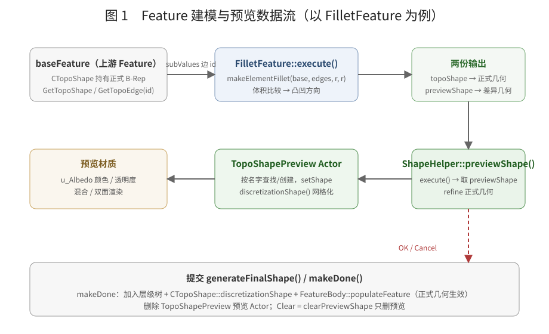
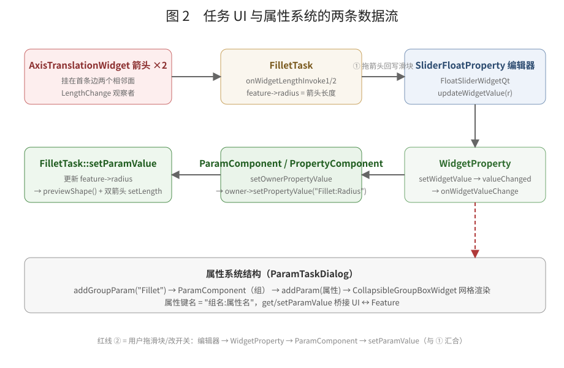

# Feature 参数化建模架构：预览 / 建模 / UI / 属性系统

> 本文以 `FilletFeature`（倒圆角）为完整示例，讲清四条线：
> **① 预览逻辑**、**② Feature 如何建模**、**③ 任务 UI 设计**、**④ 属性系统设计**。
>
> 涉及源码：
> `Moon/feature/Feature.h/.cpp`、`Moon/feature/FilletFeature.h/.cpp`、`Moon/feature/FeatureBody.h/.cpp`、
> `Moon/editor/UI/TaskPanel/BaseTaskDialog.*`、`ParamTaskDialog.*`、`ShapeHelper.*`、`FilletTask.*`、
> `Moon/Widgets/Property.*`、`PropertyComponent.*`、`SliderFloatProperty.*`、
> `Moon/editor/UI/PropertyPanel/Collapsiblegroupboxwidget.*`、`Moon/Interactive/Widgets/AxisTranslationWidget.*`

---

## 1. 总览：一条命令的完整旅程

```
用户在任务面板改参数 / 拖 3D 箭头
  → 属性系统（④）把值写回 Feature 成员
  → FilletTask::setParamValue → ShapeHelper::previewShape()
      → Feature::execute()（②）计算正式几何 + 差异预览几何
      → 预览 Actor 更新材质与网格（①）
  → 点 OK → generateFinalShape() → makeDone()（正式提交，进入特征树）
```





---

## 2. Feature 如何实现建模（②）

### 2.1 类层次

```cpp
TopoActor（ECS Actor，持有组件，可进场景/层级树）
   ▲
Feature : TopoActor
   ├─ 成员：m_baseFeature（上游特征）、subValues（选中子形状 id 列表）
   ├─ 虚函数：virtual bool execute()   // 每个特征的核心
   ├─ 数据访问：getBaseTopoShape() / getBaseTopoEdgeShapes() / getBaseTopoFaceShapes()
   └─ 提交：makeDone()
```

`Feature` 构造时把自己注册进 `FeatureBody`（全局特征链管理器），析构时移除。

### 2.2 上游数据：baseFeature + subValues

特征不是独立几何，而是**基于上游特征做布尔/形变**。上游形状通过两样东西定位：

1. `m_baseFeature`：哪个特征提供基础形状（`getBaseTopoShape()` 直接取它的 `GetTopoShape()`）；
2. `subValues`：选中了基础形状的哪些子元素（边/面），形如 `"Edge3"`、`"Face2"`。

```cpp
std::vector<Part::TopoShape> Feature::getBaseTopoEdgeShapes() {
    auto comp = m_baseFeature->GetComponent<Core::ECS::Components::CTopoShape>();
    std::vector<Part::TopoShape> ret;
    for (auto& s : subValues) {
        std::string idString = s.substr(5);          // "Edge3" → "3"
        ret.emplace_back(comp->GetTopoEdge(std::stoi(idString)));
    }
    return ret;
}
```

### 2.3 execute()：特征的核心算法

以 `FilletFeature::execute()` 为例，分四步：

```cpp
bool FilletFeature::execute() {
    Part::TopoShape baseShape = getBaseTopoShape();
    std::vector<Part::TopoShape> edges =
        useAllEdges ? baseShape.getSubTopoShapes(TopAbs_EDGE) : getBaseTopoEdgeShapes();

    Part::TopoShape resShape(0);
    resShape.makeElementFillet(baseShape, edges, radius, radius);   // OCCT 倒圆角

    topoShape->setShape(resShape.getShape());                      // ① 正式几何

    // ② 预览几何：比较体积判断凸/凹，做一次布尔切割得到“差异部分”
    double baseVol = ..., resVol = ...;                            // BRepGProp::VolumeProperties
    if (resVol < baseVol)      getPreviewShape() = baseShape.makeElementCut(resShape); // 凸：被切掉的材料
    else if (resVol > baseVol) getPreviewShape() = resShape.makeElementCut(baseShape); // 凹：新增的材料
    else                       /* 回退：空结果启发式 */;
    return true;
}
```

关键约定：

- `execute()` 每次调用都会**重建**两份几何：`topoShape`（正式结果，提交用）和 `previewShape`（本次修改的差异，预览用）；
- 因此**预览天然免费**：无论参数怎么变，重新 `execute()` 就能拿到新的差异几何；
- `execute()` 幂等、可反复调用，UI 每改一次参数就调一次；
- 失败返回 `false`，`ShapeHelper::previewShape` 据此报错而不是继续渲染。

### 2.4 提交：makeDone()

```cpp
void Feature::makeDone() {
    if (!hasInTree) { GetViewerWidget.addActorToTreeView(this); hasInTree = true; }
    auto comp = GetComponent<CTopoShape>();
    comp->discretizationShape();          // B-Rep → 三角网格，供渲染/拾取
    FeatureBody::instance().populateFeature(this);   // 更新特征链
}
```

`FeatureBody` 维护特征之间的先后链（`addFeature / removeFeature / populateFeature /
getLastBaseFeature / setBaseFeatureFor`），保证上游先于下游更新。

---

## 3. 预览逻辑（①）

预览全部由 `ShapeHelper` 完成，任务类（如 FilletTask）多重继承它获得预览能力。

### 3.1 previewShape()：重建预览 Actor

```cpp
void ShapeHelper::previewShape() {
    if (feature->execute()) {                       // 1. 重新建模
        mInternal->m_previewShape = feature->getPreviewShape();
        // 2. 正式几何 refine，让显示更干净
        shape.setShape(shape.makeElementRefine());
        // 3. 按名字查找/复用预览 Actor（不存在则创建）
        auto preActor = scene->FindActorByName("TopoShapePreview");
        if (!preActor) mInternal->m_previewActor = new TopoActor("TopoShapePreview", "TopoShape", true);
        // 4. 把差异几何塞进去并网格化
        topo.setShape(mInternal->m_previewShape);
        topoComp->discretizationShape();
        // 5. 预览材质：半透明 / 混合 / 双面
        tempMat->SetProperty("u_Albedo", FVector4(r,g,b,a));
        tempMat->SetTransparent(true); tempMat->SetDepthWriting(true);
        tempMat->SetBackfaceCulling(false); tempMat->SetFrontfaceCulling(false);
    }
}
```

要点：

- **预览是一个独立 Actor**（`TopoShapePreview`），和正式 Feature 分开存在场景里，因此可以随时增删而不影响正式模型；
- Actor **按名字查找复用**：反复 `previewShape()` 不会堆积 Actor；提交/取消时统一按名字删除；
- 材质用 `mPreviewOption` 控制：默认品红半透明（`r=1,g=0,b=1,a=0.4`），`isTransparent` 走透明通道，否则走混合通道（`isBlend` + `SetDrawOrder(10000)` 置顶）；
- `useDomainColor=false` 时加 `DISABLE_DOMAIN_COLOR` feature，强制用统一色而不是域色。

### 3.2 提交与清理

```cpp
void ShapeHelper::generateFinalShape() {
    // 停用其它 Feature（避免多个特征同时生效）
    for (auto& ac : scene->GetActors())
        if (dynamic_cast<Feature*>(ac) && ac != feature) { ac->SetActive(false); /* 刷新树 */ }
    feature->makeDone();               // 正式提交（进树 + 网格化 + 特征链）
    // 删除预览 Actor
    removeActorFromTreeView(preActor); scene->RemoveActor(preActor); delete preActor;
}

void ShapeHelper::clearPreviewShape() { /* 只删 TopoShapePreview，不动 feature */ }
```

### 3.3 子形状选择（预览的输入）

`ShapeHelper` 构造时向 `SelectionManager` 订阅 `SelectAny`，选中边/面时回调：

```cpp
void ShapeHelper::onSelectAny() {
    ViewTool::getSelectedTopoShape(shapes);
    if (shapes[1].ShapeType() == TopAbs_EDGE) onSelectEdge(shapes);
    else if (shapes[1].ShapeType() == TopAbs_FACE) onSelectFace(shapes);
}
```

子类覆写 `onSelectEdge/onSelectFace` 把选中子形状写进 `feature->subValues`，从而决定
`execute()` 对哪些边/面生效。

---

## 4. 任务 UI 设计（③）

### 4.1 三层对话框框架

```
BaseTaskDialog（QWidget）：mainLayout() + 纯虚 buildUi/clickOk/clickApply/clickCancel
   ▲
ParamTaskDialog：参数组管理（addGroupParam/addParam/buildUi），实现属性系统桥接（见⑤）
   ▲
FilletTask：具体任务（创建/复用 Feature、挂 3D 箭头、参数 ↔ Feature 双向同步）
```

### 4.2 FilletTask 构造：创建/复用 Feature

```cpp
FilletTask::FilletTask(parent, feature) {
    if (feature) { mInternal->feature = dynamic_cast<FilletFeature*>(feature); }
    else {
        // 从当前选中创建新特征
        ViewTool::getSelectedBasedFeature(baseFeature, subValues);
        feature = new FilletFeature("Fillet");
        feature->setBaseFeature(baseFeature);
        feature->setSubValues(subValues);
        self->setFeature(feature);
        // 按包围盒对角线初始化半径与箭头缩放
        feature->len    = bbox.CalcDiagonalLength() * 0.01;
        feature->radius = bbox.CalcDiagonalLength() * 0.03;
    }
}
```

这是“**任务对话框负责特征生命周期**”的设计：新建的特征由任务持有，Cancel 时删除。

### 4.3 3D 交互：双箭头手柄

```cpp
// 取第一条边的两个相邻面，各挂一个箭头（朝各自面法线）
auto [face1, face2] = getAdjacentFacesFromEdge(edge, baseShape);
DraggerPlacementProps props1 = getDraggerPlacementFromEdgeAndFace(edge, face1);
DraggerPlacementProps props2 = getDraggerPlacementFromEdgeAndFace(edge, face2);
feature->origin1/dir1 ← props1;   feature->origin2/dir2 ← props2;

axisBehaviour1 = new AxisTranslationWidget("fillet");
axisBehaviour1->setUpScale(feature->len);        // 固定屏幕尺度（与相机无关）
axisBehaviour1->setLength(feature->radius);      // 箭头长度 = 半径
axisBehaviour1->setUpOrigin(origin1); setUpDir(dir1);
axisBehaviour1->AddObserver(AxisTranslationEvent::LengthChange, this,
                            &FilletTask::onWidgetLengthInvoke1);
```

拖箭头 → `LengthChange` → 回调把 `feature->radius = 箭头长度`，再通过属性系统回写滑块
（见第 5 节），滑块回写又触发 `setParamValue → previewShape`——**一条闭环**。

### 4.4 参数面板与按钮

```cpp
PropertyComponent* p = addGroupParam("Fillet");
radiusProp = new SliderFloatProperty("Radius", p);   radiusProp->setMinMax(0.1, 10);
addParam(radiusProp);
addParam(new BoolProperty("Use ALL Edges", p));
buildUi();   // 生成 CollapsibleGroupBoxWidget 组
```

| 交互 | 入口 | 效果 |
| --- | --- | --- |
| 改滑块/开关 | `setParamValue` | 写 Feature + `previewShape()` 刷新 |
| 拖箭头 | `LengthChange` 观察者 | 写 Feature → 回写滑块 → 同一条 `setParamValue` 链 |
| OK | `clickOk → generateFinalShape` | 正式提交 + 删预览 |
| Apply | `clickApply` | 预留（当前为空） |
| Cancel | `clickCancel → clearPreviewShape` | 删预览；若为新建特征则从场景删除并释放 |

---

## 5. 属性系统设计（④）

### 5.1 角色划分

```
WidgetProperty（描述一个属性：名字 + 如何创建编辑器）
   │ createEditorWidget() 惰性创建
   ▼
PropertyQtWidget（编辑器，如 SliderFloatProperty 的 FloatSliderWidgetQt）
   │ widgetValue() / setWidgetValue()
   ▼
PropertyComponent（组容器：持有若干 WidgetProperty）
   │ getPropertyValue/setPropertyValue → 桥接到业务层
   ▼
CollapsibleGroupBoxWidget（折叠组 UI：label + 编辑器网格）
```

### 5.2 属性如何“值”驱动

```cpp
// WidgetProperty
void WidgetProperty::updateWidgetValue(const QVariant& v) { mWidget->setWidgetValue(v); }
void WidgetProperty::onWidgetValueChange() { setOwnerPropertyValue(mWidget->widgetValue()); }
void WidgetProperty::setOwnerPropertyValue(const QVariant& v) { owner->setPropertyValue(mName, v); }
```

两条方向：

| 方向 | 路径 | 说明 |
| --- | --- | --- |
| UI → 业务 | 编辑器信号 → `onWidgetValueChange` → `setOwnerPropertyValue` → `PropertyComponent::setPropertyValue` | 用户操作写回业务层 |
| 业务 → UI | `updateWidgetValue` → `setWidgetValue` | 程序刷新编辑器显示 |

**一个容易踩坑、但被巧妙利用的细节**：`updateWidgetValue` 对滑块这类控件会**再次触发
`valueChanged`**（`SliderWidgetQt::setValue → applyValue → emit valueChanged`），从而回环进入
`setOwnerPropertyValue`。FilletTask 正是靠这一点让“拖箭头 → 回写滑块 → 自动走 setParamValue →
刷新预览”成立。而 `NumberWidget`（QLineEdit 系）用 `initValue` 不发信号，所以不会回环——不同
编辑器对“程序刷新是否回写”语义不同，写新控件时要注意。

### 5.3 组与命名空间：ParamComponent

任务对话框里每个折叠组是一个 `ParamComponent`，把属性键名加上组前缀：

```cpp
class ParamComponent : public PropertyComponent {
    QVariant getPropertyValue(const QString& name) override { return owner->getParamValue(group + ":" + name); }
    void setPropertyValue(const QString& name, const QVariant& v) override { owner->setParamValue(group + ":" + name, v); }
};
```

于是 `FilletTask::setParamValue` 收到的是 `"Fillet:Radius"`、`"Use ALL Edges"` 这种**带命名空间**
的键名，同一个任务里多个组不会撞名。

### 5.4 渲染：CollapsibleGroupBoxWidget

```cpp
// ParamTaskDialog::addParam / buildUi
groupToIndex[groupName] = m_comps.size();
auto collpase = new CollapsibleGroupBoxWidget(groupName, this);
auto p = new ParamComponent(this, groupName);
// buildUi：把每个组的属性逐行加进折叠组的 label + 编辑器两列网格
```

折叠组复用属性面板的同一套控件（`PropertyLabel` / 编辑器列 / `addSubWidget` 跨列），
所以任务面板和属性面板风格一致。

### 5.5 完整闭环（结合 FilletTask）

```
用户拖 3D 箭头
  → AxisTranslationWidget::onMouseMove → InvokeEvent(LengthChange)
  → FilletTask::onWidgetLengthInvoke1
      → feature->radius = getLength()
      → radiusProp->updateWidgetValue(radius)          ← 业务 → UI
          → SliderWidgetQt::setValue → emit valueChanged
          → WidgetProperty::onWidgetValueChange
          → setOwnerPropertyValue → ParamComponent::setPropertyValue("Fillet:Radius")
          → FilletTask::setParamValue("Fillet:Radius")
              → feature->radius = value
              → axisBehaviour1/2->setLength(radius)    ← 双箭头同步（setLength 不发事件，无环）
              → previewShape()                          ← 预览刷新
```

用户拖滑块则直接走 `setParamValue`（红色虚线路径），两条路在 `setParamValue` 汇合。

---

## 6. 设计要点总结

| 关注点 | 设计 |
| --- | --- |
| 预览与正式解耦 | `execute()` 同时产出 `topoShape`（正式）与 `previewShape`（差异），预览 Actor 独立于 Feature |
| 幂等重建 | 每次参数变化都重新 `execute()`，预览免费获得 |
| 生命周期归任务 | 新建的 Feature 由任务持有，Cancel 删除，OK 提交 |
| UI 与建模解耦 | 任务类通过 `ParamComponent`/`setParamValue` 桥接，不直接操作控件 |
| 3D 手柄复用 | `AxisTranslationWidget` + 观察者，任务只关心 `LengthChange` 后的值同步 |
| 属性系统双向 | UI→业务（信号）与业务→UI（updateWidgetValue）闭环，且依赖控件“刷新是否回写”的语义 |
| 命名空间键 | `"组名:属性名"` 避免多组冲突 |

## 7. 已知小问题

- `FilletTask::clickApply()` 为空，OK/Apply 目前等价；
- `FilletFeature::execute()` 里 catch 之后的 `return true` 不可达；
- 预览 Actor 用固定名字 `"TopoShapePreview"`，若同一帧多个任务并存会互相覆盖（当前任务一次只开一个，可接受）。
