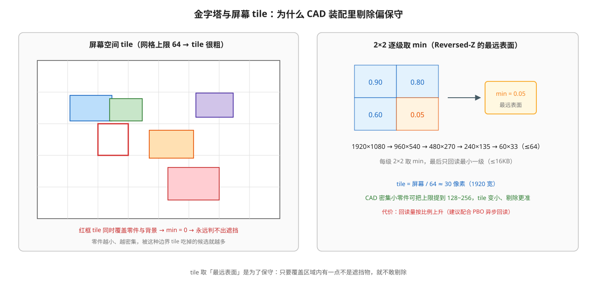
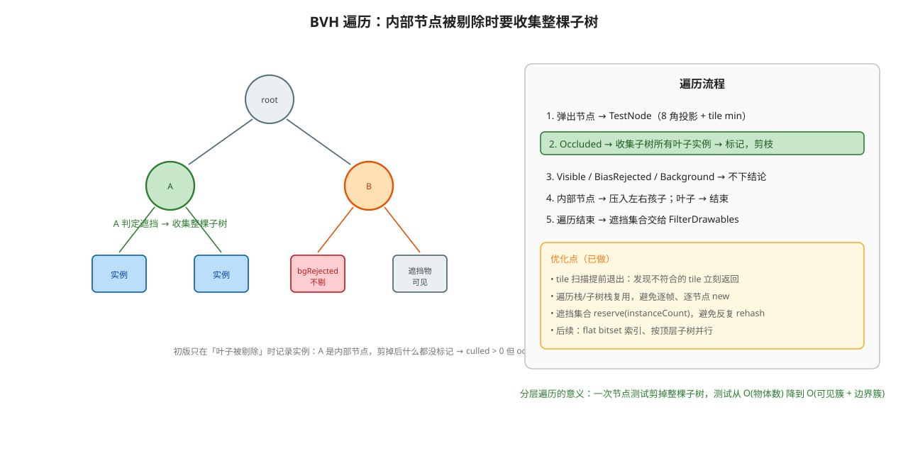
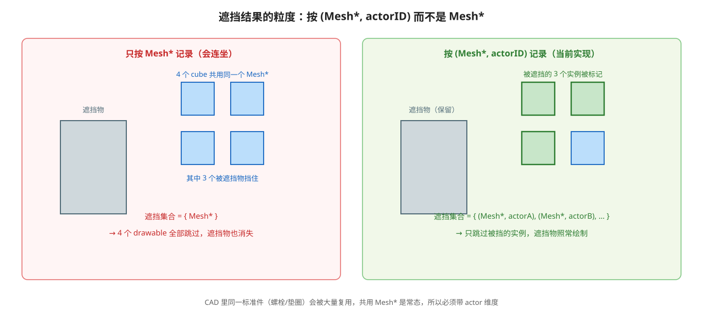

# HZB 遮挡剔除：实现与工作原理

> 相关文档：[mass-entity-render-perf.md](./mass-entity-render-perf.md)（海量实体渲染的总体优化路线）、
> [BatchedMesh.md](./BatchedMesh.md)（合批，链路的第一级压缩）
> **深度约定**：[DepthPrecision.md](./DepthPrecision.md)（本项目使用 **Reversed-Z** + 动态近远平面）
>
> 适用场景：大量 entity 都在视锥内、但彼此存在遮挡关系（装配体、密集零件）。
> 本文记录本项目中**已落地的最小可用实现**（第一版）：CPU 侧 BVH 分层测试 + GPU 侧深度金字塔 + 小网格回读。

---

## 1. 一句话原理

先由上一帧的不透明深度建立一张「**最远深度**」金字塔（Reversed-Z 下即逐级取 **min**），然后本帧用 BVH 自顶向下测试：
**如果某个节点整体都比它覆盖区域里最远的那个表面还远，那么这个节点一定被完全遮住了，整棵子树可以扔掉。**

```text
上一帧：不透明绘制 → 深度 → 2×2 逐级取 min（Reversed-Z）→ 小网格（≤64×64）
本帧  ：BVH 节点 AABB → 屏幕矩形 → 查网格拿最远深度 → 比较 → 整棵剪枝
```

---

## 2. 为什么是「最远深度」金字塔

### 2.1 判据推导

逐像素的遮挡判据很直白：物体 O 被完全遮挡 ⟺ 它投影覆盖的**每个像素**上已绘制的表面都比 O 的最近点更靠近相机。

但逐像素比较太贵，于是把屏幕切成 tile，用**一个保守值**代表整个 tile：取该 tile 内所有像素深度的**最大值**（最远的那个表面）。于是：

```text
if (tile 内最远表面比物体的最近点还近)     // 用深度值比较，见 §2.2
    → tile 里连最远的表面都比物体近 → 物体必然完全被遮挡 → 剔除
```

这就是经典的 HZB（Hierarchical Z-Buffer）遮挡剔除。金字塔按 2×2 逐级取「最远表面」构建（本项目 Reversed-Z 下即取 **min**），于是任意矩形区域只需查**少数几个 texel**（本实现取覆盖范围内最远的那一个）即可得到保守判断。

### 2.2 方向不能搞错

| 管线深度约定 | 深度值含义 | 「最远表面」= | 金字塔用 | 判据（`objNear` = 物体最近点） |
|---|---|---|---|---|
| 标准（近→0、远→1，`depthFunc=LESS`） | 值大 = 远 | max | **max** | `tileMax < objNear - bias` |
| **Reversed-Z（近→1、远→0，`depthFunc=GREATER`）——本项目** | 值大 = 近 | min | **min** | `tileMin > objNear + bias` |

本项目的 Reversed-Z 由两处共同构成：`GLBackend` 里 `glDepthRange(1.0, 0.0)`（反转 NDC→窗口深度），
`PipelineState` 默认 `depthFunc = GREATER`（比较方向同时反转），清屏深度为 **0**。详见
[DepthPrecision.md](./DepthPrecision.md)。

因此在 HZB 里：**金字塔取 min，物体最近点取各角点的 max**，判据是 `tileMin > objNear + bias`。
另外别和 **Hi-Z** 混淆：GPU 光栅化层次深度测试用的那张金字塔存的是**最近**深度，目的是加速逐像素 depth test；遮挡剔除存的是**最远**，方向正好相反。


> 左侧是几何关系，右侧是 Reversed-Z 窗口深度轴：`w_occ` 是遮挡物在 tile 里的**最远**表面（值最小），`w_obj` 是被测物体角点的**最近**点（值最大）。只有 `w_occ > w_obj + bias` 才判为完全遮挡；`bias` 用来吸收一帧延迟与深度量化误差。

### 2.3 为什么用「上一帧」的深度

本帧的深度要等绘制完才有，而剔除必须在提交绘制**之前**完成。用上一帧的深度：

1. 时序上成立（剔除 → 绘制 → 建立下一帧要用的金字塔）；
2. 可以完全避开 GPU→CPU 同步：回读走 PBO 环形缓冲（§5.4），CPU 从不等 GPU；
3. 代价是**延迟**：网格要等回读才落到 CPU 手上，比绘制晚 1~3 帧（§5.4），
   所以偏置要按「相机可能已经动过几帧」来留余量（见 §6.4）。

---

## 3. 在渲染管线中的位置

```text
Shadows(10000) → Skybox(10001) → Gbuffer(19999) → Opaques(20000)
   → SectionCap(25000) → SectionContour(25001) → Transparents(30000)
   → 【HZB(35000) ← 本次新增】
   → Post-Process(40000) → Lines(40002) → UI(50000)
   → … → Last（Picking / Gizmo / Debug Actor）
```

新增 `ERenderPassOrder::HzbBuild = 35000U`，插在**不透明与剖面封盖之后、后处理之前**。

每帧的数据流：

```text
帧 N
 ├─ Opaques / SectionCap 写入 MSAA 缓冲（颜色 + 深度）
 ├─ Transparents：depth peeling，透明深度写在 mLayerFbo[i]，不污染主深度
 ├─ HZB pass：
 │    ① CopyFramebufferDepth(MSAA → 自建 DEPTH_COMPONENT32F 纹理)   ← 解析 MSAA
 │    ② 逐级 2×2 取 min（Reversed-Z），减半到 ≤ 64×64 的 R32F 网格
 │    ③ glReadPixels 写进 PBO（异步）→ 1~3 帧后 fence 已就绪时 MapRead → HzbCuller::SetGrid()
 └─ Post-Process 及之后（不受影响）
帧 N+1
 └─ SceneRenderer::FilterDrawables → HzbCuller::Cull(BVH) → 被遮挡的 actor 不进绘制列表
```

---

## 4. 深度从哪来（关键设计点）

### 4.1 不能直接用 `mBlendFbo` 的深度

`TransparentRenderPass` 确实把不透明深度解析进了 `mBlendFbo`：

```cpp
// TransparentRenderPass::Draw
if (drawables.transparents.size() > 0) {
    CopyFramebufferColor(msaa, mBlendFbo);
    CopyFramebufferDepth(msaa, mBlendFbo);   // ← 深度解析在这里
    // ... depth peeling ...
}
```

但整段逻辑包在 `if (transparents.size() > 0)` 里：**场景里没有透明物体时这段不会执行**，`mBlendFbo` 的深度就不是本帧数据。HZB 的输入不能依赖另一个 pass 的内部分支，所以本实现选择自己解析。

### 4.2 本实现的做法

`HzbBuildPass` 自建一张 `DEPTH_COMPONENT32F` 纹理（并配一个占位 COLOR 附件，因为 `CopyFramebufferDepth` 用 COLOR 附件取尺寸），每帧执行：

```cpp
::Core::Rendering::FramebufferUtil::CopyFramebufferDepth(msaaBuffer, m_resolveFbo);
```

内部是 `glBlitNamedFramebuffer(..., GL_DEPTH_BUFFER_BIT, GL_NEAREST)`，从多重采样深度 → 单采样深度即完成 **MSAA 解析**（该项目在 `TransparentRenderPass` 里已经在用同一套 blit 解析深度，路径是验证过的）。

### 4.3 为什么透明不会被误当作遮挡物

因为透明的深度写在 peeling 的层缓冲里（`mLayerFbo[i]`，`depthWriting=true`），而最终 blend 回 `mBlendFbo` 时 `blit.stateMask.depthWriting = false`。所以从 MSAA 缓冲解析出来的深度**只有不透明 + 剖面封盖**——正好是遮挡剔除期望的遮挡物集合（半透明面不应遮挡任何东西）。

---

## 5. 金字塔构建的实现

### 5.1 目标和格式

- 每级是一张 **R32F** 单通道纹理（`EInternalFormat::R32F` + `EFormat::RED`/`FLOAT`，`NEAREST` 过滤、`CLAMP_TO_EDGE`）；
- 每级尺寸为上一级的 1/2，直到宽高都 ≤ `m_maxGridSize`（默认 **64**），最多 16 级；
- 1920×1080 时约 5 级，总像素约为全屏的 1/3，开销可忽略。



> 2×2 逐级取 min 得到金字塔；网格上限 64 意味着一个 tile 覆盖屏幕约 1/64（1920 宽时约 30 像素）。红框那种**同时覆盖零件和背景**的 tile，min 会被背景拉到 0，该区域永远判不出遮挡——这是 CAD 密集装配里剔除偏保守的主要原因之一。

### 5.2 reduce shader

`Resource/Moon/Data/Engine/Shaders/PostProcess/HzbReduce.ovfx`：输出 texel 覆盖输入的 2×2 区块，取四者中**最远**的那个 —— Reversed-Z 下即**最小值**。

```glsl
vec2 halfTexel = 0.5 / _InputResolution;
float a = texture(_InputTexture, TexCoords + vec2(-halfTexel.x, -halfTexel.y)).r;
float b = texture(_InputTexture, TexCoords + vec2( halfTexel.x, -halfTexel.y)).r;
float c = texture(_InputTexture, TexCoords + vec2(-halfTexel.x,  halfTexel.y)).r;
float d = texture(_InputTexture, TexCoords + vec2( halfTexel.x,  halfTexel.y)).r;
FRAGMENT_COLOR = vec4(min(min(a, b), min(c, d)), 0.0, 0.0, 1.0);
```

深度纹理用普通 `sampler2D` 采样即可（返回值在 `.r`），这与该项目 depth peeling 中采样深度纹理是同一套做法。
换成非 Reversed-Z 的管线时，这里必须改成 `max`（否则会把「最近的表面」当作遮挡物，导致误剔）。

### 5.3 两个绘制路径

引擎没有 compute shader（`EShaderType` 只有 `NONE/VERTEX/GEOMETRY/FRAGMENT`），所以金字塔用**全屏 fragment pass 逐级降采样**，复用现成基础设施：

| 步骤 | 输入 | 用法 |
|---|---|---|
| 第 1 级 | **深度纹理**（不是 FBO 的颜色附件） | `m_renderer.Present(*m_resolveDepth, m_reduceMaterial)`：该重载会把纹理绑成 `_InputTexture`，再在当前绑定的目标上画全屏 quad |
| 第 2..N 级 | 上一级的 **R32F 颜色** | `m_renderer.Blit(pso, 上一级, 本级, m_reduceMaterial, FILL_INPUT_TEXTURE \| UPDATE_VIEWPORT_SIZE)`——`Blit` 会把源的颜色附件绑成 `_InputTexture`（`BloomEffect` 降采样链的同一套写法，`BloomDownsampling.ovfx` 是最佳模板） |

注意 `Blit` 的 `RESIZE_DST_TO_MATCH_SRC` 不能开（各级尺寸本就不同），所以显式传 flag 而非 `DEFAULT`；视口在绘制前用 `SetViewport(0,0,levelW,levelH)` 设为当前级尺寸。

### 5.4 回读：异步 PBO 环形缓冲

只读**最小的那一级**（≤64×64 的 R32F = 最多 16KB），而且**不阻塞 CPU**：

```text
每帧：
  ① ConsumeReadyReadback()   // 从环形里挑最早的一个槽，若它的 fence 已 signal → MapRead → SetGrid
  ② IssueReadback()          // 把本帧的最小级 glReadPixels 写进下一个空闲 PBO，并插一个 fence
```

为什么不能直接 `ReadPixels` 到 CPU 内存：`glReadPixels` 会等待 GPU 把这一帧画完（隐式同步），
于是每帧白白多出一次 pipeline stall——**省下来的 draw 提交时间可能还不够赔这次等待**。
把目标换成 PBO 之后写入是异步的，CPU 立刻返回。

落地的三层：

| 层 | 改动 |
|---|---|
| HAL 设置 | `EBufferType` 增加 `PIXEL_PACK`（映射到 `GL_PIXEL_PACK_BUFFER`） |
| HAL 缓冲 | `TBuffer` 增加 `MapRead/Unmap/InsertFence/IsFenceSignaled/ClearFence`（GL 侧用 `glMapNamedBufferRange` / `glFenceSync` / `glClientWaitSync`），`GLBufferContext` 存 `GLsync` |
| HAL 帧缓冲 | `TFramebuffer::ReadPixelsToBuffer()`：绑定 PBO 后 `glReadPixels`，此时指针参数是**PBO 内的字节偏移** |

`HzbBuildPass` 里是一个 **3 槽**环形：

- `SetupTargets()` 计算完网格尺寸后按 `gridW * gridH * 4` 字节分配 3 个 PBO（`STREAM_READ`）；
- `ConsumeReadyReadback()` 从**最早**的槽开始找，用 `glClientWaitSync(..., 0)` 做非阻塞检查：
  - 已 signal → `MapRead` 取数据 → `HzbCuller::SetGrid()` → `Unmap` → 删 fence；
  - 未 signal → 本帧不消费（网格保持上一份，剔除照常工作）；
- `IssueReadback()` 写下一个槽；若该槽上一轮的数据还没被消费（GPU 落后整整一圈），
  **本帧跳过提交**并累加 `skippedFrames`，绝不在这里等 GPU。

延迟由「要错过几帧才轮得到消费」决定：同一帧里 `ConsumeReadyReadback()` 跑在
`IssueReadback()` **之前**，所以本帧提交的数据最早只能在**下一帧**被取回——**下限 1 帧**。
GPU 跟得上时就是这个值（本机实测稳态 `pending 1 / latency 1`），
此时网格的新鲜度和初版的同步回读**完全一样**，而 stall 已经消掉。

只有当 GPU 真的落后（帧太快、驱动排队）时 `pending` 才会上涨，`latency` 最多到 3
（槽数）；再落后就跳过提交，绝不在这里等 GPU。所以环形缓冲是**兜底**，
不是「必然多 2 帧延迟」。

调试叠加层里新增一行：

```text
[HZB] readback slots 3 (pending 1) | skipped frames 0 | latency 1 frames
```

判读：

- `pending 1` + `latency 1` 是稳态理想情况：每帧提交一个、下一帧就取回一个，
  `latency` 不会低于 1（代码结构决定的），看到 1 说明没有额外开销；
- `pending` 涨到槽数 3 = GPU 落后整整一圈，此时剔除用的是更旧的网格；
- `skipped frames` 偶发增长无害（只是网格更旧），持续增长说明 GPU 长期跟不上；
- `latency` 长期大于 3 说明消费侧被别的同步点拖住了，要去查别的 `glReadPixels`/`glGet*`。

### 5.5 一个必须避开的坑：别把 `Framebuffer` 放进会扩容的容器

`GLFramebuffer` 没有自定义拷贝/移动构造，而它的析构函数会 `glDeleteFramebuffers(1, &m_context.id)`。
把 `Framebuffer` **按值**放进 `std::vector` 时，扩容会「复制旧元素 → 销毁旧元素」，
于是旧元素的析构把 GL 名字删掉，而新元素仍持有那个**已删除的 id**，
之后对它 `Bind()` 就会报：

```text
GL_INVALID_OPERATION: Framebuffer name must be generated before being bound.
```

因此本实现的每级金字塔帧缓冲用 `std::vector<std::unique_ptr<Framebuffer>>` 持有
（移动 `unique_ptr` 不会触碰帧缓冲对象本身）。项目里 `SceneRenderer::mLayerFbo` 用
`resize(8)` 一次成型、之后不再扩容，所以没有暴露这个问题——但新增代码若在循环里
`emplace_back` 帧缓冲就会踩到。

---

## 6. CPU 侧：BVH 分层遮挡测试

### 6.1 数据结构

项目已有的场景 BVH 正好满足需求（原本服务于拾取与路径追踪）：

```cpp
struct Bvh::Node {
    bbox bounds;            // world space AABB
    NodeType type;          // kInternal | kLeaf
    union {
        struct { Node* lc; Node* rc; };              // 内部节点
        struct { int startidx; int numprims; };      // 叶子
    };
};
inline int const* Bvh::GetIndices();                 // 叶子 → 图元索引
```

`BvhService::m_sceneBvh` 按 `mSceneMeshInstances` 的顺序构建（`Process(boxs, sceneMeshes, instances)`），因此 `GetIndices()[i]` → `mSceneMeshInstances[i]` → `actorID`，直接给出「被遮挡的是哪个 actor」。

### 6.2 节点测试（保守性全部体现在这里）

```cpp
// TestNode 返回枚举，便于统计拒绝原因：
// NoGrid | NearClip | OutOfRange | Offscreen | Background | BiasRejected | Visible | Occluded

// 1) 8 个角投影
for (each corner of node->bounds) {
    clip = viewProjection * vec4(corner, 1);
    if (clip.w <= 1e-5) return NearClip;           // 跨近平面/在眼后 → 不剔
    depth = 0.5 - clip.z / clip.w * 0.5;           // Reversed-Z：近 1 远 0
    uv    = (clip.xy / clip.w) * 0.5 + 0.5;
    closestDepth = max(各角点 depth)                // 值大 = 最近的角点
}
if (closestDepth <= 0 || closestDepth >= 1) return OutOfRange;
if (矩形完全在屏幕外) return Offscreen;              // 交给视锥剔除
矩形 clamp 到 [0,1] → 映射到 grid texel 范围（含边界扩一格）

// 2) 扫描 tile 矩形：任一 tile 不满足条件就提前退出，不扫完整个矩形
for (tile in 矩形) {
    d = grid[tile];
    if (d <= 0)                    return Background;    // tile 里有背景 → 不剔
    if (d <= closestDepth)         return Visible;       // 遮挡物在该点后面 → 不剔
    if (d <= closestDepth + bias)  return BiasRejected;  // 只差偏置，没敢剔
    occluderDepth = min(occluderDepth, d);
}
return Occluded;            // tile 内最远表面都比物体最近点近 → 完全被遮挡
```

四处保守处理都是刻意为之，宁可漏剔也不能误剔（误剔 = 物体凭空消失）：

1. `clip.w <= 1e-5`（含近平面穿越）→ 不剔；
2. 深度落在 [0,1) 之外 → 不剔；
3. 屏幕矩形越界 → clamp 后**向外取整**，只会让测试更保守；
4. 遮挡值取范围内**最远**的那个（Reversed-Z 下为 **min**），而不是平均值或最近的表面；
5. 背景（未绘制像素）在 Reversed-Z 下是 **0**（远），所以覆盖到背景的区域永远不会误剔。

### 6.3 遍历、子树收集与实例粒度

```cpp
stack.push(root);
while (!stack.empty()) {
    n = stack.pop();
    result = TestNode(n);                       // 见 §6.2
    if (result == Occluded) {
        ++culledNodes; ++occludedNodeTests;
        collectSubtree(n);                      // 关键：内部节点也要收集整棵子树
        continue;                               // 剪枝，不再测试子树
    }
    if (result == BiasRejected) ++biasRejectedNodes;
    else if (result == Background) ++backgroundRejectedNodes;
    if (n 是叶子) continue;
    stack.push(n->lc); stack.push(n->rc);
}

// 遮挡集合的 key：
//   struct InstanceKey { const Mesh* mesh; int64_t actorID; };
//   collectSubtree 遍历被剔除子树的所有叶子，把每个图元的
//   { sceneMeshes[meshID], instance.actorID } 插入 m_occludedInstances
```



> 初版只在「叶子被剔除」时记录图元，内部节点被剪掉后子树里的实例一个都没标记，于是统计上出现 `culled > 0` 但 `occludedInst / skipped = 0`。现在内部节点被剔除会先收集整棵子树的实例再剪枝。



> 遮挡结果不能只按 `Mesh*` 记：CAD 里同一个标准件会被复用，一个实例被挡会把所有共用该 mesh 的 drawable 一起剔掉（连遮挡物自己都消失）。现在按 `(Mesh*, actorID)` 记，只跳过真正被挡的实例。

- **为什么要分层**：一次节点测试可以剪掉子树里成百上千个物体，测试成本从 O(物体数) 降到 O(可见簇 + 边界簇)。CAD 里「一个大零件挡住后面上千个小零件」正是在 BVH 上层一刀剪掉。
- **子树收集的代价**：被剔除的子树仍会被遍历一遍（只收集、不再做深度测试）。想要连这部分也省掉，需要在 BVH 构建时给内部节点存「子树实例区间」，这是后续优化项。
- **叶子粒度**：当前 `kMaxPrimitivesPerLeaf = 1`，每个 mesh 实例一个叶子；BVH 变更后必须重建（场景的 `reBuildBvh`），否则过期 AABB 会导致误剔。

### 6.4 bias

偏置要吸收的是**上一帧延迟**（相机/物体位移）与深度量化误差，但 CAD 装配的零件是贴在一起的，
遮挡物和被遮零件的深度差可能只有千分之几，固定或过大的偏置会把几乎所有候选都拒掉。当前实现分三层：

1. **相对偏置**：`bias = max(effectiveBias * closestDepth, 1e-9)`。
   窗口深度近似满足 `w ≈ near / d`，所以 `Δw / w ≈ Δd / d`——按 `closestDepth` 成比例，
   在任意距离上都等价于「遮挡物必须近 `effectiveBias × 距离`」，而不是一个随距离漂移的固定厚度。
2. **静止自适应**：culler 每帧比较本帧与上一帧的 view-projection 矩阵；若相机没动（观察固定视角时很常见），
   上一帧的深度网格对本帧是精确的，偏置自动降到 `1e-6` 的相对量级，让贴合零件的遮挡也能剔掉。
3. **运行时可调**：Settings → View → `hzbBias` 滑块（0 ~ 0.005，默认 0.0005）实时生效；
   日志里的 `bias` 打印的是**本帧实际生效**的值，方便对照。

> **注意**：静止自适应只跟踪相机运动。如果相机不动但某个零件被拖动/变形，网格仍是旧的，
> 可能出现误剔；此时把 `hzbBias` 调大，或在该交互期间临时关闭 HZB。

---

## 7. 与渲染管线的接入点

`SceneRenderer::FilterDrawables`（每帧一次，绘制列表生成前）先跑一次剔除：

```cpp
auto& sceneDescriptor = GetDescriptor<SceneRenderer::SceneDescriptor>();
if (auto* bvhService = sceneDescriptor.scene.GetBvhService())
{
    if (bvhService->m_sceneBvh != nullptr && bvhService->m_sceneBvh->m_root != nullptr)
    {
        m_hzbCuller.Cull(*bvhService,
                         camera.GetViewProjectionMatrix(),
                         m_frameDescriptor.renderWidth,
                         m_frameDescriptor.renderHeight);
    }
}
```

drawable 循环内（视锥测试之后）执行剔除：

```cpp
if (m_hzbCuller.IsOccluded(desc.sourceMesh, desc.actor.GetID()))
{
    ++m_hzbSkippedDrawables;
    continue;
}
```

pass 注册在 `SceneRenderer` 构造函数里，并把 culler 指针交给 pass：

```cpp
auto& hzbPass = AddPass<HzbBuildPass>("HZB", ERenderPassOrder::HzbBuild);
hzbPass.SetCuller(&m_hzbCuller);
```

**开关**：pass 名叫 `HZB`，因此它自动出现在 ImGui 编辑器的 **Settings → Passes** 列表里，可以直接勾掉做对比（旧 Qt 编辑器可用同一套 pass 开关机制）。

**前提：场景 BVH 必须先构建**。`BvhService` 构造函数不分配 `m_sceneBvh`，
只有 `Scene::BuildSceneBvh()` → `BvhService::Clear()` 里才会 `new Bvh(...)` 并构建；
当前唯一入口是 PathTracing 的 `reBuildBvh` 设置回调（手动点一次）。
`m_sceneBvh == nullptr` 时 `Cull()` 被整段跳过，统计里 `bvh 0 / visited 0`，日志会提示「scene BVH is null/empty」。
`SceneRenderer::RequestBvhRebuild()` 目前没有调用方，是预留的自动重建接口。

---

## 8. 调试与验证

**统计量**（`SceneRenderer::GetHzbStats()` / `HzbCuller::GetStats()`）：

| 字段 | 含义 |
|---|---|
| `visitedNodes` | 本帧实际测试过的 BVH 节点数 |
| `culledNodes` / `occludedNodeTests` | 因遮挡被剪掉的节点数（含内部节点） |
| `occludedInstances` | 最终被标记为完全遮挡的 mesh 实例数 |
| `biasRejectedNodes` | 物体在遮挡物后面，但差距没超过偏置的节点数 |
| `backgroundRejectedNodes` | 覆盖区域里混进了背景（深度 0）的节点数 |
| `bestMargin` | 本帧最大的 `occluderDepth - closestDepth` |
| `effectiveBias` | 本帧实际生效的相对偏置（静止时会自动变小） |
| `gridWidth/Height` | 回读网格尺寸（正常应 ≤ 64） |
| `gridMin/ Max/ MeanDepth` | 网格深度范围（`max = 0` 说明没有数据） |
| `cullTimeMs` | CPU 侧剔除耗时 |
| `HzbBuildPass::GetLastBuildTimeMs()` | 金字塔构建 + 回读耗时 |

**日志**：打开 Show FPS 后每秒输出一行，可直接复制：

```text
[HZB] grid 56x35 depth[0.000000 0.016110 0.001769] bvh 4 visited 3 culled 1 occludedInst 0 skipped 0 tests[occluded 1 biasRejected 0 bgRejected 2] bestMargin 0.000783 bias 0.000500 cull 0.002ms build 0.310ms
```


> 判读顺序：先看 `bvh` 是否为 0（BVH 没构建）→ 再看 `depth[max]` 是否为 0（深度/金字塔没有数据）→ 再看 `culled` 与 `occludedInst/skipped`（剪了但没标记实例）→ 最后看 `tests[...]` 里 `biasRejected`（偏置过大）和 `bgRejected`（tile 覆盖到背景）哪个占主导。

**验证方法**：

1. 在 Settings → Passes 里开关 `HZB`，对比画面与帧率：
   - 画面**必须一致**（出现物体消失说明有误剔 → 调大 bias 或先关掉）；
   - 帧率/CPU 提交耗时应有改善，否则说明当前场景没有可利用的遮挡关系（稀疏场景很常见）。
2. 观察统计：`culledNodes` 高但 `occludedInstances` 低，可能是被剪的是内部节点而收集没生效；两者都高才是目标场景。
3. 旋转/平移相机时留意有无「闪烁」（一帧延迟导致的边界抖动）→ 需要 bias 调优或对移动物体跳过剔除。

### 8.1 实测数据与已做的优化

在 CAD 装配（2 万多个 mesh 实例、零件彼此贴合）上实测：

| 指标 | 数值 |
|---|---|
| BVH 实例数 | 20000+ |
| HZB 剔除的实例 | 10000+ |
| CPU 侧剔除耗时（优化前） | ~4ms |
| 回读（PBO 环形） | `pending 1 / skipped 0 / latency 1` —— 稳态，即网格只比绘制晚 1 帧 |

初版 4ms 里有几处明显浪费，已修：

1. **tile 扫描提前退出**：只要发现任一 tile 不满足遮挡条件就立刻返回，不再把整个 AABB 矩形扫完求 min（大节点的常见路径从 O(面积) 降到 O(1)）。
2. **复用临时缓冲**：BVH 遍历栈与子树收集栈改为成员复用，去掉逐帧、逐被剔节点的 `std::vector` 分配。
3. **遮挡集合预留容量**：`reserve(instanceCount)`，避免插入上万条时反复 rehash。
4. **日志增加 `build` 字段**：把金字塔构建 + 回读的耗时和 CPU 剔除耗时分开，便于判断是同步回读拖慢还是遍历本身慢。

下一步的优化优先级（收益从大到小）：

1. 遮挡集合改成按实例索引的 flat 标志位 / 稀疏位图，彻底去掉哈希与节点分配；
2. 用 JobSystem 按顶层子树并行遍历；
3. 隔帧剔除（结果复用 2~4 帧）或相机静止时跳过。

（`glReadPixels` 的 GPU 同步已经通过 §5.4 的 PBO 环形缓冲消掉。）

是否值得保留，用 Settings → Passes 里 `HZB` 的开关做 A/B：如果省下的 10000+ draw 提交时间大于 `cull + build`，就值得。

---

## 9. 已知限制与下一步

| 项 | 现状 | 下一步 |
|---|---|---|
| 回读方式 | **PBO 三帧环形缓冲 + fence**（已实现，见 §5.4），CPU 不等待 GPU | 槽位数自适应；把 `MapRead` 的拷贝换成 `glGetBufferSubData` 或常驻映射 |
| 延迟 | 深度 1 帧 + 回读 1~3 帧（实测稳态为下限 1 帧）；相机静止时由「静止自适应 bias」消除，运动时靠 bias 留余量；物体自身运动未跟踪 | 对「本帧发生位移」的 actor 跳过剔除 |
| bias | 相对偏置 + 静止自适应 + 滑块可调 | 视空间偏置 / 按运动幅度自适应 |
| tile 分辨率 | 网格上限 64，tile≈30px；CAD 密集小零件下容易被边界 tile 吃掉 | 提到 128~256（回读已是异步，增大网格不再带来同步代价，只有带宽/拷贝成本） |
| AABB 偏大 | 旋转零件的 AABB 比实际轮廓大，最近角点偏前 → 判不出遮挡 | 用更紧的包围体（视空间 OBB / 凸包） |
| BVH 时效 | 手动 `reBuildBvh`；`RequestBvhRebuild()` 无调用方；`isDirty` 语义未使用 | 场景变更时标脏并自动/提示重建 |
| 反射 pass | 目前 `ReflectionRenderPass` 被注释掉；启用后它会用反射相机重跑 `FilterDrawables`，与主相机的网格不匹配 | 给 `FilterDrawables` 加「是否执行 HZB」开关或按相机缓存网格 |
| MSAA 深度解析 | `glBlitNamedFramebuffer` 做 MSAA→单采样深度解析，规范上要求采样数一致（驱动通常宽容） | 用 `sampler2DMS` 手动 resolve，或确认目标驱动行为 |
| 统计可视化 | 屏幕叠加 + 每秒日志 | 挂到 ImGui Settings 面板（候选 / 视锥剔除 / HZB 剔除 / 实际 draw 四个计数） |
| 每帧分配 | `unordered_set` 每帧 clear/插入（已 reserve） | 帧 Arena + 稀疏位图 |
| GPU 化 | 无 compute，无法做 GPU 侧测试 | 补 compute stage + indirect draw 后，可改为 GPU 遍历 BVH 写 indirect 参数（见 [todo.md](./todo.md) 的「HAL 能力」组） |

---

## 10. 关键代码索引

| 文件 | 内容 |
|---|---|
| `MoonRender/include/Rendering/Settings/ERenderPassOrder.h` | 新增 `HzbBuild = 35000U` |
| `Resource/Moon/Data/Engine/Shaders/PostProcess/HzbReduce.ovfx` | 2×2 取**最远**（本项目 Reversed-Z 下为 min）的降采样 shader |
| `MoonRender/include/Core/Rendering/HzbCuller.h` + `src/Core/Rendering/HzbCuller.cpp` | 网格存储、BVH 分层测试、`(Mesh*, actorID)` 实例 key、子树实例收集、偏置策略、统计 |
| `MoonRender/include/Core/Rendering/HzbBuildPass.h` + `src/Core/Rendering/HzbBuildPass.cpp` | MSAA 深度解析、金字塔构建、回读、网格下发 |
| `MoonRender/include/Core/Rendering/SceneRenderer.h` + `src/Core/Rendering/SceneRenderer.cpp` | pass 注册、`FilterDrawables` 接入、`GetHzbCuller` / `GetHzbStats` |
| `Moon/editor/View/sceneview/viewerwidget.cpp` | 屏幕统计 + 每秒 `[HZB]` 日志、`hzbBias` 同步 |
| `Moon/Settings/DebugSetting.cpp` | `hzbBias` / `showFPS` 等调试项与滑块 |

---

## 11. 小结

- **输入**：上一帧的**不透明**深度——自己从 MSAA 解析，不依赖 transparent pass 的分支；透明走 depth peeling，不参与遮挡。
- **金字塔**：R32F、逐级 2×2 取**最远**（本项目 Reversed-Z → **min**；非 Reversed-Z 管线应取 max），减半到 ≤64 网格；无 compute，用全屏 fragment pass 实现。
- **回读**：只读最小级（≤16KB），走 **PBO 三帧环形缓冲 + fence** 异步取回，CPU 不等待 GPU；延迟下限 1 帧（实测稳态就是 1 帧），GPU 落后时最多 3 帧，再落后则跳过提交。
- **测试**：BVH 分层遍历，节点 AABB → 屏幕矩形 → 与范围内最远深度比较（Reversed-Z：`tileMin > objNearClosest + bias` 即被判为遮挡）；近平面/越界/深度异常一律保守不剔；内部节点被剔时要收集整棵子树的实例，结果按 `(Mesh*, actorID)` 记录。
- **bias**：相对偏置（按距离成比例）+ 相机静止时自适应收紧 + Settings → View → `hzbBias` 可实时调。
- **接入**：`SceneRenderer::FilterDrawables` 里剔除；pass 名 `HZB`，可随时开关对比。
- **前提**：场景 BVH 需要手动构建（`reBuildBvh`）；BVH 为空时 culling 被跳过，日志会提示。
