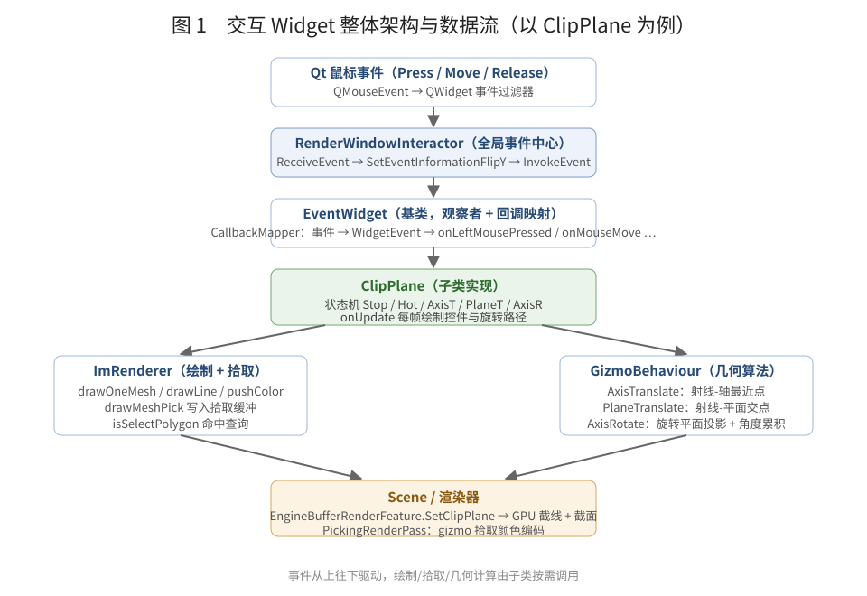
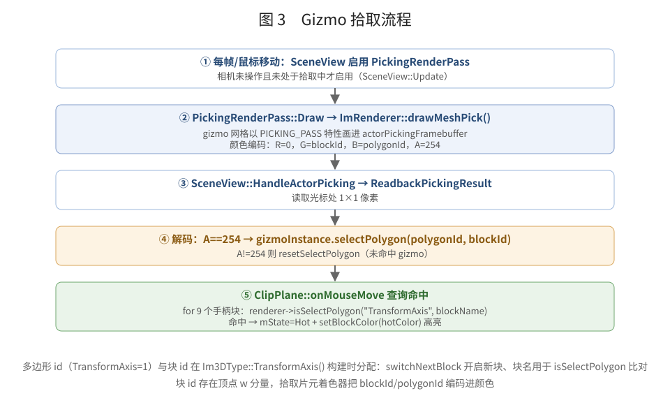
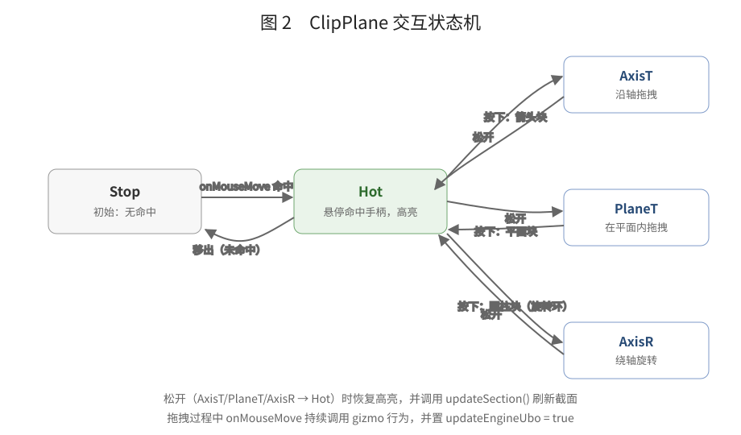

# 交互 Widget 设计实现架构（以 ClipPlane 剖切控件为例）

> 本文基于 `Moon/Interactive/EventWidget.*`、`Moon/Interactive/Im3DRenderer.*`、`Moon/Interactive/GizmoBehaviour.*`、`Moon/Interactive/Widgets/ClipPlane.cpp` 与 `Moon/Interactive/Im3DType.*` 的实际代码整理。

---

## 1. 概述

交互 Widget 是编辑器里的**可交互 3D 控件**：固定屏幕尺寸的 gizmo 网格 + 鼠标拾取 + 状态机驱动的拖拽/旋转。典型例子：

- `ClipPlane`：剖切平面控件（本文主线示例）——沿轴拖、在平面内拖、绕轴旋转，实时驱动 GPU 截面；
- `AxisTranslationWidget` / `ArrowRotateWidget` / `PadTaskWidget`：建模工具的平移/旋转手柄。

一个 Widget 由四层协作完成：

| 层 | 文件 | 职责 |
| --- | --- | --- |
| 事件层 | `EventWidget` + `RenderWindowInteractor` | 把 Qt 鼠标/键盘事件分发给 widget 的虚函数 |
| 绘制层 | `ImRenderer` | 立即模式 3D 绘制（网格/线/点）与 gizmo 拾取 |
| 几何层 | `GizmoBehaviour` | 射线与轴/平面/旋转平面的求交算法 |
| 业务层 | `ClipPlane` 等子类 | 状态机、控件外观、把交互结果写回场景/渲染器 |

现有控件可以归为两种风格，绘制与拾取方式不同：

| 风格 | 代表 | 几何载体 | 绘制路径 | 拾取方式 |
| --- | --- | --- | --- | --- |
| ClipPlane 风格 | `ClipPlane` | `PolygonMesh`（块结构） | `drawOneMesh` → `drawMeshList`（FIXED_SCALE） | GPU 颜色编码（`PickingRenderPass`） |
| WidgetViewData 风格 | `AxisTranslationWidget` / `ArrowRotateWidget` / `PadTaskWidget` | `TriangleFace` / `Edge` / `VertexPoint` | `drawTriangleList` → `vertexData`（立即模式） | CPU 射线求交（`hitFace` / `hitEdge` / `hitPoint`） |



---

## 2. 每帧驱动

编辑器每帧按以下顺序驱动：

```cpp
ImRenderer::newFrame(sceneView);   // 清空上一帧绘制列表、记录当前视图
// ... 业务层每帧渲染场景 ...
ImRenderer::endFrame();
//   └─ drawWidgets()：遍历 mGizmoWidgets，逐个调用 widget->update()
//   └─ drawMesh()：提交 drawMeshList（含 gizmo 网格）
```

`EventWidget::update()`：

```cpp
void EventWidget::update()
{
    mCurrentFrame = (mCurrentFrame + 1) % 1000000;   // 帧计数，用于鼠标事件节流
    if (mActive && mVisible)
    {
        onUpdate();                                   // 子类绘制控件 + 更新逻辑
    }
}
```

`EventWidget` 构造时把自己注册进 `ImRenderer::instance()`（`addGizmoWidget`），因此所有 widget 共享同一个绘制器与拾取缓冲。

---

## 3. 事件系统

### 3.1 Qt → RenderWindowInteractor

`RenderWindowInteractor::ReceiveEvent(QEvent*)` 接收 Qt 鼠标事件，转换成内部事件并广播：

```cpp
if (t == QEvent::MouseButtonPress || t == QEvent::MouseButtonRelease ||
    t == QEvent::MouseButtonDblClick || t == QEvent::MouseMove || t == QEvent::HoverMove)
{
    QMouseEvent* e2 = static_cast<QMouseEvent*>(e);
    SetEventInformationFlipY(e2->x(), e2->y(), ctrl, shift, 0, dblClick);
    if (t == QEvent::MouseMove || t == QEvent::HoverMove)
        InvokeEvent(ExecuteCommand::MouseMoveEvent, e2);
    else if (t == QEvent::MouseButtonPress)
        // switch(e2->button()) → InvokeEvent(LeftButtonPressEvent / ...)
}
```

`RenderWindowInteractor` 是**全局单例事件中心**：它维护一张观察者表（`EventObject::AddObserver(event, command, priority)`），`InvokeEvent` 按事件类型和优先级分发。

### 3.2 Interactor → EventWidget

`EventWidget` 构造时把自己挂到 Interactor 上，并通过 `CallbackMapper` 建立「事件 → 回调」映射：

| ExecuteCommand 事件 | WidgetEvent | 触发虚函数 |
| --- | --- | --- |
| `LeftButtonPressEvent` | `Select` | `onLeftMousePressed()` |
| `LeftButtonReleaseEvent` | `Select3D` | `onLeftMouseReleased()` |
| `RightButtonPressEvent` | `EndSelect` | `onRightMousePressed()` |
| `RightButtonReleaseEvent` | `Completed` | `onRightMouseReleased()` |
| `MouseMoveEvent` | `Move3D` | `onMouseMove()` |
| `KeyPressEvent` / `KeyReleaseEvent` | — | `onKeyPress()` / `onKeyRelease()` |

鼠标移动做了**帧节流**：静态入口 `EventWidget::MouseMove` 只在 `mCurrentFrame != mPreFrame` 时才调用 `onMouseMove()`，避免同一帧内重复处理。

### 3.3 直接订阅观察者

除了 CallbackMapper，widget 也可以直接向 Interactor 注册自己的回调。ClipPlane 用它来选择被剖切的模型：

```cpp
clickObserver = mSelf->Interactor->AddObserver(
    ExecuteCommand::LeftButtonReleaseEvent,
    this, &ClipPlane::ClipPlaneInternal::onMouseLeftClick, 0.0f);
```

`onMouseLeftClick` 拾取当前选中的 Actor，若带 `Model Renderer`，则用其世界包围盒初始化 widget 的位置与大小（`setupBox`）。

---

## 4. 绘制系统

### 4.1 两条绘制路径（灵活混用）

widget 的绘制并不局限于一种方式：**同一个 widget 里可以自由混用两条路径**，它们在本帧结束时分别提交。

| 路径 | 调用方式 | 数据去向 | 提交时机 |
| --- | --- | --- | --- |
| 网格路径 | `drawOneMesh(...)` / `drawOneFixScaleMesh(...)` | `drawMeshList`（预构建 `PolygonMesh`） | `endFrame → drawMesh()` |
| 立即模式路径 | `drawLine / drawPoint / drawTriangleList` | 顶点列表 `vertexData[0] / [1]`（按图层 + 图元类型） | `endFrame → drawSort() / drawUnsort()` |
| 2D / 覆盖层 | ImGui 等 | 独立 UI 上下文 | 独立提交 |

`endFrame()` 的提交顺序为 `runDrawTask → drawWidgets → drawMesh → drawSort → drawUnsort`：gizmo 网格先画，立即模式图元后画（排序 / 未排序两层，支持透明度与深度测试）。

以 ClipPlane 为例，同一个 `onUpdate()` 里就同时用到了三种方式：

- **网格路径**：`drawOneMesh(center, rotation, {0.1,0.1,0.1}, "TransformAxis")` 绘制三轴手柄 / 旋转环（固定屏幕尺寸）；
- **立即模式路径**：`drawLine` 画旋转圆弧、包围盒线框、圆心连线，`drawAlignedBox` 画盒线；
- **2D 覆盖**：`ImGui::GetForegroundDrawList()->AddText(...)` 显示旋转角度。

所以“有的部分是立即绘制、其它部分是 PolygonMesh”正是这套设计有意为之：需要固定缩放 / 深度 / 排序的实体手柄走 mesh 列表，临时路径与装饰线走立即模式，两者在 `onUpdate` 里按需混用。

### 4.2 立即模式 API

`ImRenderer` 提供类似立即模式 GUI 的 3D 绘制接口，widget 在 `onUpdate()` 里直接调用：

- `drawLine(a, b, size, color)` / `drawPoint(pos, size, color)` / `drawTriangleList(...)`：基础图元；
- `drawOneMesh(translation, rotation, scale, "TransformAxis")`：按名字绘制预构建的 gizmo 网格；
- `pushColor / popColor`、`pushSize / popSize`、`pushMatrix / popMatrix`：绘制状态栈；
- `getFrameParam()`：返回 `FrameParam`（eye、rayOrigin、rayDirection、cursor、viewport 尺寸、投影类型等），供几何计算使用。

立即模式调用按“图层 + 图元类型”写入本帧的顶点列表，`endFrame()` 里由 `drawSort()` / `drawUnsort()` 统一提交；网格调用进入 `drawMeshList`，由 `drawMesh()` 提交。所有列表在 `newFrame()` 清空。

### 4.3 Gizmo 网格的块结构

gizmo 网格（如 `TransformAxis()`，见 `Im3DType.cpp`）是一个 `PolygonMesh`，由若干**块（block）**组成：

```cpp
poly.addModel(cil, Identity, color);
poly.switchNextBlock({1,0,0,1}, "XAxis");   // 开启新块并命名
poly.addModel(cil, ...);
// ...
poly.addCell(cell);                          // 程序化多边形面
poly.switchNextBlock({0,1,0,1}, "YPlane");
```

- 每个块有一个 **blockId**（在块内顶点的 `w` 分量里），用于拾取解码；
- `getBlockId(name)` 按块名查 id，`setBlockColor(id, color)` 改颜色（悬停/激活高亮）；
- 整个网格有一个 **polygonId**（`setId`），`isSelectPolygon` 用它区分不同 gizmo。

### 4.4 固定屏幕尺寸（FIXED_SCALE）

gizmo 用 `GizmoCell.ovfx` 的 `FIXED_SCALE` 特性绘制，保证控件在任意相机距离下占用恒定像素数。原理与公式的详细推导见 [ClipPlane.cpp](../Moon/Interactive/Widgets/ClipPlane.cpp) 中 `ComputeGizmoFixedScaleRatio` 上方的注释：缩放后 1 个网格单位恒等于 200 像素。

这也是 ClipPlane 旋转圆弧必须用同一个 ratio 缩放的原因——否则控件固定大小、圆弧却随距离缩放，两者会脱节。

WidgetViewData 风格控件不走 FIXED_SCALE 着色器，需要在 C++ 侧用同一个 ratio 手动缩放（见 4.5）。

### 4.5 WidgetViewData 风格控件（以 AxisTranslationWidget 为例）

`WidgetViewData` 是另一套控件几何容器：`TriangleFace`（本地三角形 + 颜色 + 4×4 model 矩阵）、`Edge`（线段）、`VertexPoint`（点）。`AxisTranslationWidget` 用它承载倒圆角半径箭头：

**构造**：加载 `Arrow_Translate` 模型，把顶点乘以 `Scaling(10)` 写入 `TriangleFace`（本地坐标，绕 gizmo 原点分布），再调用 `setTriangleFace("Arrow", f, color)` 注册。

**绘制**：`onUpdate` 对每个 `TriangleFace` 压入 model 矩阵后提交：

```cpp
renderer->pushMatrix(faces[i].model);            // model = R | t
renderer->drawTriangleList(faces[i].faces, 1.0, faces[i].color);
renderer->popMatrix();
```

`model` 的旋转与平移由外部设置：`setUpOrigin` / `setUpDir`（旋转矩阵 `RotationMatrixZ(normal)`）/ `setLength` 更新平移列；`setUpScale` 通过 `setTriangleFaceScale` 直接缩放本地顶点（模型相对大小）。

**固定屏幕尺寸**：与 ClipPlane 相同的 ratio 公式，在 C++ 侧手动缩放：

```cpp
const float ratio = ComputeFixedScaleRatio(*m_sceneView, mInternal->center);
if (mInternal->mRefScaleRatio < 0.0f) mInternal->mRefScaleRatio = ratio;  // 首帧锁定基准
const float scale = ratio / mInternal->mRefScaleRatio;                    // 之后屏幕尺寸恒定
Eigen::Matrix4f scaleMat = Eigen::Matrix4f::Identity();
scaleMat(0, 0) = scaleMat(1, 1) = scaleMat(2, 2) = scale;
renderer->pushMatrix(faces[i].model * scaleMat);                          // 绕 gizmo 原点缩放
```

`scale = ratio / mRefScaleRatio` 让控件锁定在“出现时”的大小，此后随相机距离等比缩放、屏幕尺寸不变；正交相机 ratio 为常量，scale 恒为 1。**绘制与拾取必须使用同一个 scale**（见 5.3），否则命中会错位。

---

## 5. 拾取系统

拾取分为「写入」与「查询」两步。

### 5.1 写入：拾取 Pass 颜色编码

`PickingRenderPass`（渲染顺序 `Last`）每帧把 gizmo 网格画进**独立的拾取 framebuffer**（`actorPickingFramebuffer`）。核心是 `ImRenderer::drawMeshPick()`：以 `PICKING_PASS` 特性渲染 `drawMeshList`，片元输出编码：

```glsl
// GizmoCell.ovfx（PICKING_PASS）
fResult = vec4(0, int(round(fs_in.pos.w)) / 255.0, polygonId / 255.0, 254.0 / 255.0);
//           R=0      G=blockId（顶点 w）          B=polygonId           A=254（gizmo 标记）
```

该 Pass 只在“非相机操作、非正在拖拽”时启用（`SceneView::Update`），因此平时不产生额外开销。

### 5.2 查询：读回像素 → 解码 → 命中

`SceneView::HandleActorPicking` 读取光标处像素并解码：

```cpp
// PickingRenderPass::ReadbackPickingResult
if (pixel[3] == 254)   // gizmo 命中
{
    uint32_t polygonID = pixel[2];
    uint32_t blockID   = pixel[1];
    gizmoInstance.selectPolygon(polygonID, blockID);   // 写回 ImRenderer
    isSelected = true;
}
```

`selectPolygon(pid, bid)` 把当前命中结果存进 `ImRenderer` 的 `selectPolygonId / selectBlockId`。widget 随后在 `onMouseMove` 里逐块查询：

```cpp
bool hit = renderer->isSelectPolygon("TransformAxis", table[i].blockName);
// 等价于：TransformAxis().getId() == selectPolygonId && getBlockId(blockName) == selectBlockId
```



### 5.3 CPU 射线拾取（WidgetViewData 风格）

WidgetViewData 风格控件不用 GPU 颜色编码，而是在 `onMouseMove` 里直接对 CPU 端三角形做射线求交：

```cpp
auto ray = m_sceneView->GetMouseRay();                 // 世界空间鼠标射线
mInternal->curHitTarget = mInternal->viewData.hitFace(it, mInternal->mLastScale);
```

`WidgetViewData::hitFace(ray, scale)` 把每个 `TriangleFace` 的本地三角形用 `model * Scale(scale)` 变换到世界空间，逐三角形做 Möller–Trumbore 求交（`Intersect`），取最近命中并返回块的**名字**（如 `"Arrow"`）。控件拿到名字后驱动状态机：命中 `"Arrow"` → `Hot` → 按下进入 `AxisT`。

`scale` 参数与绘制时的缩放一致（见 4.5），保证“画在哪、命中就在哪”。`hitEdge` / `hitPoint` 则把线/点经视口矩阵投影到屏幕，按屏幕距离命中，适合 2D 手柄。

两种拾取方式对比：

| GPU 颜色编码（ClipPlane 风格） | CPU 射线求交（WidgetViewData 风格） |
| --- | --- |
| 每帧把 gizmo 画进拾取 framebuffer，读 1 像素解码 polygonId/blockId | 直接对 CPU 端三角形做射线求交，返回块名 |
| 适合复杂、多块的 `PolygonMesh` gizmo | 适合简单三角面控件，无额外 GPU 开销 |
| 命中信息是数字 id，需要 `isSelectPolygon` 再比对 | 命中即名字，直接驱动状态机 |

---

## 6. ClipPlane 状态机（示例）

ClipPlane 用五个状态管理交互，手柄与操作的对应关系由一张表定义：

| 手柄块（blockName） | 交互类型 | 触发几何行为 |
| --- | --- | --- |
| `XArrow` / `YArrow` / `ZArrow` | 沿轴平移（`AxisT`） | `GizmoAxisTranslate` |
| `XPlane` / `YPlane` / `ZPlane` | 平面内平移（`PlaneT`） | `GizmoPlaneTranslate` |
| `XAxis` / `YAxis` / `ZAxis`（圆柱） | 绕轴旋转（`AxisR`） | `GizmoAxisRotate` |



### 6.1 状态转移

**Stop（初始）**

`onMouseMove` 遍历 9 个手柄块，`isSelectPolygon` 命中任一 → `mPickMesh = i`、`mState = Hot`、`setBlockColor(hotColor)` 高亮。

**Hot（悬停）**

- 再次移动：若不再命中任何块 → 回到 `Stop`，恢复原色；
- 左键按下：根据 `table[mPickMesh].meshId` 决定进入哪个拖拽状态，并初始化对应 gizmo 行为：

```cpp
// 沿轴拖：把轴与起点交给 transLatePick
m_internal->transLatePick.startPick(axis, m_internal->center);
mState = AxisT;

// 平面内拖：构造平面方程（法线 n，过 center）
float w = -m_internal->center.dot(normal);
m_internal->planeTPick.startPick({n.x, n.y, n.z, w}, m_internal->center);
mState = PlaneT;

// 绕轴旋转：绑定旋转轴 + 参考方向 + 参考点
m_internal->axisRPick.startPick(rotationAxis, m_internal->center, refDir, center + refDir);
mState = AxisR;
```

**AxisT / PlaneT / AxisR（拖拽中）**

`onMouseMove` 用 `getFrameParam()` 的射线原点/方向驱动 gizmo 行为，并把结果写回内部状态：

```cpp
// 平移：直接改 center；旋转：更新 xAxis/yAxis/zAxis 之一并正交化
m_internal->transLatePick.apply(rayDir, rayOrigin, m_internal->center);
m_internal->updateEngineUbo = true;    // 标记：下一帧同步平面到渲染器
```

旋转状态下 `onUpdate` 额外绘制角度文字、旋转路径圆弧（半径用 FIXED_SCALE ratio 缩放，见 §4.3）。

**松开（→ Hot）**

`onLeftMouseReleased` 恢复高亮色，并按 `updateFlag` 条件调用 `updateSection()` 刷新截面。

### 6.2 与截面渲染的联动

ClipPlane 只负责“交互”，不直接生成几何。拖拽时置 `updateEngineUbo = true`，`onUpdate` 中把平面写入渲染器：

```cpp
auto& feature = m_sceneView->GetRenderer().GetFeature<EngineBufferRenderFeature>();
feature.SetClipPlane(zAxis.x, zAxis.y, zAxis.z, -zAxis.dot(center));
```

GPU 侧（`SectionCapRenderPass` / `SectionContourRenderPass`）每帧读 `ubo_plane` 生成截面与截线——交互与渲染解耦，这也是“拖动即实时更新”的原因。原理见 [SectionRendering.md](SectionRendering.md)。

---

## 7. 几何交互算法（GizmoBehaviour）

### 7.1 GizmoAxisTranslate（沿轴拖）

把鼠标射线投影到轴上，取射线上离轴最近的点，维护按下时的初始偏移：

```cpp
// 射线 P(t) = eye + t * ray，轴 center + s * axis
// 求 min|P(t) - (center + s*axis)| 得到 t，再投影出轴上点
```

### 7.2 GizmoPlaneTranslate（平面内拖）

射线与平面求交：

```cpp
float t = -(eye.dot(n) + d) / ray.dot(n);   // n 为平面法线，d 为平面常数
pos = eye + ray * t;
```

### 7.3 GizmoAxisRotate（绕轴旋转）

1. **平面投影**：把射线与过中心的旋转平面求交，交点相对中心的向量投影到平面并归一化（`computePlaneProj`）；
2. **增量角**：相邻两帧投影方向夹角，用 `atan2(axis·(a×b), a·b)` 带符号累计（`computeAngle`）；
3. **累积角 + 吸附**：`m_totalAngle` 累加后按 1° 吸附（`enableSnap`）；
4. **输出**：`Eigen::AngleAxisf(snapAngle, axis)` 旋转参考方向/参考位置；
5. **圆弧**：`getRotationArc()` 在参考方向与当前方向之间插值出一圈弧点，供 `onUpdate` 绘制旋转路径。

---

## 8. 如何扩展一个新 Widget

1. **继承 `EventWidget`**，构造时传入名字（自动注册到 `ImRenderer` 与 `RenderWindowInteractor`）；
2. **选择控件风格**：
   - ClipPlane 风格：在 `Im3DType` 构建 `PolygonMesh`（`switchNextBlock` 分块命名），`onUpdate` 用 `drawOneMesh`，`onMouseMove` 用 `isSelectPolygon` 拾取；
   - WidgetViewData 风格：用 `viewData.setTriangleFace(...)` 承载三角形，`onUpdate` 用 `pushMatrix + drawTriangleList`，`onMouseMove` 用 `viewData.hitFace(ray, scale)` 拾取（需要固定屏幕尺寸时按 4.5 计算 scale）；
3. **重写 `onUpdate()`**：绘制控件，读取 `getFrameParam()` 做逻辑；
4. **重写 `onMouseMove()`**：做悬停检测，切换状态机；
5. **重写 `onLeftMousePressed()` / `onLeftMouseReleased()`**：进入/退出拖拽，初始化 `GizmoBehaviour`；
6. **把交互结果写回场景**（如 `SetClipPlane`、`InvokeEvent(自定义事件)` 通知业务层）；
7. 需要接收键盘时重写 `onKeyPress` / `onKeyRelease`。

---

## 9. 关键文件

| 文件 | 职责 |
| --- | --- |
| `Moon/Interactive/EventWidget.*` | widget 基类：事件回调映射、生命周期、帧节流 |
| `Moon/Interactive/Interactive/RenderWindowInteractor.*` | Qt 事件 → 内部事件分发中心 |
| `Moon/Interactive/Im3DRenderer.*` | 立即模式绘制、gizmo 网格提交、拾取查询 |
| `Moon/Interactive/Im3DType.*` | `PolygonMesh` 块结构、`TransformAxis()` 等 gizmo 构建 |
| `Moon/Interactive/GizmoBehaviour.*` | 轴/平面/旋转几何算法 |
| `Moon/Interactive/Widgets/ClipPlane.*` | 剖切控件：状态机、手柄表、截面联动（示例） |
| `Moon/Interactive/ViewData.*` | WidgetViewData 风格控件的几何容器与 CPU 拾取（`hitFace` / `hitEdge` / `hitPoint`） |
| `Moon/Interactive/Widgets/AxisTranslationWidget.*` | 沿轴拖拽控件：固定屏幕尺寸、CPU 拾取、`LengthChange` 事件 |
| `Moon/editor/UI/TaskPanel/FilletTask.cpp` | 倒圆角 UI：用两个 `AxisTranslationWidget` 拖动控制半径 |
| `Moon/renderer/PickingRenderPass.cpp` | 拾取 framebuffer、像素读回与 `selectPolygon` |
| `Moon/Interactive/Im3DRenderer.h` | `FrameParam`（射线/光标/视口信息） |
