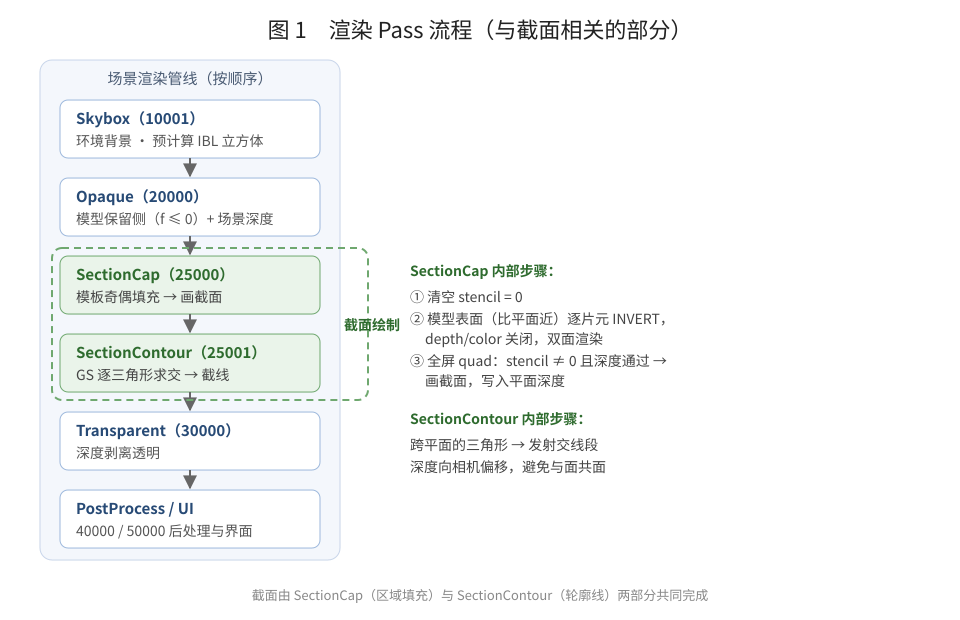
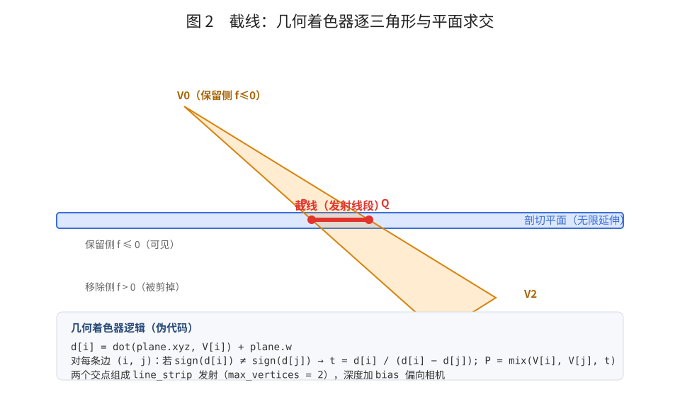
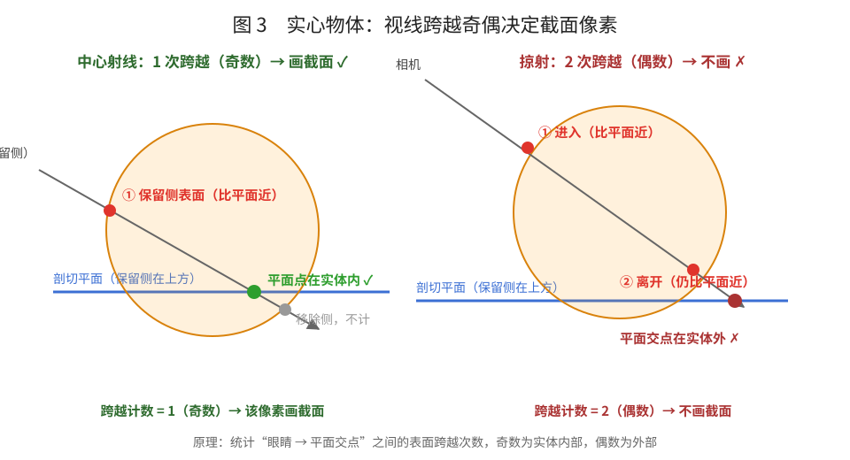
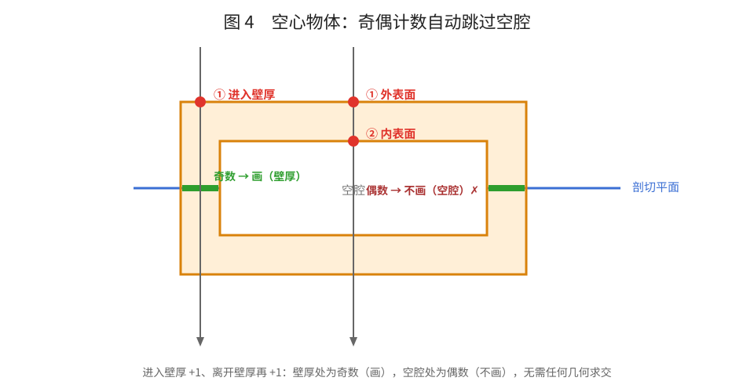
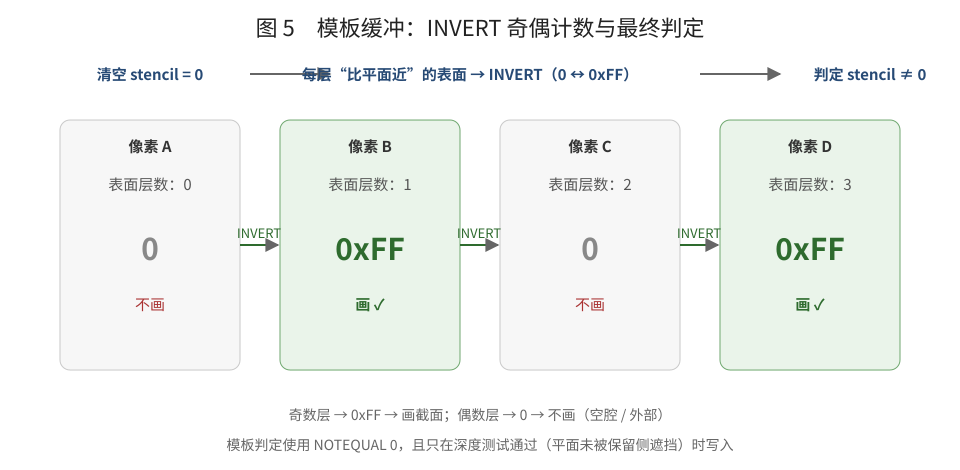

# 截面绘制（Clip Section）原理

> 本文基于 `MoonRender/src/Core/Rendering/SceneRenderer.cpp` 中的 `SectionCapRenderPass` / `SectionContourRenderPass`，以及 `Resource/Moon/Data/Engine/Shaders/` 下的 `SectionCap.ovfx`、`SectionParity.ovfx`、`SectionContour.ovfx` 整理。

---

## 1. 概述

剖切（clip section）用一个无限平面把模型切成两部分，只显示**保留侧**，并在切口处绘制**截面**。整个绘制拆成两个独立的问题：

| 问题 | 含义 | 方案 | 可靠性 |
| --- | --- | --- | --- |
| 截线（contour） | 模型表面与剖切平面的交线 | 几何着色器（GS）逐三角形求交 | 纯局部几何，永远可靠 |
| 截面（cap） | 交线围成的二维区域填充 | 模板（stencil）奇偶填充 | 闭合网格正确；开口网格按奇偶规则 |

这两个问题性质不同：**截线是局部的**（每个三角形与平面独立求交即可），而**截面区域是全局的**（“平面点是否在实体内部”需要跨越整条视线统计表面层数）。

历史上曾尝试用“保留侧深度 + 移除侧深度”的双深度比较来判断截面区域，但逐像素深度无法表达“区域内部”这种拓扑信息，导致截面时对时错、截线外也被填充。最终改为与 OCCT capping 相同的**模板奇偶填充**方案。



---

## 2. 渲染流程

与截面相关的 Pass 按以下顺序执行（数值为 `ERenderPassOrder`）：

| Pass | 顺序 | 职责 | 与截面的关系 |
| --- | --- | --- | --- |
| `SkyboxRenderPass` | 10001 | 环境背景，预计算 IBL 立方体（irradiance / prefilter / BRDF LUT） | 为截面提供 IBL 纹理 |
| `OpaqueRenderPass` | 20000 | 绘制模型保留侧（`f > 0` 丢弃），写入颜色与深度 | 提供场景深度，供截面遮挡测试 |
| `SectionCapRenderPass` | 25000 | 模板奇偶填充 → 绘制截面 | **截面本体** |
| `SectionContourRenderPass` | 25001 | GS 逐三角形求交画截线 | **截线本体** |
| `TransparentRenderPass` | 30000 | 深度剥离透明 | 被截面深度正确遮挡 |
| `PostProcessRenderPass` / `UIRenderPass` | 40000 / 50000 | 后处理与 UI | 无关 |

主场景渲染在 MSAA framebuffer（含 `DEPTH32F_STENCIL8`）中完成，截面 Pass 直接写回这个 buffer。

---

## 3. 平面约定

裁剪平面用四维向量表示：`f(P) = dot(plane.xyz, P) + plane.w`。

- **保留侧（可见）**：`f(P) <= 0`
- **移除侧（被剪掉）**：`f(P) > 0`

这与 `GeomertySurface.ovfx` 中的 `if (offsetw > 0) discard;` 一致。`ClipPlane` 控件通过 `SetClipPlane(zAxis, -zAxis·center)` 设置平面，即法线为控件 z 轴、过控件中心。

---

## 4. 截线：几何着色器逐三角形求交

`SectionContour.ovfx` 的几何着色器对每个三角形独立处理：

1. 计算三个顶点到平面的有向距离 `d[i] = dot(plane.xyz, V[i]) + plane.w`；
2. 若三个 `d[i]` 同号（三角形完全在一侧），跳过；
3. 否则，对每条跨平面的边 `(i, j)`，线性插值出交点：

```glsl
float t = d[i] / (d[i] - d[j]);
vec3  p = mix(V[i], V[j], t);
```

4. 三角形与平面至多交出一条线段，把两个交点作为 `line_strip` 发射（`max_vertices = 2`）。



关键细节：发射顶点时对深度做微小偏移（`gl_Position.z -= bias * w`），使截线在深度上略偏向相机，避免与模型表面共面时被深度测试吃掉（z-fighting）。

这个方案**不依赖网格闭合**，也**不依赖三角形绕序**，因此截线始终正确。

---

## 5. 截面：模板奇偶填充

### 5.1 为什么需要模板

“截面内部”是**拓扑性质**：它是平面与实体体积的交区域。逐像素深度只能告诉我们“这一像素处谁更近”，无法回答“平面这个点是否在实体内部”。

双深度方案失败的原因正在于此：它对“平面在视线方向上穿过模型”的判据是 `保留侧有表面 && 移除侧有表面`，但对于凹体、空心体、开口网格，这个条件与“平面点在实体内部”并不等价，导致截面画到截线外面或时有时无。

OCCT 的做法（`Graphic3d_ClipPlane::SetCapping`）明确是 **stencil 测试 + 多趟渲染**（官方文档原文：*"The graphic driver produces this surface for convex graphics by means of stencil-test and multi-pass rendering"*），源码中对应 `glStencilOp(GL_KEEP, GL_INVERT, GL_INVERT)`。本实现采用同一思路。

### 5.2 算法步骤

`SectionCapRenderPass::Draw` 分三步：

**① 清空 stencil**

只清 stencil（颜色、深度保留）：

```cpp
m_renderer.Clear(false, false, true, Maths::FVector4(0.0f));
```

**② 奇偶填充：模型表面逐片元 INVERT**

用 `SectionParity.ovfx` 重绘所有不透明三角形（双面、关闭深度测试/深度写入/颜色写入），模板状态为：

```cpp
p_pso.stencilTest   = true;
p_pso.stencilFuncOp = EComparaisonAlgorithm::ALWAYS;   // 片元全部参与
p_pso.bothOpFail    = EOperation::INVERT;              // 每层表面翻转一次
```

片元着色器只保留“比剖切平面更靠近相机”的表面：

```glsl
float fFrag = dot(ubo_plane.xyz, FragPos) + ubo_plane.w;
float fEye  = dot(ubo_plane.xyz, ubo_ViewPos) + ubo_plane.w;
if (fFrag * fEye <= 0.0) discard;   // 与相机异侧 = 已越过平面，不计
```

**③ 绘制截面**

全屏 quad，模板判定 `stencil != 0`（奇数为 0xFF，偶数为 0），深度测试 `LESS_EQUAL` 对比场景深度，片元写入 `gl_FragDepth = 平面深度`，并开启深度写入：

```cpp
p_pso.stencilFuncOp = EComparaisonAlgorithm::NOTEQUAL;
p_pso.stencilFuncRef = 0;
p_pso.stencilWriteMask = 0x00;      // 不再写模板
p_pso.depthFunc = EComparaisonAlgorithm::LESS_EQUAL;
p_pso.depthWriting = true;          // 截面写入平面深度，遮挡其后的内容
```

### 5.3 为什么“奇数 = 截面”

对闭合流形，从眼睛到平面交点的射线每穿过一次实体表面，就进入或离开实体一次。因此：

> **视线在平面交点之前的表面跨越次数为奇数 ⇔ 平面交点位于实体内部 ⇔ 该像素属于截面。**



中心射线只跨越 1 次保留侧表面（奇数）→ 画截面；掠射射线在到达平面前跨越 2 次（偶数）→ 平面点在实体外，不画。

空心物体天然受益于奇偶计数：进入壁厚 +1、离开壁厚再 +1，空腔处为偶数，自动不被填充。



模板值变化与最终判定：



### 5.4 关键状态总结

| 阶段 | stencil 功能 | stencil 操作 | 深度 | 颜色 |
| --- | --- | --- | --- | --- |
| 奇偶填充 | `ALWAYS` | `INVERT`（通过时） | 关 | 关 |
| 画截面 | `NOTEQUAL 0` | `KEEP` | `LESS_EQUAL`，写平面深度 | 开 |

---

## 6. 深度与遮挡

截面片元的 `gl_FragDepth` 是平面沿视线的深度：

```glsl
vec4 clipPos = ubo_Projection * ubo_View * vec4(hit, 1.0);
gl_FragDepth = (clipPos.z / clipPos.w) * 0.5 + 0.5;
```

- **保留侧表面在平面前**：截面深度测试失败，被模型遮挡（正确）。
- **截面可见处**：写入平面深度，其后的任何内容（透明物体、UI、截线）都会被它正确遮挡。
- **深度比较用 `LESS_EQUAL`**：避免截面边缘与模型表面共面（深度相等）时漏掉一圈像素。

如果截面不写深度（`depthWriting = false`），就会出现“透过截面看到背后片段”的 bug，因此必须开启深度写入。

---

## 7. 剖面线条纹：随距离的抗锯齿

剖面线是世界空间等距条纹（周期 `stripePeriod`）。相机拉远后，一个像素覆盖多个条纹周期，采样相位随相机移动乱跳，表现为条纹不断闪烁变化——这是低于奈奎斯特频率的混叠。

解法是解析抗锯齿：用 `fwidth(dist)` 得到当前像素覆盖的条纹坐标变化量 `w`：

- 条纹边缘的过渡宽度随 `w` 放大，保证过渡至少一个像素；
- 当 `w >= stripePeriod`（一个像素内已包含整个周期）时，条纹无法分辨，直接退化为周期内的**平均颜色** `1 - stripeBand / stripePeriod`，而不是继续乱采样。

```glsl
float w = max(fwidth(dist), 1e-5);
float tStrip;
if (w >= stripePeriod)
{
    tStrip = 1.0 - stripeBand / stripePeriod;   // 低于奈奎斯特 → 平均色
}
else
{
    float phase = abs(fract(dist / stripePeriod) - 0.5) * 2.0; // 0=线中心
    float halfW = stripeBand / stripePeriod;
    float aa    = clamp(w / stripePeriod, 0.02, halfW);
    tStrip = smoothstep(halfW - aa, halfW + aa, phase);
}
```

效果：近处条纹清晰且边缘柔和；远处条纹平滑过渡为均匀填充，不再闪烁。

---

## 8. 射线重建（透视 / 正交）

截面着色器需要沿视线求平面交点，而透视与正交的射线构造不同：

```glsl
vec3 rayOrigin = ubo_ViewPos;                        // 透视：相机位置
if (ubo_CameraType == 1)                             // 透视
    rayDir = normalize(farWorld.xyz - ubo_ViewPos);  // 反投影远平面点
else {                                               // 正交
    rayOrigin = nearWorld.xyz;                       // 近平面点
    rayDir     = normalize(farWorld.xyz - nearWorld.xyz); // 平行射线
}
```

历史问题：早期代码在正交相机下用 `farWorld - ubo_ViewPos` 作为射线方向，其中混入了像面偏移分量，导致平面命中点、深度与剖面线位置计算错误。必须按 `ubo_CameraType` 区分两种投影。

---

## 9. 截面 IBL 光照

截面的法线就是剖切平面法线 `ubo_plane.xyz`（朝向相机翻转），着色器用与模型相同的 IBL 管线（irradiance 漫反射 + prefilter 镜面反射 + BRDF LUT）计算光照。

注意：`_IrradianceCube` / `_PrefilterCube` / `_BRDFLut` 必须**每帧在 `Draw()` 里绑定**，而不能在 Pass 构造时绑定——天空盒 Pass 要等第一帧才分配这些纹理，构造时拿到的还是空指针，绑定后会回退到黑色空立方体，导致截面全黑。

---

## 10. 边界与限制

- **闭合网格**：奇偶填充精确正确（包括空心、凹体的大部分情形）。
- **开口网格**：会按奇偶规则填充“奇数层”的投影区域，可能出现多余填充——这是通用 GPU 截面方案的固有边界，OCCT 官方也只保证凸体正确（"for convex graphics"）。
- **多个独立物体**：同一条视线上的奇偶会互相抵消。若需要，可扩展为每个物体单独清模板计数（OCCT 按 structure 逐个处理）。
- **退化情形**：相机恰好位于平面上（`fEye == 0`）时，奇偶填充会全部丢弃，表现为无截面。

---

## 11. 关键文件

| 文件 | 职责 |
| --- | --- |
| `MoonRender/src/Core/Rendering/SceneRenderer.cpp` | `SectionCapRenderPass`（模板奇偶 + 画截面）、`SectionContourRenderPass`（GS 截线） |
| `Resource/Moon/Data/Engine/Shaders/SectionParity.ovfx` | 奇偶填充片元：保留比平面近的表面 |
| `Resource/Moon/Data/Engine/Shaders/SectionCap.ovfx` | 截面：平面求交、深度、剖面线、IBL |
| `Resource/Moon/Data/Engine/Shaders/SectionContour.ovfx` | 截线：GS 逐三角形求交 |
| `MoonRender/include/Rendering/Settings/ERenderPassOrder.h` | Pass 顺序（`SectionCap = 25000`，`SectionContour = 25001`） |
| `Moon/Interactive/Widgets/ClipPlane.cpp` | 剖切平面控件，实时更新平面 UBO |
