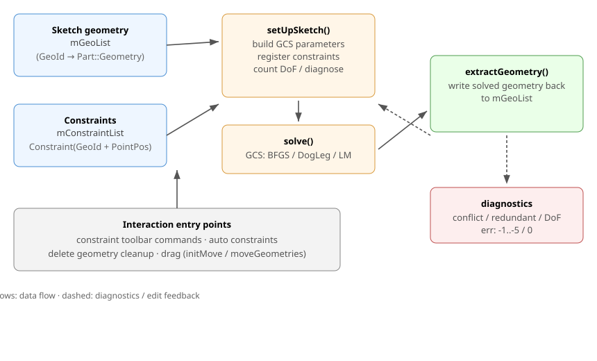

# 草图约束：原理、架构与用法

> 阅读顺序建议：本文面向“约束在项目里如何工作、为什么这么设计”。
> 与草图的整体交互（事件 → 坐标 → 状态机 → 提交）见
> [SketchModelingWidget.md](SketchModelingWidget.md) 与
> [SketchModelingWidgetArchitecture.md](SketchModelingWidgetArchitecture.md)；
> `SketcherObj` 的职责见 [SketcherObj.md](SketcherObj.md)。



---

## 1. 一句话概括

草图不是“存一堆固定坐标”，而是存 **几何 + 一组约束方程**。每当几何被拖拽、
尺寸被编辑或新图元被创建后，求解器（GCS）会以“尽量不改动当前形状”的方式
重新求出一组满足全部约束的坐标。

本项目约束层移植自 FreeCAD（`Sketcher::Constraint` 数据模型 + `Sketcher::Sketch`
GCS 桥接），但在外层 `SketcherObj` 上做了一版轻量装配。

## 2. 核心概念

| 概念 | 含义 | 项目中的位置 |
| --- | --- | --- |
| GeoId | 几何在草图里的序号（`0..n-1`） | `SketcherObj` 内几何索引；约束引用它 |
| PointPos | 元素引用点：`none`（曲线本体）/ `start` / `end` / `mid`（圆心） | `Sketcher/Datatypes/GeoEnum.h` |
| 约束 | 一条等式：Coincident/Horizontal/Vertical/Parallel/Tangent/Distance/… | `Sketcher/Datatypes/Constraint.h` |
| DoF | 自由度：当前几何在满足约束后还能独立变化的参数个数 | `Sketch::setUpSketch()` 返回 |
| 过约束 / 冲突 / 冗余 | `DoF<0` / 等式矛盾 / 重复且不矛盾 | `retrieveSolverDiagnostics()` |
| Driving 尺寸 | 参与求解、决定形状的数值（长度/半径/角度） | `Constraint::Value` |

约束的引用单位是 `{GeoId, PointPos}`，而不是具体坐标点，所以“删除一条边后
索引要平移、相关约束要清理”是整个系统的关键不变量（见第 8 节）。

## 3. 架构分层

```
UI 层
  ConstraintToolbar（工具栏建约束）
  DrawSketchHandler*（画图/自动约束，如矩形自动加约束）
        │  addConstraint / addGeometry / solve / setDatum / move...
        ▼
SketcherObj（草图宿主）
  mGeoList          —— 几何本体（GeoId 顺序 = 索引）
  mConstraintList   —— vector<Constraint*>（约束）
  selectIds         —— 当前选中 {GeoId, PointPos}
  solvedSketch      —— Sketcher::Sketch（GCS 封装）
        │  setUpSketch(GeoList, ConstraintList) / solve() / extractGeometry()
        ▼
Sketch / Constraint（Datatypes 目录）
  把 Part::Geometry + Constraint 翻译成 GCS 参数与方程
        ▼
GCS 求解器（planegcs）
```

关键设计：**所有约束相关入口都收口在 `SketcherObj`**：

- `addConstraint(...)`：构造/克隆约束并追加（带索引与重复校验）；
- `setDatum(...)`：改已有尺寸约束的数值并重解，失败回滚；
- `solve()`：装配 → 诊断 → 求解 → 把求解结果写回几何；
- `deleteGeometries(...)`：删几何时同时清理/平移约束；
- 鼠标拖动：`initMove()` + `moveGeometries()`，让求解器知道哪个点是“锚”。

## 4. 几何与约束如何翻译成 GCS 参数 / 方程

这一层完全在 `Sketcher/Datatypes/Sketch.cpp` 的 `addGeometry(...)` 与
`addConstraints(...)` 里完成。基本思路：**每个几何几何体先“参数化”成若干
`double*`，再为这些参数建立 GCS 的点/线/圆/弧对象；每个约束则注册一条或多条
方程，方程只通过这些参数写出。**

### 4.1 几何 → 参数与 GCS 对象

| Part::Geometry | GCS 对象 | 声明的参数 | 额外约束 |
| --- | --- | --- | --- |
| `GeomPoint` | `Point` | x, y | — |
| `GeomLineSegment` | `Line(p1,p2)` | x1,y1,x2,y2 | — |
| `GeomCircle` | `Circle(center,rad)` | cx,cy,r | — |
| `GeomArcOfCircle` | `Arc(start,end,center,rad,a1,a2)` | 起点、终点、圆心各 (x,y)，加 r、startAngle、endAngle | 注册 `ArcRules`，强制端点位于圆上且角度一致 |
| `GeomEllipse` / 椭圆弧 / 双曲线 / 抛物线弧 | `Ellipse` / `ArcOfEllipse` / … | 中心、长短轴方向、半径、起止参数等 | 每类有对应的“规则约束” |
| `GeomBSplineCurve` | GCS `BSpline` | 每个控制点 x,y | 求解器只解控制点，真实曲线仍由 OCC 重建，因此需要二次 solve |

每个参数会同时登记进：

- `Parameters`（未知量）或 `FixParameters`（被 Block 冻结的固定量）；
- `param2geoelement`（反向映射：参数指针 → `{GeoId, PointPos, 分量}`），
  供诊断时告诉你“这个自由度属于哪个几何元素”。

例：一条直线 `start(x1,y1)→end(x2,y2)` 在求解器里就是：

```text
Line l;  l.p1 = {x1, y1};  l.p2 = {x2, y2};
```

圆弧比“圆心+半径”多一组起点/终点参数，因为 GCS 把圆弧端点当作独立参数，
再用 `ArcRules` 约束“端点在圆上、角度参数一致”，这样端点既能被
Coincident 引用，也不会和圆心/半径矛盾。

### 4.2 约束 → 方程

`Constraint`（Sketch 层）按 `Type` 把 {GeoId, PointPos} 解析成 GCS 点/线/圆对象，
然后调用 `GCSsys.addConstraintXXX(...)` 注册方程。示意：

| 约束 | 方程（残差=0） | GCS 接口 |
| --- | --- | --- |
| Coincident（两点重合） | p1 - p2 = (0,0)，即 2 条标量方程 | `addConstraintP2PCoincident` |
| Horizontal（直线） | y1 - y2 = 0 | `addConstraintHorizontal(line)` |
| Vertical（直线） | x1 - x2 = 0 | `addConstraintVertical(line)` |
| Horizontal/Vertical（两点） | 对应 y/x 差 = 0 | point 版接口 |
| Parallel（两线） | (p2-p1) × (q2-q1) = 0 | `addConstraintParallel(l1,l2)` |
| Perpendicular（两线） | (p2-p1)·(q2-q1) = 0 | `addConstraintPerpendicular` |
| Tangent（线-线/圆/弧） | 方向点乘 = 0（点式相切走 `addAngleAtPointConstraint`） | `addTangentConstraint` / `addConstraintTangentViaPoint` |
| PointOnObject（点在线上） | 点与线方向向量叉积 = 0 | `addPointOnLineConstraint` |
| PointOnObject（点在圆上） | |p-c|² - r² = 0 | `addPointOnCircleConstraint` |
| Distance / DistanceX / DistanceY | |p2-p1| - d = 0（或只差 x/y 分量） | `addDistanceConstraint` |
| Radius / Diameter | r - value = 0（直径 2r - value = 0） | 半径类接口 |
| Angle | 两方向夹角 - value = 0 | `addAngleConstraint` |
| Equal | 两长度/半径差 = 0 | `addEqualConstraint` |
| Block | 相关参数全部进 `FixParameters`，并“冻结”受它影响的其它约束 | Block 预分析 |

每一条约束在注册时还会带上 `tagId`（一个 tag ≈ 一条 `Sketcher::Constraint`），
同一条约束可能贡献多条 GCS 方程；冗余/冲突诊断最终会按 tag 归并回约束索引。

### 4.3 “翻译”完成的内部状态

`Sketch::setUpSketch()` 结束后，内部至少包含：

```text
Geoms[]         每个几何体自己的克隆 + type + 索引
Points/Lines/Circles/Arcs/...    GCS 点/线/圆/弧对象
Parameters      所有未知参数（double*）
FixParameters   固定参数
GCSsys          已注册全部方程与 tag
```

之后求解器对这套“参数 + 方程”系统工作，和 OCCT 的 `Part::Geometry` 不再直接相关；
求解完成后再把参数值“翻译回”几何（`updateGeometry/extractGeometry`）。

## 5. GCS 内部原理与求解器工作方式

代码在 `Moon/Sketcher/planegcs/`（`GCS.h/GCS.cpp`，也即 FreeCAD 的 GCS）。

### 5.1 问题建模：最小二乘

所有约束残差写成向量

```text
f(p) = 0
```

其中 p 是全部几何参数。对每个约束在参数处求偏导得到稀疏雅可比 J：

```text
J[i][j] = ∂f_i / ∂p_j
```

GCS 不依赖任何 OCC 几何，方程只由参数写出，因此求解快速且与具体拓扑无关。

### 5.2 `initSolution()` 做了什么

求解前保存“参考位形”（`setReference`），然后：

1. **诊断**（见 5.4）：QR 求秩，给出 `dofs`、conflict/redundant tag；
2. **去掉冗余、只保留 driving 约束**进入实际求解；
3. **图分割**：把参数与约束建成二分图，找连通分量，把大系统切成可独立求解的
   subsystem——互不相连的图形（比如两个没约束的矩形）可以并行/分别解。

### 5.3 迭代求解：BFGS / Levenberg-Marquardt / DogLeg

`Sketch::solve()` 默认走 BFGS，拖拽走 DogLeg：

- **BFGS**：拟牛顿法，迭代用近似 Hessian 修正下降方向，收敛快、适合中等规模
  正常草图；
- **Levenberg-Marquardt**：阻尼最小二乘，`JᵀJ + λI` 求步长，对病态初值更稳；
- **DogLeg**：在 Gauss-Newton 步与最速下降步之间“狗腿式”取折中，专用于
  **拖动**场景（`isInitMove` 时强制使用），保证被拖的锚点不会把整个图形带飞。

每轮：计算残差与雅可比 → 求步长 h → 试探是否使残差下降 → 更新参数；
直到达到收敛判据或迭代上限。成功才 `applySolution()`，把参数写回
`Part::Geometry`；若写回后几何校验失败（如椭圆变成退化），会 `undoSolution()`
并尝试其它求解器。

### 5.4 诊断：为什么能报“冲突/冗余/过约束”

GCS 对**约化雅可比 J**（只含 driving、去掉 driven 值参数）做 QR：

- 对 Jᵀ 做 QR，R 的上三角/零行能判断**列（参数）依赖** → 计算 `dofs`；
- 行（约束）依赖关系则通过全主元 QR 的置换跟踪哪些约束 tag 冗余；
- 冲突 = 约束矛盾；冗余 = 重复但不矛盾；过约束 = dof < 0；
- 小系统用 DenseQR，参数很多时切到 SparseQR（阈值 `autoQRThreshold`，约 200 参数），
  避免 SparseQR 在特殊图形（如对齐槽）上的秩判断问题。

诊断结果写进 `conflicting/redundant/partiallyRedundant`（tag 集合），
`SketcherObj::retrieveSolverDiagnostics()` 再拷贝到 `lastConflicting` 等字段。

### 5.5 拖动如何“只移动被拖元素”

`initMove(ids)` 为被拖参数创建**临时 coincident 方程**，并复制一份参数值到
`MoveParameters`；拖拽时只改 `MoveParameters`，再用 DogLeg 求解整套约束，
因此求解结果中“被拖锚点”跟随鼠标、其余自由参数按约束最小改动。松开后
`resetInitMove()` 清掉临时方程，恢复正常求解。

## 6. 一次求解会发生什么（工作流）

```text
用户操作（加约束 / 改尺寸 / 拖动 / 删除）
  → SketcherObj::solve()
      ├─ solvedSketch.resetInitMove()
      ├─ lastDoF = solvedSketch.setUpSketch(GeoList, mConstraintList, 0)
      │     把几何与约束转成 GCS 参数、注册方程、QR 预分析
      ├─ retrieveSolverDiagnostics()         // 冲突/冗余/畸形标记
      ├─ 按优先级给 err：
      │   冗余 -2 → 过约束 -4 / 冲突 -3 / 畸形 -5 / 求解失败 -1
      ├─ err == 0 时：
      │   geomlist = solvedSketch.extractGeometry()   // 克隆结果
      │   清掉旧 mGeoList 段缓存 → 原位重填 → 释放克隆
      └─ 返回 err（调用方由此区分成功/失败）
```

约束成功求解后并不保证“形状会变”：如果当前坐标已经满足全部约束，GCS
会保持原状；只有新增约束或用户改参数导致不一致时才移动几何。

## 7. 支持哪些约束、怎么用

工具栏（`Moon/editor/Toolbar/ContraintToolbar.cpp`）先选择几何，再点按钮：

| 约束 | 选择方式 | 说明 |
| --- | --- | --- |
| Coincident | 2~3 个点（端点/圆心） | 点重合 |
| PointOnObject | 1 点 + 1 曲线 | 点落在曲线上（Coincident 命令自动推断） |
| Horizontal / Vertical | 1 条线，或 2 个点 | 线水平/垂直，或两点共水平线/竖直线 |
| Parallel | 2 条直线 | 仅允许直线 |
| Perpendicular | 2 条直线，或点/点/直线 | 垂直；支持点式垂直 |
| Tangent | 2 条曲线（可选带端点） | 曲线相切或端点处点式相切 |
| Equal | 2 个同类元素 | 等长/等半径 |
| Symmetric | 2 点 + 1 对称轴/点 | 对称约束 |
| DistanceX / DistanceY / Length | 按选择类型弹窗输入数值 | 水平/垂直/两点距离 |
| Radius / Diameter | 圆/圆弧 | 半径/直径尺寸 |
| Angle | 2 条线或相关选择 | 角度尺寸 |
| Block | 选中元素 | 整体冻结 |

“创建矩形/圆角矩形”这类绘制 handler 会**自动**创建约束：
普通矩形建 4 个角 Coincident + 2H/2V（或 Parallel/Perpendicular）+
中心画法时对角 Symmetric；圆角矩形额外建 8 个切点 Tangent、
角弧半径 Equal 以及外角点 PointOnObject。

### 数值尺寸的“改值”

尺寸按钮每次都弹出数值框，但底层不会再往同一对元素上叠第二个尺寸：

```cpp
void addOrSetDatumConstraint(SketcherObj* Obj, unique_ptr<Constraint> c) {
    int idx = Obj->findConstraint(c.get());      // 同类型同元素
    if (idx >= 0) Obj->setDatum(idx, c->getValue());  // 编辑已有尺寸
    else { Obj->addConstraint(std::move(c)); Obj->solve(); }
}
```

`setDatum()` 改完 `Constraint::Value` 后求解；若失败（比如改成不合法值）会
**回滚旧值**，保证草图不处于“数值已变但没求解成功”的半状态。

## 8. 关键一致性规则

### 6.1 删除几何时必须清理约束

`deleteGeometries()` 会：

1. 先为每个幸存旧 GeoId 计算 `oldIndex → newIndex`；
2. 删除几何；
3. 遍历 `mConstraintList`：凡引用被删 GeoId 的约束整条移除；
   保留约束中所有 `First/Second/Third` 按映射前移。

FreeCAD 对应实现在 `SketchObjectGeometry.cpp::delGeometry`（它还会先把共点约束
转移给仍存在的点）。DELETE 删除后会自动补一次 `solve()`。

### 6.2 求解回写不经过“删除全量几何”

早期实现曾用 `deleteGeometries(全部) + addGeometry()` 来回写，这会把约束清掉
（因为新的一致性规则会移除所有引用被删几何的约束）。现在 `solve()` 直接清段
缓存、原位重填 `mGeoList`，`mConstraintList` 全程不动。

### 6.3 拖拽必须告诉求解器锚点

自由拖动与“点式约束拖动”不同。现在 `SketcherObj::onMouseMove` 在 `OperationGeo`
状态下：

- 单选圆弧/圆本体 → `initMove(锚住圆心)` + `moveGeometries(..., 绝对鼠标点, false)`，
  表现为“圆心不动、半径跟随鼠标”，其它圆角由约束联动；
- 其它选择（端点/圆心/整线/多选）→ `initMove + moveGeometries(累计位移, relative)`；
- 每次成功后在 `extractGeometry()` 回写几何；
- 松开鼠标 `resetInitMove()`。

这就是“拖动带约束的矩形角弧时，被拖弧圆心不变、其它弧圆心自适应”的来源。

## 9. 错误码与调试

`SketcherObj::solve()` 返回值（与 FreeCAD 的约定一致）：

| 值 | 含义 |
| --- | --- |
| 0 | 求解成功 |
| -1 | 求解器未收敛（几何未更新） |
| -2 | 存在冗余约束 |
| -3 | 约束冲突 |
| -4 | 过约束（DoF < 0） |
| -5 | 畸形约束（引用不存在的 GeoId 等） |

诊断缓存字段：`lastDoF/lastSolverStatus/lastHasConflict/lastHasRedundancies/
lastConflicting/lastRedundant/...`。后续如果要加 UI 提示（如 FreeCAD 的
“conflicting constraint”高亮），直接从这些字段读取。

## 10. 当前限制 / TODO

- 约束**符号/尺寸标注**绘制已实现（`SketcherObjDraw.cpp::drawConstraintIcons` /
  `drawConstraintLabels`），部分类型（Symmetric、Block 等）图标仍较简陋；
- Tangent/Perpendicular 尚未移植 FreeCAD 的自动 Orientation（内部/外部）判定；
- 多选 >3 个点的 Coincident 仍只处理前 3 个；
- handler 自动约束（画线/圆弧时的端点 Coincident/Tangent 建议）还未接上，
  目前只有矩形类工具自动建约束；
- 隔离点的 PointPos 仍按 `mid` 使用，未对齐 FreeCAD“裸点=start”的语义；
- 求解失败时的用户提示（当前通过返回码 + 诊断字段暴露，UI 尚无弹窗）。

## 11. 关键源码对照

| 本项目 | 说明 | FreeCAD 对照 |
| --- | --- | --- |
| `Moon/Sketcher/Datatypes/Constraint.h` | 约束数据模型 | `src/Mod/Sketcher/App/Constraint.cpp` / `GeoEnum.h` |
| `Moon/Sketcher/Datatypes/Sketch.h/.cpp` | GCS 桥接（近似同源移植） | `src/Mod/Sketcher/App/Sketch.cpp` |
| `Moon/Sketcher/SketcherObj.cpp::solve/addConstraint/setDatum` | 草图宿主封装 | `SketchObjectConstraints.cpp` |
| `Moon/Sketcher/SketcherObj.cpp::deleteGeometries` | 删除联动清理 | `SketchObjectGeometry.cpp::delGeometry` |
| `Moon/Sketcher/SketcherObj.cpp::onMouseMove` | 拖拽走 solver | `SketchObjectOperations.cpp::moveGeometries` |
| `Moon/editor/Toolbar/ContraintToolbar.cpp` | 建约束 UI 命令 | Sketcher 约束工具命令 |

## 12. 建议阅读

- `docs/SketcherObj.md`：草图对象本身的事件/选择/绘制细节；
- `docs/SketchModelingWidget*.md`：创建几何的工具交互与状态机；
- FreeCAD 源码（本地 `D:\Project\C++\FreeCAD\src\Mod\Sketcher\App`）：
  `SketchObjectConstraints.cpp`、`SketchObjectGeometry.cpp`、
  `SketchObjectOperations.cpp`。

---

## 13. 从 Part::Geometry 到 GCS：数据结构逐层拆解

第 4 节给出“概念映射”，本节对照 `Sketch.h` / `Sketch.cpp` 说明这些概念在代码里
到底是哪些字段、谁持有参数、谁持有指针。

### 13.1 `GeoDef`：每个几何在求解器里的“户口”

`Sketch` 内部并不直接保存用户的 `mGeoList`，而是为每条几何克隆一份并登记为
`GeoDef`：

```cpp
struct GeoDef {
    Part::Geometry* geo;   // 求解器自己的克隆（会随求解结果原地更新）
    GeoType type;          // Point / Line / Arc / Circle / Ellipse / ...
    bool external;         // 是否外部几何
    int index;             // 在 Lines/Arcs/Circles/... 里的下标
    int startPointId;      // 该几何起点在 Points 里的下标（无则 -1）
    int midPointId;        // 圆心/中点/焦点等“中”点下标
    int endPointId;        // 终点下标
};
```

`Geoms` 是 `vector<GeoDef>`，顺序与草图 GeoId 一一对应；`checkGeoId()` 还支持把
负数（外部几何）折算成 Geoms 下标。**GeoId = Geoms 下标** 是整个系统的一致性基础。

### 13.2 参数仓库：`double*` 与 Points/Lines/Arcs

求解器的“未知数”全部是 `double*`：

```cpp
std::vector<double*> Parameters;       // 活动未知参数
std::vector<double*> DrivenParameters; // 被驱动参数（随约束自动取值）
std::vector<double*> FixParameters;    // Block/固定参数
```

每个 GCS 点/线/圆/弧对象里保存的只是这些指针：

```cpp
GCS::Point  p;  p.x = Parameters.back();  p.y = Parameters.back()+1;
GCS::Line   l;  l.p1 = Points[i];         l.p2 = Points[i+1];
```

以直线为例，`addLineSegment()` 实际做了：

```text
1. 克隆 GeomLineSegment 存入 def.geo；
2. 为 start.x/start.y/end.x/end.y 各 new 一个 double 并 push 进 Parameters；
3. 创建两个 GCS::Point p1/p2，让它们的 x/y 指向上面 4 个 double；
4. GCS::Line l = {p1, p2}；
5. def.type=Line, def.startPointId/endPointId 指向 Points 下标，
   def.index 指向 Lines 下标；
6. 把 <参数指针, {GeoId, PointPos, 分量}> 写进 param2geoelement，供诊断定位。
```

圆弧的 `GeoDef` 有 3 个 PointId：`startPointId / endPointId / midPointId`，即
**起点、终点、圆心各是一组独立 GCS 点**；半径、起始角、终止角另存
`GCS::Arc{start, end, center, rad, startAngle, endAngle}`。起点/终点是自由参数，
求解器用“点必须在圆上且与角度一致”的规则把它们和圆心/半径绑起来，这样
Coincident 等约束可以直接引用弧端点，同时拖动端点时仍能保持“点在圆上”。

### 13.3 `param2geoelement`：参数 ↔ 草图元素 的反向索引

```cpp
std::map<double*, std::tuple<int, Sketcher::PointPos, int>> param2geoelement;
```

它的 key 是 `Parameters` 里的 `double*`，value 是 `{GeoId, PointPos, 分量}`。
例如某条直线 end 的 x 参数 value 就是 `{3, PointPos::end, 0}`。诊断/自由度报告
正是靠它把“某个自由度”翻译回“哪条几何的哪个点/哪条边”。

### 13.4 `ConstrDef`：约束在求解器里的登记

```cpp
struct ConstrDef {
    Constraint* constr;  // Sketcher::Constraint（Type/GeoId/Positions/Value）
    bool driving;
    double* value;       // 尺寸约束的数值参数（Distance/Radius/Angle/...）
    double* secondvalue; // 目前 SnellsLaw 使用
};
```

`setUpSketch()` 遍历 UI 层约束，对每条调用 `addXXXConstraint(...)`，每条 GCS 方程
拿一个 `ConstraintsCounter++` 的 tagId；同一条 UI 约束可能贡献多条 GCS 方程。
冲突/冗余诊断按 tag 归并，因此能回指到 `mConstraintList` 的某一条。

---

## 14. 求解成功后：参数如何更新回原来的几何

### 14.1 完整链路

```text
Sketch::solve()
  → internalSolve()
      → GCSsys.solve()            // 迭代求解，只改 Parameters 指向的 double
      → GCSsys.applySolution()    // 把解写进每个 double*（参数仓库）
      → updateGeometry()          // 逐条 GeoDef 调 updateXxx(GeoDef)
      → updateNonDrivingConstraints()
  → 返回 GCS 状态
SketcherObj::solve()             // 外层宿主
  → 若 err==0：
      geomlist = solvedSketch.extractGeometry()   // 克隆 Geoms[i].geo
      清 mGeoSegment 缓存 → mGeoList.clear()
      for g in geomlist: addGeometry(g)           // 再拷贝一份进宿主
      delete 临时克隆
```

关键点：

- `GCSsys.applySolution()` 只改**参数指针指向的 double**；真正把数值“变成
  OCCT 几何”的是 `updateGeometry()`；
- `updateGeometry()` 是“就地修改” `GeoDef::geo` 那个克隆，不改宿主 `mGeoList`；
- `extractGeometry()` 克隆这些已更新过的克隆给宿主；
- `SketcherObj::addGeometry()` 还会再次 `copy()`，并重建 `mGeoSegment`
  （离散折线 + 关键点缓存），供拾取/吸附/绘制使用；
- `mConstraintList` 在这条链路里全程不动，因此不会触发“删除几何时清理约束”的
  一致性规则。

### 14.2 逐类型的回写函数

| GeoType | 回写函数 | 做了什么 |
| --- | --- | --- |
| Point | `updatePoint` | `setPoint(Points[start].x/y)` |
| Line | `updateLineSegment` | `setPoints(Lines.p1, Lines.p2)` |
| Arc | `updateArcOfCircle` | `setCenter(mid)`、`setRadius(rad)`、`setRange(startAngle,endAngle,true)` |
| Circle | `updateCircle` | `setCenter(mid)`、`setRadius(rad)` |
| Ellipse | `updateEllipse` | 由 center/focus1/radmin 反推长短轴并 `setMajorAxisDir` |
| ArcOfEllipse/双曲/抛物弧 | 对应 `updateArcOf*` | 同理由焦点+半径+角度重建 |
| BSpline | `updateBSpline` | 回写极点/权重/节点 |

圆弧回写时统一使用 `emulateCCWXY=true`，即把求解器的 CCW 角度换算成 OCC 原始
参数；这是“草图弧可能跨 0°/180°、但显示与求解始终一致”的关键一步。

### 14.3 求解失败时保持原状

`internalSolve()` 只在 `ret == GCS::Success` 时才 `applySolution()`。若求解成功但
`updateGeometry()` 认为结果非法（如退化椭圆），会：

```text
GCSsys.undoSolution();   // 把参数恢复成解前值
updateGeometry();        // 几何恢复成解前位形
```

随后尝试其它求解器（DogLeg → LM → BFGS → SQP）。所有求解器都失败时，
`SketcherObj::solve()` 返回负错误码，**不会碰 mGeoList**，几何停留在求解前状态。

### 14.4 拖动为什么也走“参数 + 回写”

拖动（`initMove` + `moveGeometries`）不直接改几何：

```text
initMove(dragIds)
  → 为被拖元素创建临时 coincident 方程，锚点参数存入 MoveParameters
moveGeometries(dragIds, toPoint, relative)
  → 只改 MoveParameters
  → 调 solve()（DogLeg）
  → 成功 → applySolution → updateGeometry → extractGeometry 回写宿主
```

因为“被拖点”通过临时方程约束在鼠标位置上，求解器在满足其它约束时仍会让
被拖点跟随鼠标；松开后 `resetInitMove()` 清掉临时方程。
