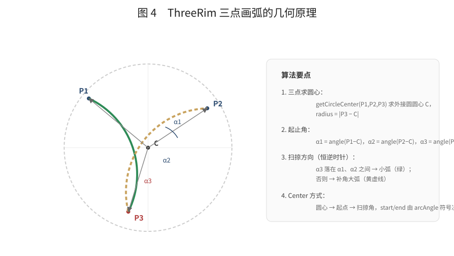
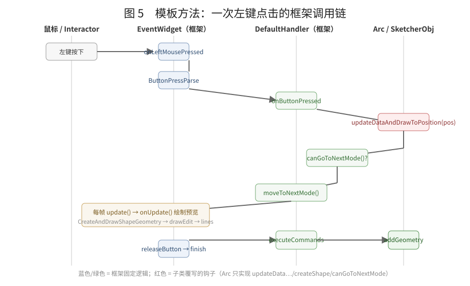
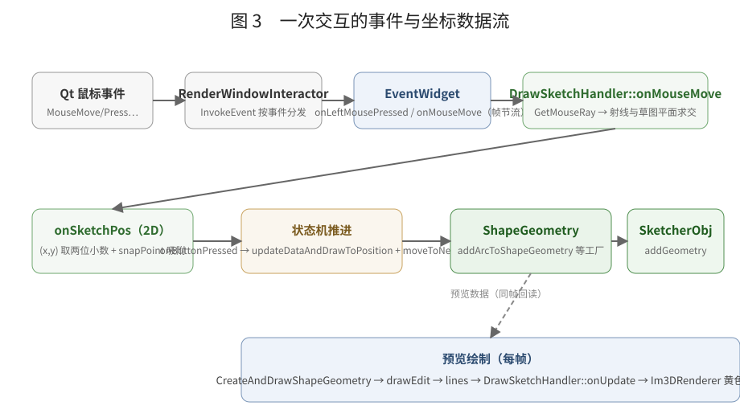
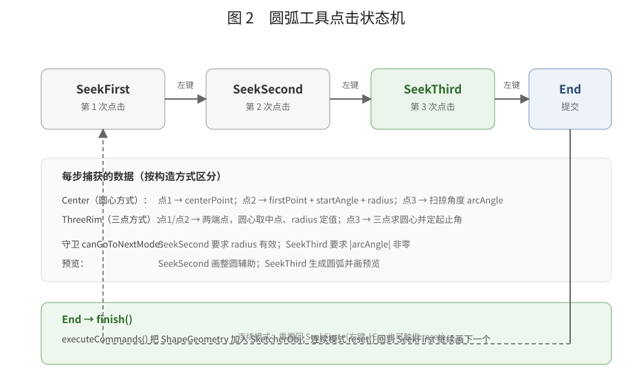
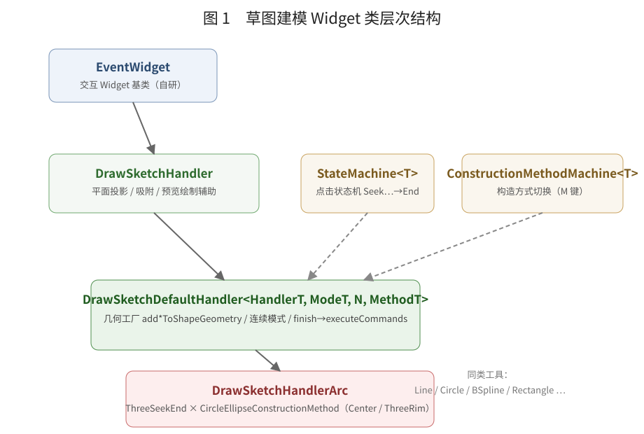

# 草图建模 Widget 深入解析：从鼠标事件到几何提交

> 本文是**逐行级深入解析**（事件→交互、预览管线、状态转移、提交时序）。
> 先看架构总览再读本文效果更好：[SketchModelingWidgetArchitecture.md](./SketchModelingWidgetArchitecture.md)。
>
> 本文聚焦 `DrawSketchDefaultHandler` 这一个类的设计，把“事件 → 交互 → 曲线 → 预览 → 状态转移 →
> 提交草图”整条链路的每个细节讲透。
>
> 涉及源码：
> `Moon/Interactive/EventWidget.*`、`Moon/Interactive/Widgets/DrawSketchHandler.h/.cpp`、
> `Moon/Interactive/Widgets/DrawSketchDefaultHandler.h`、`Moon/Interactive/Widgets/DrawSketchHandlerArc.h/.cpp`、
> `Moon/Sketcher/SketcherObj.*`、`Moon/editor/Toolbar/sketchToolbar.cpp`、`Moon/renderer/GizmoRenderPass.cpp`

---

## 1. 一句话总览

**Qt 鼠标事件**经过三层“翻译”，最终变成**一条加到草图对象里的几何曲线**：

```
屏幕像素坐标
  └─(1) 射线求交       RenderWindowInteractor → EventWidget 回调
  └─(2) 平面投影       世界点 → 草图 2D 坐标 onSketchPos（两位小数 + 吸附）
  └─(3) 状态机语义化   onSketchPos 被按“当前状态”解释（圆心 / 端点 / 扫掠角）
  └─(4) 几何化         ShapeGeometry（GeomArcOfCircle 等）
  └─(5) 落盘           SketcherObj::addGeometry（深拷贝）
```

每一步的“数据形态”与“意义”：

| 阶段 | 数据形态 | 意义 | 代码位置 |
| --- | --- | --- | --- |
| 原始事件 | `QMouseEvent` 像素坐标 | 无意义 | `RenderWindowInteractor::ReceiveEvent` |
| 世界坐标 | `FVector3 out` | 光标在 3D 空间的落点 | `DrawSketchHandler::onMouseMove` |
| 草图坐标 | `Base::Vector2d onSketchPos` | 光标在草图平面上的 2D 位置 | 同上 |
| 语义点 | `centerPoint / firstPoint / …` | “这个点代表圆心/端点/弧上点” | `DrawSketchHandlerArc::updateDataAndDrawToPosition` |
| 几何 | `unique_ptr<Part::Geometry>` | 可提交的曲线 | `addArcToShapeGeometry` |
| 草图数据 | `SketcherObj::mGeoList` | 正式进入草图 | `executeCommands → addGeometry` |

---

## 2. 先回答三个问题

### 2.1 事件是如何变成“有意义的画草图”交互的？

事件本身只携带“按下了哪个键、光标在哪”，没有任何草图语义。语义化发生在**三个不同的层**：

1. **坐标语义化**（`DrawSketchHandler`）：把屏幕坐标变成**草图平面上的 2D 坐标**。这一步让后续
   所有处理都脱离相机、脱离 3D，只在一个 2D 平面上思考；
2. **状态语义化**（`StateMachine`）：同样一个 2D 点，在 `SeekFirst` 时被解释为“圆心”，在
   `SeekSecond` 时被解释为“圆弧起点”——**同一个坐标，不同状态，不同含义**；
3. **几何语义化**（`createShape`）：把累积的中间量（圆心+半径+起止角）翻译成 `GeomArcOfCircle`。

`DrawSketchDefaultHandler` 是这三层之间的“翻译官”：它不自己产生任何草图语义，但它规定
“什么时候问谁要语义”。

### 2.2 鼠标事件如何影响曲线创建与预览？

鼠标事件影响曲线的路径有两条，**同时发生**：

```
鼠标移动
  ├─ DrawSketchHandler::onMouseMove()   → 刷新 onSketchPos（坐标语义化）
  └─ MouseMoveParse() → mouseMove() → updateDataAndDrawToPosition(pos)
        ├─ 更新 m_internal（圆心/半径/角度，曲线“数据”变了）
        └─ 内部调用 CreateAndDrawShapeGeometry()
              ├─ clearEdit()                清空上一帧折线缓冲 lines
              ├─ createShape(true)          用新数据重建 ShapeGeometry
              └─ drawEdit(ShapeGeometry)    离散成折线写入 lines
        → 每帧 onUpdate() 把 lines 画成黄色预览
```

关键点：**“曲线数据”和“预览折线”是两份不同的东西**。`ShapeGeometry` 是正式的几何对象；
`lines` 只是把几何离散成 `(p0,p1),(p1,p2),…` 顶点对、供 `onUpdate` 立即模式绘制。每次鼠标移动
都会**先改数据、再重建预览**，所以预览永远跟手。

### 2.3 状态如何转移、连续模式如何影响、交互何时结束、何时提交？

完整答案见第 6~8 节，先给结论：

| 问题 | 结论 |
| --- | --- |
| 状态转移 | 左键按下时 `onButtonPressed`：先 `updateDataAndDrawToPosition` 再 `canGoToNextMode` 通过则 `moveToNextMode`；`End` 是哨兵末态 |
| 连续模式 | 状态到达 `End` 后，左键**释放**时 `finish()` 提交几何，然后 `handleContinuousMode()` → `reset()` 回 `SeekFirst`，可以继续画下一个 |
| 右键/Esc | 在 `SeekFirst`（第一步）→ `quit()` 结束工具；在其它状态 → `handleContinuousMode()` 丢弃当前半成品重新开始 |
| 交互结束 | 右键第一步 `quit()`，或工具栏取消勾选（`setActive(false)`） |
| 提交 | 左键释放且状态为 `End` → `executeCommands()` → 逐个 `SketcherObj::addGeometry` |

---

## 3. DrawSketchDefaultHandler 类声明逐段解读

### 3.1 模板参数

```cpp
template<
    typename HandlerT,            // 具体工具类型（CRTP 风格，目前只用于实例化）
    typename SelectModeT,         // 状态枚举，如 StateMachines::ThreeSeekEnd
    int PInitAutoConstraintSize,  // 预留：自动约束初始容量，当前未使用
    typename ConstructionMethodT  // 构造方式枚举，如 CircleEllipseConstructionMethod
>
class DrawSketchDefaultHandler : public DrawSketchHandler,
                                 public StateMachine<SelectModeT>,
                                 public ConstructionMethodMachine<ConstructionMethodT>
```

四个模板参数的用途：

| 参数 | 用途 | 现状 |
| --- | --- | --- |
| `HandlerT` | 让每个工具实例化成独立类型（`DrawSketchHandlerArc` 就是 `HandlerT`），为将来 CRTP 静态分发留位置 | 仅用于类型标识，未做静态转换 |
| `SelectModeT` | 决定“要几次点击、每步叫什么” | 实际生效 |
| `PInitAutoConstraintSize` | FreeCAD 自动约束数组的初始容量 | 已剥离，未使用 |
| `ConstructionMethodT` | 决定“有几种画法”，配合 `M` 键循环 | 实际生效 |

### 3.2 三个基类的分工

```cpp
public DrawSketchHandler,          // is-a：事件入口 + 坐标/预览基础设施
public StateMachine<SelectModeT>,  // has-a 状态轴：现在是第几步
public ConstructionMethodMachine<ConstructionMethodT>  // has-a 方式轴：用哪种画法
```

这是一个“**双正交状态**”设计：状态机管“第几步”，构造方式机管“怎么画”，两者互不影响。
圆弧工具在 `SeekSecond` 时，既可能是“圆心式的起点”也可能是“三点式的端点”，由
`constructionMethod()` 决定。

### 3.3 成员与公开接口清单

```cpp
protected:
    std::vector<std::unique_ptr<Part::Geometry>> ShapeGeometry;  // 当前半成品的几何
    bool continuousMode;                                          // 是否连续绘制
```

公开接口（按职责分组）：

| 组 | 接口 | 作用 |
| --- | --- | --- |
| 生命周期 | `onReset()`、`reset()` | 清空数据回到 `SeekFirst` |
| 连续模式 | `handleContinuousMode()` | 提交后/右键时决定继续还是结束 |
| 提交 | `finish()`、`executeCommands()` | 判断是否 `End`，提交几何 |
| 事件 | `onLeftMousePressed/Released/onMouseMove/onRightMousePressed/onKeyPress` | 事件 → 框架流程 |
| 解析 | `ButtonPressParse/ButtonReleaseParse/MouseMoveParse` | 事件 → `onSketchPos` 语义化入口 |
| 钩子 | `updateDataAndDrawToPosition/canGoToNextMode/createShape` | 子类实现 |
| 流程 | `CreateAndDrawShapeGeometry()` | 预览刷新三段式 |
| 几何工厂 | `addLine/addArc/addPoint/addEllipse/addCircleToShapeGeometry` | 构造 `ShapeGeometry` 元素 |

---

## 4. 构造与初始状态

```cpp
DrawSketchDefaultHandler(const std::string& name, ConstructionMethodT constructionmethod = 0)
    : DrawSketchHandler(name),
      StateMachine<SelectModeT>(),
      ConstructionMethodMachine<ConstructionMethodT>(constructionmethod),
      continuousMode(true)
{
    setActive(false);                    // 工具创建后默认不激活
    makePlane(SketcherPlane2D());        // 先给一个默认平面，激活后由 onUpdate 刷新
}
```

注意两个细节：

1. **构造即 `setActive(false)`**。所有草图 handler 在 `GizmoRenderPass` 构造时一次性创建、常驻内存，
   但默认全部不激活，不响应不绘制。工具栏勾选时才激活。
2. **默认平面是空的 `SketcherPlane2D()`**。真正的平面来自当前激活的草图：

```cpp
void DrawSketchHandler::onUpdate() {
    auto feature = SketcherObjManager::instance().GetCurrentActiveSketcherFeature();
    if (feature) {
        if (auto sketchobj = feature->getSketcherObj()) {
            makePlane(sketchobj->getPlane());   // 每帧从活动草图刷新平面
        }
    }
    // … 然后画吸附点、坐标浮标、lines 预览
}
```

平面是**每帧刷新**的：如果用户移动/旋转了草图平面，交互坐标系自动跟随，不需要重新激活工具。

---

## 5. 状态机与构造方式机内部实现

### 5.1 StateMachine\<T\> 的完整语义

```cpp
enum class ThreeSeekEnd { SeekFirst, SeekSecond, SeekThird, End };
```

内部实现把枚举当作整数数组的索引：

```cpp
SelectModeT computeNextMode() const {
    auto modeint = static_cast<int>(state());
    if (modeint < maxMode) return static_cast<SelectModeT>(modeint + 1);
    return SelectModeT::End;
}
```

其中 `maxMode = static_cast<int>(SelectModeT::End)`，也就是**枚举成员总数**。因此：

- `End` 必须是最后一个枚举值（哨兵），状态数量由枚举自动推导；
- `moveToNextMode()` 在最后一个真实状态再 +1 就是 `End`；
- `reset()` 回到 `static_cast<SelectModeT>(0)`，即 `SeekFirst`。

所有状态接口及语义：

| 接口 | 语义 |
| --- | --- |
| `setState(m)` | 无条件切状态，回调 `onModeChanged()` |
| `ensureState(m)` | 不同才切（去重） |
| `ensureStateIfEarlier(m)` | 只允许回退到“已经过”的更早状态（预留修改流程用） |
| `moveToNextMode()` | 顺序 +1 |
| `reset()` | 清空 `nextMode`、回到 `SeekFirst` |
| `setNextState / getNextState / applyNextState` | 延迟状态切换：先存起来，稍后统一应用 |
| `isFirstState() / isLastState()` | 判断首/末 |

### 5.2 ConstructionMethodMachine\<T\> 的循环语义

```cpp
ConstructionMethodT getNextMethod() const {
    auto modeint = static_cast<int>(ConstructionMode);
    if (modeint < maxMode - 1) return static_cast<ConstructionMethodT>(modeint + 1);
    return static_cast<ConstructionMethodT>(0);       // 循环回第一个
}
void iterateToNextConstructionMethod() {
    if (ConstructionMethodsCount() > 1) setConstructionMethod(getNextMethod());
}
```

以圆弧的 `CircleEllipseConstructionMethod { Center=0, ThreeRim=1, End=2 }` 为例：
`Center → ThreeRim → Center` 循环；只有一个方式的工具不会触发切换。

---

## 6. 事件如何驱动框架：完整调用链

### 6.1 事件 → 框架方法 映射

`DrawSketchDefaultHandler` 覆写了 `EventWidget` 的五个事件入口：

| 事件 | 覆写 | 内部流程 |
| --- | --- | --- |
| 左键按下 | `onLeftMousePressed()` | `ButtonPressParse()` → `onButtonPressed(onSketchPos)` |
| 左键释放 | `onLeftMouseReleased()` | `ButtonReleaseParse()` → `releaseButton(onSketchPos)` → `finish()` |
| 鼠标移动 | `onMouseMove()` | `DrawSketchHandler::onMouseMove()`（先刷坐标）→ `MouseMoveParse()` → `mouseMove(onSketchPos)` |
| 右键按下 | `onRightMousePressed()` | `rightButtonOrEsc()` |
| 键盘 | `onKeyPress(key)` | `M` 键且非 `End` → 切换构造方式 |

### 6.2 左键按下：先刷新再推进（顺序不可颠倒）

```cpp
virtual void onButtonPressed(Base::Vector2d pos) {
    this->updateDataAndDrawToPosition(pos);   // ① 用当前光标更新中间数据 + 刷新预览
    if (canGoToNextMode()) {                  // ② 校验这次点击是否“有效”
        this->moveToNextMode();               // ③ 有效才推进状态
    }
}
```

顺序的意义：假设现在在 `SeekFirst`，光标在 P1。`updateDataAndDrawToPosition(P1)` 先把
`firstPoint = P1`，随后 `moveToNextMode()` 进入 `SeekSecond`。**如果先推进状态再更新数据**，
新状态拿到的还是上一帧的数据，逻辑就全错了。

### 6.3 左键释放：finish 判定

```cpp
virtual bool releaseButton(Base::Vector2d onSketchPos) {
    if (finish()) { }   // finish() 内部判断状态，不是 End 就什么都不做
    return true;
}

bool finish() {
    if (this->isState(SelectMode::End)) {
        executeCommands();          // 提交
        return handleContinuousMode();  // 连续 → reset() 回 SeekFirst
    }
    return false;
}
```

> 提交发生在**左键释放**而非按下：按下只推进状态，释放时如果恰好到达 `End` 才提交。
> 这保证“第三次点击”的画面先完整呈现（按下时已生成几何），松手才落盘。

### 6.4 鼠标移动：坐标刷新与预览刷新是两条路径

```cpp
virtual void onMouseMove() override {
    DrawSketchHandler::onMouseMove();   // ① 射线求交 → onSketchPos + 吸附
    MouseMoveParse();                   // ② 用新坐标驱动状态机
}

virtual void mouseMove(Base::Vector2d pos) {
    updateDataAndDrawToPosition(pos);   // 默认实现：只调钩子
}
```

第①步更新“光标在哪”，第②步让子类用新位置“改数据 + 刷预览”。两者分离的好处是：未来如果加入
约束/捕捉预览，可以在②之前统一插入，而不动子类代码。

吸附收敛在 `SketcherObj::snapPoint()`：端点/圆心 → 原点/坐标轴 → 曲线本体，
最后才是网格交叉点（面板 **Snap To Grid** 开关，阈值同为 10px），详见
`docs/SketcherObj.md §3.4`。

### 6.5 右键/Esc

```cpp
virtual void rightButtonOrEsc() {
    if (this->isFirstState()) {
        quit();                 // 第一步：结束工具（取消激活 + 取消工具栏勾选）
    } else {
        handleContinuousMode(); // 中途：丢弃半成品，回到 SeekFirst
    }
}
```

### 6.6 键盘

```cpp
virtual void onKeyPress(const std::string& key) {
    if (key == "M" && !this->isLastState()) {
        this->iterateToNextConstructionMethod();
    }
}
```

`End` 状态不允许切方式（马上要提交了，切了没意义）。

---

## 7. 连续模式、交互结束与提交

### 7.1 handleContinuousMode 的两种去向

```cpp
bool handleContinuousMode() {
    if (continuousMode) {
        reset();        // 清空 ShapeGeometry / lines / 状态回 SeekFirst
        return false;   // 继续使用当前 handler
    }
    return true;        // 非连续：通知调用方可以结束（Moon 里由右键 quit 收尾）
}
```

`reset()` 做了什么：

```cpp
void reset() {
    clearEdit();          // lines 清空
    ShapeGeometry.clear();// 半成品几何清空
    onReset();            // 子类可覆写（清自己的 m_internal 中间量）
    ModeStateMachine::reset();  // 状态回 SeekFirst
}
```

注意：`reset()` **不**重置 `constructionMethod()`（画法保持），也不退出激活——连续模式就是
“同一工具、同一画法、无限画下去”。

### 7.2 交互何时真正结束

只有两条路径：

1. **右键/Esc 且处于 `SeekFirst`** → `quit()`：

```cpp
void DrawSketchHandler::quit() {
    this->setActive(false);
    GetService(SketchToolbar).setUncheckedAction(getName());  // 工具栏按钮弹起
}
```

2. **工具栏手动取消勾选** → `CreateCurveCommand::execute` → `enableGizmoWidget(name, false)`
   → `setActive(false)`。

> ⚠️ 设计缺口：路径 2 只调 `setActive(false)`，**不 reset 状态**。如果用户在 `SeekThird` 时直接
> 取消工具栏，再重新激活该工具，状态机还停在 `SeekThird`，会接着上次的半成品继续。目前靠
> 右键/Esc 在 `SeekFirst` 退出是唯一“干净”的结束方式。

### 7.3 提交：executeCommands

```cpp
virtual void executeCommands() {
    CORE_INFO("add {0} geometry to sketcher obj ", ShapeGeometry.size());
    SketcherObj* sketchobj = SketcherObjManager::instance().GetCurrentActiveSketcherObj();
    if (sketchobj) {
        for (auto& geo : ShapeGeometry) {
            sketchobj->addGeometry(geo);   // 注意：传的是裸指针，内部深拷贝
        }
    }
}
```

`SketcherObj::addGeometry(Part::Geometry*)` 的语义：

```cpp
int SketcherObj::addGeometry(Part::Geometry* curve) {
    std::unique_ptr<Part::Geometry> temp(curve->copy());   // 深拷贝
    return addGeometry(temp);                              // 存入 mGeoList + 缓存离散段
}
```

深拷贝的意义：`ShapeGeometry` 随后会被 `reset()` 清空，草图里保留的是独立副本，两者互不影响。

---

## 8. 预览：数据 → 离散折线 → 立即模式绘制

### 8.1 三段式刷新

```cpp
void CreateAndDrawShapeGeometry() {
    clearEdit();                 // ① 清空上一帧 lines
    createShape(true);           // ② 钩子：重建 ShapeGeometry（子类负责 clear + 重建）
    drawEdit(toPointerVector(ShapeGeometry));  // ③ 几何 → 离散折线 → lines
}
```

三个约定：

- `clearEdit()` 只清 `lines`（预览缓冲），**不清** `ShapeGeometry`；
- `createShape(true)` 的约定是**自己清空并重建** `ShapeGeometry`（`DrawSketchHandlerArc::createShape`
  第一行就是 `ShapeGeometry.clear()`）；
- 所以 `ShapeGeometry` 有两个清空入口：`reset()` 和 `createShape()`，都写了 clear，缺一不可。

### 8.2 几何 → 折线

```cpp
void DrawSketchHandler::drawEdit(const std::vector<Part::Geometry*>& geometries) {
    std::list<std::vector<Base::Vector2d>> list;
    for (auto& geo : geometries)
        if (geo->isDerivedFrom<Part::GeomCurve>())
            list.push_back(CurveConvert::toVector2D(geo, 50));   // 曲线离散成 50 段
    drawEdit(list);   // 每段再展开成 (p0,p1),(p1,p2),… 压入 lines
}
```

`lines` 是 `std::vector<Base::Vector2d>`，按“成对顶点”存储：`[a0,a1, a1,a2, a2,a3, …]`，
`onUpdate` 里 `for (i += 2) drawLine(lines[i], lines[i+1])` 逐段绘制。

### 8.3 每帧绘制内容

`DrawSketchHandler::onUpdate()` 依次画：

```cpp
if (isSnapedSketchPos) drawPoint(plane.valueEigen(onSketchPos), 16, 洋红);  // 吸附点
if (drawSketchPos)     ImGui 前景文字(坐标字符串);                          // 坐标浮标
renderer->pushColor(黄); renderer->pushSize(3);
for (i += 2) drawLine(plane.valueEigen(lines[i]), plane.valueEigen(lines[i+1]));  // 预览折线
```

`drawFloatValue` 同理在光标旁画数值（如半径/角度，Arc 中暂被注释）。

---

## 9. 以 ThreeRim 画圆弧为例：完整状态-数据-预览推演

假设草图平面是 XOY，光标依次落在：

```
P1 = (0, 0)          P2 = (10, 0)          P3 = (5, 8.66025)
```

（等边三角形三点，外接圆半径 R = 10/√3 ≈ 5.7735，圆心 C = (5, 2.88675)。）

### 9.1 逐步推演

| 事件 | 状态 | 代码做了什么 | 中间数据 | 预览 |
| --- | --- | --- | --- | --- |
| 移动到 P1 | SeekFirst | `firstPoint = P1` | firstPoint=(0,0) | 无 |
| 左键按下① | SeekFirst | 推进状态 | — | — |
| 移动到 P2 | SeekSecond | `centerPoint = (P2−P1)/2 + P1 = (5,0)`；`radius = 5` | 临时圆心/半径 | **整圆**辅助（半径 5） |
| 左键按下② | SeekSecond | 半径非零，推进状态 | — | — |
| 移动到 P3 | SeekThird | 三点求圆心 C=(5,2.88675)，radius=5.7735；α1=210°，α2=330°，α3=90°；α3 不在 α1..α2 之间 → 补角大弧：start=330°，end=210°，arcAngle=240° | 完整圆弧参数 | **圆弧**预览 |
| 左键按下③ | SeekThird | 弧角非零，推进状态 → **End** | — | 圆弧 |
| 左键释放③ | End | `finish()` → `executeCommands()` → `addGeometry(圆弧副本)` → `handleContinuousMode()` → `reset()` | 清空 | 无（等下一个） |

其中 `SeekThird` 的判定代码：

```cpp
angle3 = (onSketchPos - centerPoint).Angle();
if (angle3 > min(α1,α2) && angle3 < max(α1,α2)) {
    start = min(α1,α2); end = max(α1,α2); arcAngle = end - start;        // 小弧
} else {
    start = max(α1,α2); end = min(α1,α2); arcAngle = 2π - (start - end); // 补角大弧
}
```

本例 α3=90° 落在区间外 → 走大弧分支，从 330° 逆时针扫 240° 经过 90°（P3 ✓）到 210°，正好是
“过 P3 的优弧”。

### 9.2 关于 startAngle 的一个微妙细节（Center 方式）

`DrawSketchHandlerArc::updateDataAndDrawToPosition` 的 `SeekThird`（Center 分支）在生成预览后
**把 startAngle 恢复成备份值**：

```cpp
double startAngleBackup = m_internal->startAngle;
// … 根据 arcAngle 符号交换 start/end 并 createShape …
CreateAndDrawShapeGeometry();
if (constructionMethod() == Center) {
    m_internal->startAngle = startAngleBackup;   // 恢复，供下一帧连续性判断
}
```

也就是说：**预览用的起止角顺序**（为了显示方向）和**下一帧继续判断用的 startAngle**（为了
连续性）是两套值，中间靠“画完即还原”衔接。这是这类“预览语义”与“交互语义”分离的典型细节。



---

## 10. 完整调用链图









---

## 11. 三个钩子的契约（子类必读）

### 11.1 `updateDataAndDrawToPosition(Base::Vector2d pos)`

- 调用时机：每次鼠标移动、每次左键按下（`onButtonPressed` 第一步）；
- 入参：已经吸附/量化过的 `onSketchPos`；
- 职责：**更新 m_internal 中间数据，并在内部调用 `CreateAndDrawShapeGeometry()` 刷新预览**；
- 约定：幂等（同一位置调用两次结果相同）；不得推进状态（状态由框架推）；
- Arc 实现：按 `state()` 分支更新 `centerPoint/firstPoint/secondPoint/radius/startAngle/endAngle/arcAngle`。

### 11.2 `canGoToNextMode()`

- 调用时机：`onButtonPressed` 第二步；
- 职责：判断“这次点击产生的数据是否有效”；
- 约定：返回 false 时状态**不**推进，数据保留（用户可继续移动光标修正）；
- Arc 实现：`SeekSecond` 半径非零、`SeekThird` 弧角非零。

### 11.3 `createShape(bool onlyeditoutline)`

- 调用时机：仅由 `CreateAndDrawShapeGeometry()` 调用；
- 职责：**清空并重建 `ShapeGeometry`**；
- 约定：不碰 `lines`（框架负责 clearEdit）；`onlyeditoutline` 目前恒为 true，用于区分
  “只画轮廓”与“画辅助线”；
- Arc 实现：`SeekSecond` 画整圆辅助、`SeekThird` 生成圆弧。

---

## 12. 设计评价

### 12.1 优点

1. **正交解耦**：事件（EventWidget）、坐标（DrawSketchHandler）、状态（StateMachine）、几何
   （ShapeGeometry）各管一摊，互不渗透；
2. **模板方法**：框架把“点击→推进→提交”流程写死，子类只需 3 个钩子，新增工具成本极低；
3. **所有权清晰**：`unique_ptr` 容器持有半成品，提交时深拷贝进 `SketcherObj`，生命周期无歧义；
4. **常驻实例**：handler 不随激活创建/销毁，避免频繁注册/注销观察者；
5. **预览与数据分离**：`ShapeGeometry`（正式几何）与 `lines`（离散折线）解耦，预览成本可控。

### 12.2 已知问题/风险

| 问题 | 说明 |
| --- | --- |
| 工具栏取消不 reset | `setActive(false)` 不清状态，重新激活会接着半成品继续 |
| `ShapeGeometry` 双清空约定 | `reset()` 与 `createShape()` 都要 clear，容易漏 |
| `HandlerT` 未真正使用 | CRTP 只是类型标识，可进一步做静态分发 |
| `PInitAutoConstraintSize` 未使用 | FreeCAD 自动约束剥离后的残留参数 |
| `constructionMode` 未接入 | `add*ToShapeGeometry` 的构造线参数是占位，无参考线区分 |
| 无撤销 | 提交后没有 `undo`，误操作只能手动删 |
| 日志尾随空格 | `executeCommands` 的日志字符串末尾带空格 |

---

## 13. 扩展：新增一个工具的最小改动

1. 定义状态枚举（`End` 必须最后）；
2. 继承 `DrawSketchDefaultHandler<X, 状态机, N, 构造方式>`；
3. 实现三个钩子；
4. `GizmoRenderPass` 注册 + `SketchToolbar` 加 `CreateCurveCommand` 并入 `blackList`。

```cpp
class DrawSketchHandlerX : public DrawSketchDefaultHandler<DrawSketchHandlerX, StateMachines::TwoSeekEnd, 2,
                                                          ConstructionMethods::DefaultConstructionMethod> {
public:
    DrawSketchHandlerX(const std::string& name)
        : DrawSketchDefaultHandler<DrawSketchHandlerX, StateMachines::TwoSeekEnd, 2,
                                   ConstructionMethods::DefaultConstructionMethod>(name) {}
    void updateDataAndDrawToPosition(Base::Vector2d pos) override {
        // 更新中间数据；内部调用 CreateAndDrawShapeGeometry() 刷预览
    }
    bool canGoToNextMode() override { return true; }
    void createShape(bool) override {
        ShapeGeometry.clear();
        // addLineToShapeGeometry(…) / addArcToShapeGeometry(…) …
    }
};
```
