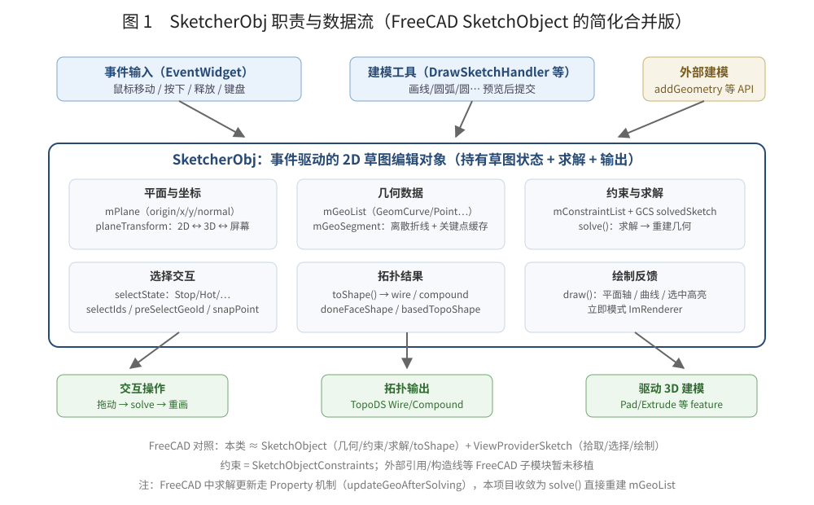
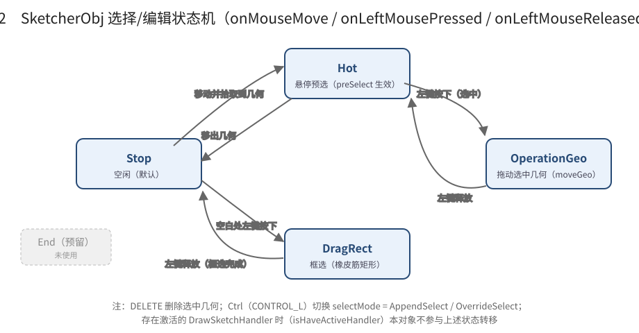

# SketcherObj：工作职责、功能清单与开发计划

> 本文基于 `Moon/Sketcher/SketcherObj.h` / `SketcherObj.cpp` 的实际实现整理，并对照 FreeCAD 的
> `src/Mod/Sketcher/App/SketchObject*`（App 侧）与 `src/Mod/Sketcher/Gui/ViewProviderSketch`（交互侧）
> 说明本类完成了其中哪些、还缺哪些。

---

## 1. 一句话总览

**`SketcherObj` 是一个事件驱动的 2D 草图编辑对象**：它持有草图平面、2D 几何与约束，把
`EventWidget` 的鼠标/键盘事件翻译成“选择 → 拖动 → 求解 → 重绘”，并能在完成编辑时把草图几何
输出为可用于 3D 建模的拓扑（wire / compound）。

FreeCAD 中这一套逻辑被拆在多个类里（`SketchObject` 管数据与求解、`ViewProviderSketch` 管拾取绘制、
`DrawSketchHandler*` 管工具交互、`Constraint` 管约束类型），本项目的 `SketcherObj` 把它们**合并成一个
`EventWidget` 子类**，工具交互则仍然拆到 `Moon/Interactive/Widgets/DrawSketchHandler*`。



---

## 2. 工作职责（按模块）

### 2.1 数据持有

| 成员 | 类型 | 职责 | 对应 FreeCAD |
| --- | --- | --- | --- |
| `mPlane` | `SketcherPlane2D` | 草图平面（origin / xAxis / yAxis / normal） | `SketchObject.Placement` + 平面属性 |
| `planeTransform` | `Base::Matrix4D` | 2D 草图坐标 → 3D 世界坐标的基矩阵 | `Placement` 作用在几何上 |
| `mGeoList` | `vector<unique_ptr<Part::Geometry>>` | 草图几何（线/圆弧/圆/样条/点），平面局部坐标 | `SketchObject.Geometry` |
| `mConstraintList` | `vector<Constraint*>`（裸指针） | 约束列表 | `SketchObject.Constraints` |
| `solvedSketch` | `Sketcher::Sketch` | GCS 求解器封装 | `Sketcher::Sketch`（内部求解器） |
| `mGeoSegment` | `unordered_map<Geometry*, CurveSegment>` | 每条曲线的离散折线 + 参数 + Start/End/Center 关键点缓存 | `ViewProviderSketch` 内部的显示缓存 |
| `selectIds / preSelectGeoId` | `vector<SelectGeoId>` / `SelectGeoId` | 选中项与悬停预选项（GeoId + 点类型） | `ViewProviderSketch` 选择逻辑 |
| `basedTopoShape / doneFaceShape` | `Part::TopoShape` | 编辑前基准 / 编辑完成后输出的拓扑 | `SketchObject` 的 Shape 输出 |

### 2.2 职责分解

1. **坐标转换**：`updateTransform()` 用平面基向量构造列主序矩阵；
   `getMouseHitSketchPlanePoint()` 用鼠标射线打平面得到 2D 草图坐标（量化到 0.01）；
   `testSelect()` / `snapPoint()` 把 2D 坐标经 `planeTransform × 视口矩阵` 变成屏幕坐标做距离判定。
2. **选择交互状态机**：`Stop / Hot / OperationGeo / DragRect` 四个状态在
   `onMouseMove / onLeftMousePressed / onLeftMouseReleased` 中转移；`Ctrl` 切换
   `AppendSelect / OverrideSelect`，`DELETE` 删除选中。
3. **拖动几何**：`moveGeo()` 按 `PointPos`（None/StartP/EndP/CenterP）修改线端点、圆弧范围、
   圆半径/圆心等；拖动后触发 `solve()`。
4. **约束求解**：`solve()` 把几何与约束喂给 GCS，`retrieveSolverDiagnostics()` 记录冲突/冗余/过约束，
   成功后从求解器重建全部几何。
5. **几何管理 API**：`addGeometry` / `deleteGeometry(s)` / `replaceGeometry(ies)` / `trim` /
   `fillet` / `addSymmetric` / `getSymmetric`，索引为 `GeoId`。
6. **输出拓扑**：`toShape()` 把边连成 wire（`BRepBuilderAPI_MakeWire` + `ShapeFix_Wire`），
   多 wire 合成 compound，再挂 `planeTransform`。
7. **绘制反馈**：`draw()` 画平面坐标轴、所有曲线的离散折线、关键点与选中高亮。
8. **生命周期**：`setPlane` / `fitCamera` / `beginEdit` / `makeDone` 控制进入/退出草图编辑
   （进入时切正交相机并摆正视角）。
9. **与工具协作**：`onUpdate()` 检测激活的 `DrawSketchHandler`，有激活工具时本对象不抢事件。

---

## 3. 核心流程

### 3.1 编辑生命周期

```text
setPlane(plane) ──► fitCamera()          // 正交相机、看向平面法线
beginEdit() ──────► isInEdit = true      // 进入编辑
    │  … 几何/约束/拖动/求解循环 …
makeDone() ───────► toShape() → doneFaceShape   // 输出拓扑、恢复旋转、停用工具
```

### 3.2 交互状态机



关键点：

- 只有 `!isHaveActiveHandler && isInEdit` 时状态机才运转（避免和画线/画圆弧工具冲突）；
- `OperationGeo` 状态下每次鼠标移动都会 `solve()`，是全量删除重建，代价较高；
- 框选（`DragRect`）判定：整条曲线的离散点都在框内才选中整条，否则只选中框内的关键点。

### 3.3 solve 流程（当前实现）

```text
solvedSketch.resetInitMove()
  → setUpSketch(GeoList, mConstraintList)
  → retrieveSolverDiagnostics()          // 冲突 / 冗余 / 过约束标记
  → 若正常：solvedSketch.solve()
  → 若成功：deleteGeometries(全部) → mGeoList.clear()
            → extractGeometry() → addGeometry() 全量重建
```

⚠️ 注意：当前 `solve()` **恒返回 0**（内部算出的 `err` 未返回），且成功路径全量删除重建，
约束与选择依赖“GeoId 顺序不变”的隐含假设。

---

## 4. 功能清单（当前实现状态）

| 模块 | 功能 | 状态 | 说明 |
| --- | --- | --- | --- |
| 生命周期 | setPlane / beginEdit / makeDone / fitCamera | ✅ 完整 | fitCamera 硬编码 `SetSize(100)`，不按草图包围盒 |
| 几何 | addGeometry / getGeometry / deleteGeometry(s) | ✅ 完整 | unique_ptr 持有，无泄漏 |
| 几何 | replaceGeometry(ies) | ✅ 完整 | 同步维护 mGeoSegment |
| 几何 | trim（两参数裁剪/删除） | ✅ 基本完整 | 依赖 `GeomCurve::createArc` 支持 |
| 几何 | fillet / chamfer（含 seekTrimPoints） | ✅ 基本完整 | 支持线-线；其它组合待验证 |
| 几何 | addSymmetric / getSymmetric | ✅ 完整 | |
| 几何 | isClosedCurve | ✅ 完整 | 圆/椭圆/周期样条 |
| 拖动 | moveGeo：线/圆弧/圆/样条 | ✅ 完整 | |
| 拖动 | moveGeo：GeomArcOfConic | ❌ 占位 | 分支为空，圆锥弧拖不动 |
| 约束 | addConstraint（去重）/ 求解器对接 | ✅ 基本完整 | |
| 约束 | 析构释放 mConstraintList | ❌ 缺失 | `~SketcherObj()` 为空 → 泄漏 |
| 求解 | solve + 诊断（冲突/冗余/过约束） | ⚠️ 部分 | err 恒返回 0；全量重建 |
| 选择 | 点选 / 框选 / 悬停 / 追加选择 / DELETE | ✅ 完整 | |
| 选择 | End 状态 / hasClickSelected / getPickGeoIndex | ❌ 冗余 | 已定义未使用 |
| 吸附 | 端点/圆心/原点/坐标轴/曲线上 | ✅ 基本 | 无中点/交点等 |
| 输出 | toShape → wire/compound + transform | ✅ 完整 | 不生成 Face；闭合校验弱 |
| 绘制 | 平面轴 / 曲线 / 选中高亮 / 框选矩形 | ✅ 基本 | 无约束符号/尺寸标注 |
| 撤销 | undo / redo | ❌ 缺失 | |

---

## 5. Plan to do（按优先级）

### P0 —— 正确性与资源

- [ ] `solve()` 返回真实错误码（过约束 -4 / 冲突 -3 / 冗余 -2 / 求解失败 -1 / 畸形 -5），
      调用方（拖动、工具栏）能区分失败并给出提示；
- [ ] `~SketcherObj()` 释放 `mConstraintList`（或改 `unique_ptr` 持有）；
- [ ] 拖动的 `solve()` 副作用：拖动中可改用“求解后原位替换几何”或仅求解拖动的图元，避免
      每帧全量删除重建（GeoId / 选择状态全依赖索引稳定，重建很脆弱）。

### P1 —— 功能补全（对照 FreeCAD）

- [ ] `moveGeo()` 补齐 `GeomArcOfConic`（椭圆弧端点/圆心拖动）；
- [ ] `toShape()` 增加闭合校验，闭合草图生成 Face（供 Pad 直接使用），并接入
      `ShapeAnalysis_FreeBounds::ConnectEdgesToWires` 这类更稳的连线方案；
- [ ] `fitCamera()` 按 `mGeoList` 包围盒自适应视口尺寸与中心；
- [ ] 吸附增强：中点、交点、曲线端点自动约束（对照 FreeCAD `autoConstraint` / `GeoEnum`）；
- [ ] 约束编辑 UI 接入（距离/角度/共线/相切等，当前只有数据层）。

### P2 —— 体验与清理

- [ ] 去掉 `End` / `hasClickSelected` / `getPickGeoIndex` 等未用字段；
- [ ] 交互坐标去掉 0.01 量化或改为可配置网格吸附；
- [ ] 绘制补约束符号、尺寸、构造线样式（construction）；
- [ ] undo/redo 栈（FreeCAD 用 Property + Transaction，本项目可先做快照式）；
- [ ] 与 `DrawSketchHandler` 的提交回调节点整理（当前靠 `isHaveActiveHandler` 隐式协作）。

---

## 6. 参考源码

- 本类：`Moon/Sketcher/SketcherObj.h`、`Moon/Sketcher/SketcherObj.cpp`
- 交互框架：`Moon/Interactive/EventWidget.*`、`Moon/Interactive/Widgets/DrawSketchHandler*`
- 工具 UI：`Moon/editor/Toolbar/sketchToolbar.cpp`
- FreeCAD 对照：
  `D:\Project\C++\FreeCAD\src\Mod\Sketcher\App\SketchObject.h`（及
  `SketchObjectGeometry.cpp / SketchObjectConstraints.cpp / SketchObjectOperations.cpp`）、
  `D:\Project\C++\FreeCAD\src\Mod\Sketcher\Gui\ViewProviderSketch.cpp`、
  `D:\Project\C++\FreeCAD\src\Mod\Sketcher\Gui\DrawSketchHandler*.h`
- 关联文档：`docs/SketchModelingWidget.md`、`docs/SketchModelingWidgetArchitecture.md`、
  `docs/SketchWidgets/DrawSketchHandler*.md`
