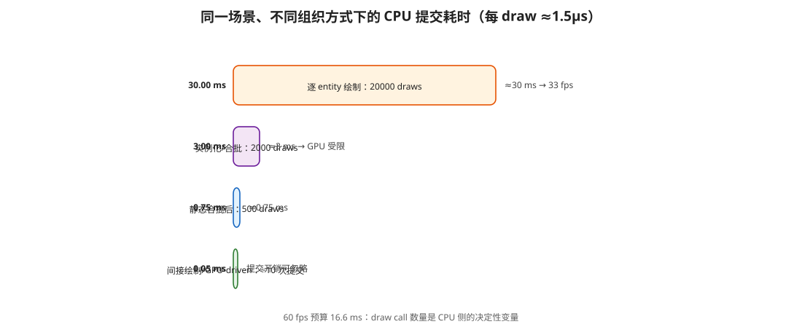
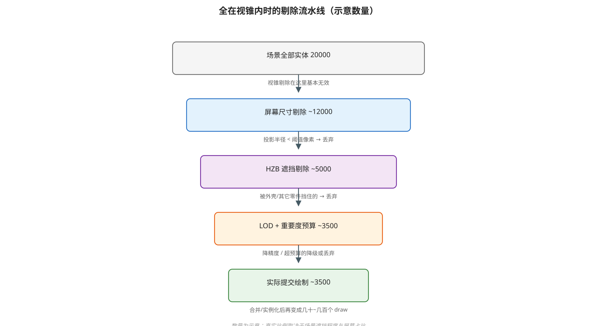

# 海量实体场景的渲染性能优化方案

> 主文档：[README.md](./README.md)
>
> 适用场景：**2 万个以上 entity 需要在同一帧绘制，且绝大多数都落在视锥内**。
> 这类场景常见于 CAD 装配体、BIM 模型、点云/扫描数据、密集零件可视化。
> 本文与具体引擎无关，Filament 的实测数据只作为参照。

## 1. 问题定义与核心判断

先明确一件事：**"entity 数量"和"draw call 数量"不是一回事**。

```text
逻辑对象（entity）     20000 个
        ↓ 按 mesh / material / 渲染状态 分组
绘制批次（draw call）  几十 ~ 几千个
        ↓ 剔除（遮挡 / 屏幕尺寸 / LOD）
实际提交              更少
```

优化的全部工作，就是**把上面这条链路逐级压缩**。如果 1 个 entity 直接对应 1 个 draw call，
那么后面的所有努力都会被 CPU 提交开销吃掉。



## 2. 先算账：预算与瓶颈分类

### 2.1 每 draw 的预算

```text
60 fps  →  16.6 ms/帧
20000 draws  →  每个 draw 只有 0.8 µs 预算

而一次 glDraw* + 必要状态切换（VAO/程序/描述符绑定）通常是 1~5 µs
⇒ 20000 draws ≈ 20~100 ms，必然是 CPU 瓶颈
```

参照实测（同一场景、同一 GPU，Filament 多线程 Release）：

| draw calls | fps | 帧时间 |
|---|---|---|
| 23469 | ≈33 | ~29 ms |
| 4694 | ≈150 | ~6.5 ms |
| 235 | 165 | 6.1 ms |

**draw call 数量从 2.3 万降到几百，帧率是数量级的差别。**

### 2.2 先判断瓶颈在哪

| 观察结果 | 瓶颈 | 优先手段 |
|---|---|---|
| CPU 上每帧提交耗时长，GPU 时间短、利用率低 | **CPU 提交** | 减少 draw call、降低每 draw 成本 |
| GPU 时间高、CPU 有空闲 | **GPU** | LOD、剔除、降低着色/带宽 |
| GPU 时间随 draw call 增加而增加（几何不变） | **状态切换 / 驱动开销** | 排序、批处理、MDI |
| 换廉价材质后帧率大涨 | **片元着色 / overdraw** | 前到后排序、遮挡剔除、预通道 |
| 关闭部分物体后帧率线性上升 | **每物体固定开销** | 批处理、实例化 |

测量要点：分开测 CPU 提交时间、GPU 时间、overdraw；不要只看帧率。

## 3. 剔除：视锥失效之后的三个维度



### 3.1 屏幕尺寸剔除（最便宜，先做）

物体在视锥内不代表它值得画——投影后可能只有 1~2 个像素。

```text
屏幕半径(px) = (包围球半径 / 相机距离) × (viewportHeight / (2 × tan(fovY/2)))
if (屏幕半径 < 阈值，例如 2.0 px) → 丢弃
```

实现要点：

- 每个 entity 预计算**包围球半径**（一次）；
- 每帧只做一次除法和比较，可 SIMD 批量处理；
- 阈值可分级：交互中阈值大（更激进），静止后代之以精细渲染（渐进式）。

CAD 场景里大量小零件在远景会直接消失，视觉几乎无感，收益却很大。

### 3.2 遮挡剔除（收益最大）

推荐 **HZB（层次 Z 缓冲）**：用上一帧的深度信息判断"这个东西是不是完全被挡住了"。

```text
渲染阶段：
    深度缓冲 → 降采样 mip 链（每级取 4 像素的 min/max，得到"最远深度"金字塔）

剔除阶段（下一帧）：
    for each entity:
        把 AABB/包围球投影到屏幕空间
        取 HZB 中覆盖该投影区域的最粗一级
        if (物体最近深度 > 该级记录的最远深度)
            → 完全被遮挡，丢弃
```

保守性处理（避免边缘闪烁）：

- 使用上一帧的 HZB；
- AABB 向屏幕外扩 1~2 像素；
- 对"位于遮挡物边界附近"的物体宁可画不剔。

其它方案：

| 方案 | 说明 | 适用 |
|---|---|---|
| 硬件遮挡查询（`GL_ANY_SAMPLES_PASSED_CONSERVATIVE`） | **必须按空间簇批量查询**，逐物体查等于又花一次 draw 级开销 | 遮挡关系稳定的大物体 |
| Portal / 房间-门户 | 把遮挡关系预先烘焙成图 | 室内建筑 |
| 八叉树节点级剔除 | 若节点整体被遮挡/不可见则整簇跳过 | 与 HZB 配合 |

### 3.3 时间维度

- **多级视锥**：近处每帧更新，远处每 2~3 帧更新一次可见集；
- **重要度预算**：设定"本帧最多 N 个 draw / M 个三角形"，按
  `屏幕占比 × 距离 × 语义重要度` 排序，超出预算的降级或丢弃（渐进式渲染）；
- **交互优先**：拖拽/旋转时用低质量，停手 200 ms 后补齐细节。

### 3.4 如果确实全都可见且都要画

那剔除已经无解，剩下的只有两条路：

1. **减少 draw call**（第 4 节）——把 2 万次提交变成几十次；
2. **降低每个 draw 的成本**（第 5 节）——把 1.5 µs 压到 0.5 µs。

## 4. 减少 draw call（CPU 侧的根本解）

| 手段 | 适用条件 | 说明 |
|---|---|---|
| **实例化** | 多个 entity 共享 mesh + material，仅变换/颜色不同 | `glDrawElementsInstanced`，每实例数据放 SSBO/实例缓冲；CAD 零件高度重复时收益最大 |
| **静态合批** | 静态物体、同材质 | 烘进同一 VBO/IB；代价是剔除粒度变粗、无法单独变换 |
| **材质合并** | 差异只在贴图 | 图集/数组纹理，让不同物体的材质可以合并 |
| **间接绘制 / MDI** | GL 4.3+ / Vulkan / D3D12 | `glMultiDrawElementsIndirect`，参数放缓冲，一次提交成百上千 draw |
| **GPU-driven** | 规模化后的终极方案 | compute shader 做剔除/排序，写 indirect 参数，主机端几次提交 |
| **层级/簇批处理** | 大量小物体 | 按空间簇合并成一个 buffer（或 meshlet），整簇一次画 |

> 关键顺序：**先合并，再剔除**。合并之后的批次仍可按空间簇粒度剔除，
> 避免"一个子物体可见就整批绘制"。

## 5. 降低每个 draw 的成本

- **命令排序**：给每次提交算一个 64 位排序键
  `[pass | pipeline | material/descriptor | depth | mesh]`，让相邻 draw 共享状态；
  排序成本 O(n log n) 但省下的状态切换通常是数量级；
- **每对象数据进 SSBO/UBO 数组**，用 `gl_InstanceID` / draw ID 索引，
  **不要每次 draw 调 `glUniform*`**；
- **预创建 VAO、不可变缓冲**（`glBufferStorage`），避免每帧重建；
- **持久映射缓冲**（persistent map），不要每帧 map/unmap 或用 orphaning；
- **杜绝同步 API 进热路径**：`glGetError`、`glReadPixels`、`glFinish`、同步 map；
- **避免字符串查材质表、逐对象虚函数、每帧堆分配**；材质/管线用索引或指针直接引用。

## 6. 降低 GPU 成本

| 手段 | 适用条件 |
|---|---|
| **LOD / Impostor** | 远处物体降面或换成贴图 |
| **不透明前到后排序** | 永远值得做，配合硬件 early-Z 自动省掉被遮挡片元 |
| **深度预通道（pre-pass）** | ⚠️ 仅在"片元/overdraw 受限 且 draw call 不多"时有效；否则 draw 翻倍反而更慢 |
| **背面剔除 / 小三角形剔除** | 闭合实体、高密度网格 |
| **降低着色复杂度** | 片元受限时：简化 PBR、减少纹理采样、降低精度 |
| **带宽优化** | 压缩纹理、顶点量化（half/归一化整数）、减少 MRT |

判断是否需要深度预通道：把材质临时换成最廉价的 unlit，如果帧率大涨，
说明片元是瓶颈、值得做；如果几乎不变，说明瓶颈在别处。

## 7. 架构与并行

- **ECS + SoA**：组件按列存储，遍历紧凑数组，避免指针追逐；
- **每帧 Arena 分配**：绘制列表、剔除结果、命令缓冲都从同一块线性内存分配，帧末整体回收；
- **命令缓冲 + 单线程提交**：多线程并行做剔除/LOD/命令生成，
  API 调用集中在一个线程（或使用多命令缓冲的现代 API）；
- **帧并行**：CPU 生成第 N+1 帧命令时 GPU 执行第 N 帧，避免相互等待（2~3 帧延迟）；
- **材质/管线状态对象化**：预编译管线，运行时只切换索引；
- **API 选择**：OpenGL 每 draw 驱动开销偏高；若目标平台允许，
  Vulkan/D3D12 + MDI 能把每 draw 成本降一个数量级。

## 8. 落地路线（按性价比）

| 阶段 | 手段 | 预期收益 | 工作量 | 前置条件 |
|---|---|---|---|---|
| 0 | 测出 CPU 提交 / GPU / overdraw | 决定后续方向 | 低 | — |
| 1 | **屏幕尺寸剔除** | 可见数 −20%~50% | 低 | 包围球 |
| 2 | **实例化 + 材质合并** | draw call −80%~95% | 中 | 网格重复度 |
| 3 | **HZB 遮挡剔除** | 提交量再 −30%~70% | 中高 | 保留上一帧深度 |
| 4 | **64 位键排序 + 每对象数据入 SSBO** | 每 draw 成本 −50% | 中 | 命令列表 |
| 5 | **LOD / 重要度预算** | GPU 与内存下降 | 中 | 多级网格 |
| 6 | **MDI / 间接绘制** | 提交次数再降一个数量级 | 高 | GL 4.3+/现代 API |
| 7 | **GPU-driven 剔除** | 上限最高 | 很高 | 计算着色器管线 |

## 9. 决策树

```text
帧率不够 →
 ├─ 所有 entity 都在视锥内？
 │    ├─ 有遮挡关系 → HZB 遮挡剔除
 │    ├─ 大量小物体 → 屏幕尺寸剔除
 │    └─ 确实全可见 → 走下面
 ↓
 瓶颈在 CPU 提交？
  ├─ 是 → 实例化/合批/MDI（减少 draw call）+ 排序/SSBO（降低每 draw 成本）
  └─ 否 → 瓶颈在 GPU
        ├─ 片元受限（换廉价材质后帧率大涨）→ 前到后排序、预通道、降低着色复杂度
        ├─ 顶点/三角形受限 → LOD、网格简化、小三角剔除
        └─ 带宽受限 → 纹理压缩、顶点量化、减少 MRT
```

## 10. 常见坑

1. **把 entity 直接当 draw call**：这是 2 万级场景最大的性能陷阱；
2. **逐物体调 `glUniform*`**：每次都是一次驱动交互，改成 SSBO + 索引；
3. **逐物体硬件遮挡查询**：查询本身就是 draw 级开销，必须按簇批量做；
4. **在 CPU 提交受限时做深度预通道**：让 draw 数量翻倍，直接更慢；
5. **合批后失去剔除粒度**：要用空间簇分批，否则远处一个小物体牵出整批；
6. **每帧 new/delete 绘制列表**：用 Arena；
7. **排序键设计不当**：键位顺序错了会破坏状态合批，注意"最常变的字段放低位"；
8. **只看平均帧率**：要看 P99 帧时间，卡顿往往来自偶发的上传/编译/分配。

## 11. 附录：关键公式与伪代码

### 屏幕尺寸剔除

```cpp
// 预计算：每个 entity 的包围球半径 radius
const float dist = length(entityCenter - cameraPos);
const float screenRadiusPx =
    (radius / dist) * (viewportHeight * 0.5f / tanf(fovY * 0.5f));
if (screenRadiusPx < kMinScreenRadiusPx) continue;   // 丢弃
```

### HZB 遮挡判定（示意）

```cpp
// 投影 AABB → 屏幕矩形 [x0,y0,x1,y1] + 最近深度 zNear
const int level = selectHzbLevel(x1 - x0, y1 - y0);   // 投影越大取越细的级
const float occluderDepth = hzb.sampleMaxDepth(level, x0, y0, x1, y1);
if (zNear > occluderDepth + kDepthBias) {
    // 完全被遮挡
    continue;
}
```

### 64 位命令排序键（示意）

```text
bit 63..60  pass（不透明/透明/阴影/后处理）
bit 59..52  pipeline / program
bit 51..32  material / descriptor set
bit 31..16  深度桶（不透明前到后 / 透明后到前）
bit 15..0   mesh / 顶点缓冲
```

排序后同状态的对象相邻，状态切换次数与材质数量同阶，而不是与 entity 数量同阶。
